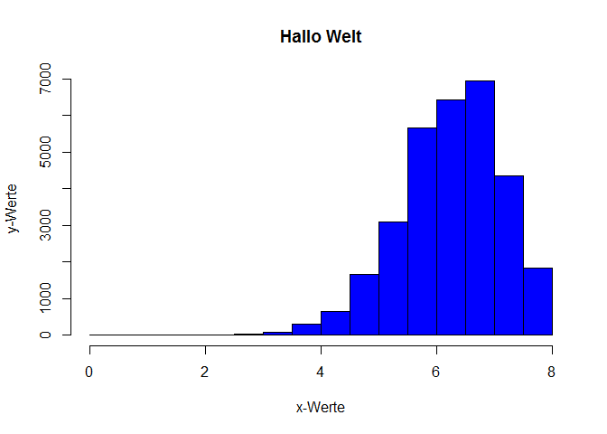
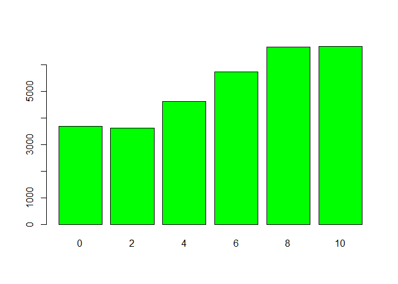
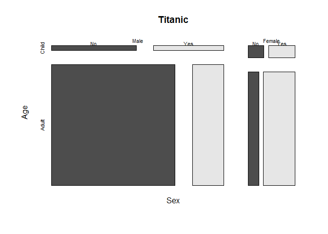
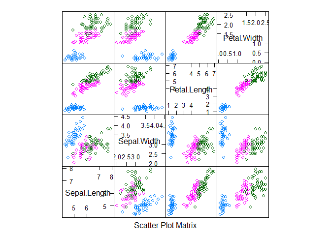
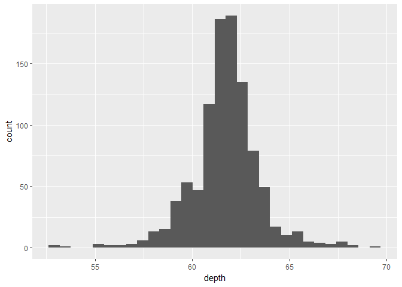
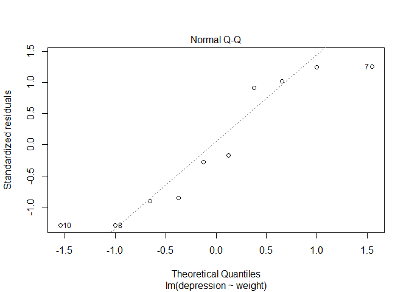

Gliederung
==========

Einführung
----------

-   [Einführung und Motivation](md_slides/Intro.md)
-   [Erste Schritte mit R](md_slides/ersteSchritte.md)
-   [Wie bekommt man Hilfe?](md_slides/)
-   [Modularer Aufbau](md_slides/R-Pakete.md)
-   [Datenimport](md_slides/Datenimport.md)
-   [Datenaufbereitung](md_slides/Datenaufbereitung.md)
-   [Datenexport](md_slides/Datenexport.md)

Liebe auf den ersten Plot – Grafiken und Datenanalyse mit R
-----------------------------------------------------------

-   [Basisgrafiken](md_slides/Basisgrafiken.md)
-   [Datenanalyse](md_slides/Datenanalyse.md)
-   [Grafiken und Zusammenhang](md_slides/Zusammenhang.md)
-   [Das lattice Paket](md_slides/LatticeGraphiken.md)  
-   [ggplot und ggmap](md_slides/ggplot2.md)

Regression mit R
----------------

-   [Die lineare Regression](md_slides/lineareRegression.md)  
-   [Die logistische Regression](md_slides/logistischeRegression.md) -
    [Mehrebenenmodelle](md_slides/Multilevel.md)

Präsentation von Daten - Reproducible Research
----------------------------------------------

-   [Word Dokumente mit R erstellen](md_slides/R2word.md)
-   [PDF Dokumente und Präsentationen mit LaTeX, Beamer und
    Sweave](md_slides/R2pdf.md)
-   [HTML Dokumente, Präsentationen und Dashboards mit
    Rmarkdown](md_slides/Rmarkdown.md)
-   [Notebooks](md_slides/Notebooks.md) zur Integration von anderen
    Programmiersprachen (Python,LaTeX,Julia)

Interaktive Darstellung mit Javascript und R
--------------------------------------------

-   [Interaktive Tabellen mit
    DataTables](md_slides/InteraktiveTabellen.md)
-   [Interaktive Karten mit dem Javascript Paket
    leaflet](md_slides/InteraktiveKarten.md)


Einführung und Motivation
=========================

Pluspunkte von R
----------------

-   Als Weg kreativ zu sein ...
-   [Graphiken](http://www.sr.bham.ac.uk/~ajrs/R/r-gallery.html),
    Graphiken, Graphiken
-   In Kombination mit anderen Programmen nutzbar
-   Zur Verbindung von Datenstrukturen
-   Zum Automatisieren
-   Um die Intelligenz anderer Leute zu nutzen ;-)
-   ...

Gründe
------

-   R ist [frei verfügbar](https://www.r-project.org/). Es kann umsonst
    [runtergeladen](http://www.inside-r.org/why-use-r) werden.
-   R ist eine Skriptsprache / [Popularität von
    R](http://blog.revolutionanalytics.com/popularity/)


[Ein Hauptgrund - die Community](http://blog.revolutionanalytics.com/2017/06/r-community.html)
----------------------------------------------------------------------------------------------


Möglichkeiten auf dem neuesten Stand zu sein
--------------------------------------------

-   [rweekly](https://rweekly.org/)


-   [r-bloggers](https://www.r-bloggers.com/)


[Modularer Aufbau](http://stats.idre.ucla.edu/r/seminars/intro/)
----------------------------------------------------------------


[Viel genutzte Pakete](https://gallery.shinyapps.io/cran-gauge/)
----------------------------------------------------------------


Organisation des Kurses
-----------------------

-   Unterlagen sind komplett auf Github hinterlegt, damit man den Kurs
    gleich mitverfolgen kann (mehr dazu gleich)
-   Es werden viele verschiedene kleine Beispieldatensätze verwendet um
    spezifische Dinge zu zeigen
-   Alle Funktionen in R sind mit diesen kleinen Beispielen hinterlegt
-   An geeigneten Stellen verwende ich auch
    größere (sozialwissenschaftliche) Datensätze

Dem Kurs folgen
---------------

-   <http://japhilko.github.io/Rinter/>


Das Wiki zum Kurs
-----------------

-   <https://github.com/Japhilko/Rinter/wiki>


Komplette Foliensätze
---------------------

Die kompletten Foliensätze kann man hier herunterladen:

<https://github.com/Japhilko/Rinter/blob/master/pdf_slides/R_intern.pdf>

Der R-code
----------

-   Den R-code kann man direkt in die R-Konsole kopieren und ausführen.
-   Begleitend zu den Folien wird meistens auch jeweils ein
    R-File angeboten.
-   Der R-code befindet sich in folgendem Ordner:

<https://github.com/Japhilko/RInter/tree/master/code>

Daten herunterladen
-------------------

-   Vereinzelt sind auch Datensätze vorhanden.

-   `.csv` Dateien können direkt von R eingelesen werden (wie das geht,
    werde ich noch zeigen).

-   Wenn die `.csv` Dateien heruntergeladen werden sollen - den Raw
    Button verwenden.

-   Alle anderen Dateien (bspw. `.RData`) auch mittels Raw
    Button herunterladen.

Ausdrucken
----------

-   Zum Ausdrucken eignen sich die pdf-Dateien am besten.

-   Diese können mit dem Raw Button heruntergeladen werden.

### Raw Button bei Github


Basis R ...
-----------

-   Wenn man nur R herunterlädt und installiert, sieht das so aus:
-   So habe ich bis 2012 mit R gearbeitet.


... und Rstudio
---------------

-   Rstudio bietet Heute sehr viel Unterstützung:
-   und macht einige Themen dieses Workshops erst möglich


Aufgabe - Vorbereitung
----------------------

-   Prüfen Sie, ob eine Version von R auf Rechner installiert ist.
-   Falls dies nicht der Fall ist, laden Sie [R](r-project.org) runter
    und installieren Sie R.
-   Prüfen Sie, ob Rstudio installiert ist.
-   Falls nicht - [Installieren](http://www.rstudio.com/) sie Rstudio.
-   Laden Sie die R-Skripte von meinem GitHub-Account
-   Erstellen Sie ein erstes Script und finden Sie das Datum mit dem
    Befehl `date()` und die R-version mit `sessionInfo()` heraus.

<!-- -->

    ## [1] "Mon Jul 31 14:55:43 2017"

    ## R version 3.3.2 (2016-10-31)
    ## Platform: x86_64-w64-mingw32/x64 (64-bit)
    ## Running under: Windows 7 x64 (build 7601) Service Pack 1
    ## 
    ## locale:
    ## [1] LC_COLLATE=German_Germany.1252  LC_CTYPE=German_Germany.1252   
    ## [3] LC_MONETARY=German_Germany.1252 LC_NUMERIC=C                   
    ## [5] LC_TIME=German_Germany.1252    
    ## 
    ## attached base packages:
    ## [1] stats     graphics  grDevices utils     datasets  methods   base     
    ## 
    ## loaded via a namespace (and not attached):
    ##  [1] backports_1.0.4 magrittr_1.5    rprojroot_1.1   tools_3.3.2    
    ##  [5] htmltools_0.3.5 yaml_2.1.14     Rcpp_0.12.9     stringi_1.1.2  
    ##  [9] rmarkdown_1.3   knitr_1.15.1    stringr_1.2.0   digest_0.6.11  
    ## [13] evaluate_0.10

R ist eine Objekt-orientierte Sprache
-------------------------------------

Vektoren und Zuweisungen

-   R ist eine Objekt-orientierte Sprache
-   `<-` ist der Zuweisungsoperator (Shortcut: "Alt" + "-")

<!-- -->

    b <- c(1,2) # erzeugt ein Objekt mit den Zahlen 1 und 2

-   Eine Funktion kann auf dieses Objekt angewendet werden:

<!-- -->

    mean(b) # berechnet den Mittelwert

    ## [1] 1.5

Mit den folgenden Funktionen können wir etwas über die Eigenschaften des
Objekts lernen:

    length(b) # b hat die Länge 2

    ## [1] 2

Objektstruktur - Datentypen
---------------------------

    str(b) # b ist ein numerischer Vektor

    ##  num [1:2] 1 2

-   mehr zu den [möglichen
    Datentypen](http://www.statmethods.net/management/typeconversion.html)
    später

Funktionen im base-Paket
------------------------

<table>
<thead>
<tr class="header">
<th align="left">Funktion</th>
<th align="left">Bedeutung</th>
<th align="left">Beispiel</th>
</tr>
</thead>
<tbody>
<tr class="odd">
<td align="left">length()</td>
<td align="left">Länge</td>
<td align="left">length(b)</td>
</tr>
<tr class="even">
<td align="left">max()</td>
<td align="left">Maximum</td>
<td align="left">max(b)</td>
</tr>
<tr class="odd">
<td align="left">min()</td>
<td align="left">Minimum</td>
<td align="left">min(b)</td>
</tr>
<tr class="even">
<td align="left">sd()</td>
<td align="left">Standardabweichung</td>
<td align="left">sd(b)</td>
</tr>
<tr class="odd">
<td align="left">var()</td>
<td align="left">Varianz</td>
<td align="left">var(b)</td>
</tr>
<tr class="even">
<td align="left">mean()</td>
<td align="left">Mittelwert</td>
<td align="left">mean(b)</td>
</tr>
<tr class="odd">
<td align="left">median()</td>
<td align="left">Median</td>
<td align="left">median(b)</td>
</tr>
</tbody>
</table>

Diese Funktionen brauchen nur ein Argument.

Funktionen mit mehr Argumenten
------------------------------

Andere Funktionen brauchen mehr:

<table>
<thead>
<tr class="header">
<th align="left">Argument</th>
<th align="left">Bedeutung</th>
<th align="left">Beispiel</th>
</tr>
</thead>
<tbody>
<tr class="odd">
<td align="left">quantile()</td>
<td align="left">90 % Quantile</td>
<td align="left">quantile(b,.9)</td>
</tr>
<tr class="even">
<td align="left">sample()</td>
<td align="left">Stichprobe ziehen</td>
<td align="left">sample(b,1)</td>
</tr>
</tbody>
</table>

Beispiel - Funktionen mit einem Argument
----------------------------------------

    max(b)

    ## [1] 2

    min(b)

    ## [1] 1

    sd(b)

    ## [1] 0.7071068

    var(b)

    ## [1] 0.5

Funktionen mit einem Argument
-----------------------------

    mean(b)

    ## [1] 1.5

    median(b)

    ## [1] 1.5

Funktionen mit mehr Argumenten
------------------------------

    quantile(b,.9)

    ## 90% 
    ## 1.9

    sample(b,1) 

    ## [1] 2

[Übersicht Befehle](http://cran.r-project.org/doc/manuals/R-intro.html)
-----------------------------------------------------------------------

<http://cran.r-project.org/doc/manuals/R-intro.html>


Aufgabe - Zuweisungen und Funktionen
------------------------------------

Erzeugt einen Vektor b mit den Zahlen von 1 bis 5 und berechnet...

1.  den Mittelwert

2.  die Varianz

3.  die Standardabweichung

4.  die quadratische Wurzel aus dem Mittelwert

Verschiedene Datentypen
-----------------------

<table>
<thead>
<tr class="header">
<th align="left">Datentyp</th>
<th align="left">Beschreibung</th>
<th align="left">Beispiel</th>
</tr>
</thead>
<tbody>
<tr class="odd">
<td align="left">numeric</td>
<td align="left">ganze und reele Zahlen</td>
<td align="left"><code>5, 3.462</code></td>
</tr>
<tr class="even">
<td align="left">logical</td>
<td align="left">logische Werte</td>
<td align="left"><code>FALSE, TRUE</code></td>
</tr>
<tr class="odd">
<td align="left">character</td>
<td align="left">Buchstaben und Zeichenfolgen</td>
<td align="left"><code>&quot;Hallo&quot;</code></td>
</tr>
</tbody>
</table>

Quelle: [R. Münnich und M.
Knobelspieß](https://www.uni-trier.de/fileadmin/fb4/prof/VWL/FIN/Oekonometrie/PC-UEbung/Einfuehrung_in_R.pdf)
(2007): Einführung in das statistische Programmpaket R

Verschiedene Datentypen
-----------------------

    b <- c(1,2) # numeric
    log <- c(T,F) # logical
    char <-c("A","b") # character
    fac <- as.factor(c(1,2)) # factor

Mit `str()` bekommt man den Objekttyp.

    str(fac)

    ##  Factor w/ 2 levels "1","2": 1 2

Indizieren eines Vektors:
-------------------------

    A1 <- c(1,2,3,4)
    A1

    ## [1] 1 2 3 4

    A1[1]

    ## [1] 1

    A1[4]

    ## [1] 4

    A1[1:3]

    ## [1] 1 2 3

    A1[-4]

    ## [1] 1 2 3

Logische Operatoren
-------------------

    # Ist 1 größer als 2?
    1>2

    ## [1] FALSE

    1<2

    ## [1] TRUE

    1==2

    ## [1] FALSE

Sequenzen
---------

    # Sequenz von 1 bis 10
    1:10

    ##  [1]  1  2  3  4  5  6  7  8  9 10

    # das gleiche Ergebnis
    seq(1,10)

    ##  [1]  1  2  3  4  5  6  7  8  9 10

Weitere Sequenzen
-----------------

    seq(-2,8,by=1.5)

    ## [1] -2.0 -0.5  1.0  2.5  4.0  5.5  7.0

    a <-seq(3,12,length=12)
    a

    ##  [1]  3.000000  3.818182  4.636364  5.454545  6.272727  7.090909  7.909091
    ##  [8]  8.727273  9.545455 10.363636 11.181818 12.000000

    b <- seq(to=5,length=12,by=0.2)
    b

    ##  [1] 2.8 3.0 3.2 3.4 3.6 3.8 4.0 4.2 4.4 4.6 4.8 5.0

Reihenfolge von Argumenten
--------------------------

    1:10

    ##  [1]  1  2  3  4  5  6  7  8  9 10

    seq(1,10,1)

    ##  [1]  1  2  3  4  5  6  7  8  9 10

    seq(length=10,from=1,by=1)

    ##  [1]  1  2  3  4  5  6  7  8  9 10

Wiederholungen
--------------

    # wiederhole 1 10 mal
    rep(1,10)

    ##  [1] 1 1 1 1 1 1 1 1 1 1

    rep("A",10)

    ##  [1] "A" "A" "A" "A" "A" "A" "A" "A" "A" "A"

Die Funktion paste
------------------

    ?paste

    paste(1:4)

    ## [1] "1" "2" "3" "4"

    paste("A", 1:6, sep = "")

    ## [1] "A1" "A2" "A3" "A4" "A5" "A6"

-   Ein weiteres Beispiel:

<!-- -->

    paste0("A", 1:6)

    ## [1] "A1" "A2" "A3" "A4" "A5" "A6"

<!--

## Wie bekommt man Hilfe 

- Foren, Blogs und Supportmöglichkeiten

-->
Wie bekommt man Hilfe?
----------------------

-   [Um generell Hilfe zu
    bekommen:](http://itfeature.com/tag/how-to-get-help-in-r)

<!-- -->

    help.start()

-   [Online Dokumentation für die meisten
    Funktionen:](https://www.r-project.org/help.html)

<!-- -->

    help(name)

-   Nutze ? um Hilfe zu bekommen.

<!-- -->

    ?mean

-   example(lm) gibt ein Beispiel für die lineare Regression

<!-- -->

    example(lm)

Vignetten
---------

-   Dokumente zur Veranschaulichung und Erläuterung von Funktionen im
    Paket

<!-- -->

    browseVignettes()

Demos
-----

-   zu manchem Paketen gibt es Demonstrationen, wie der Code zu
    verwenden ist

<!-- -->

    demo()
    demo(nlm)

Die Funktion `apropos`
----------------------

-   sucht alles, was mit dem eingegebenen String in Verbindung steht

<!-- -->

    apropos("lm")

    ##  [1] ".__C__anova.glm"      ".__C__anova.glm.null" ".__C__glm"           
    ##  [4] ".__C__glm.null"       ".__C__lm"             ".__C__mlm"           
    ##  [7] ".__C__optionalMethod" ".colMeans"            ".lm.fit"             
    ## [10] "colMeans"             "confint.lm"           "contr.helmert"       
    ## [13] "dummy.coef.lm"        "getAllMethods"        "glm"                 
    ## [16] "glm.control"          "glm.fit"              "KalmanForecast"      
    ## [19] "KalmanLike"           "KalmanRun"            "KalmanSmooth"        
    ## [22] "kappa.lm"             "lm"                   "lm.fit"              
    ## [25] "lm.influence"         "lm.wfit"              "model.matrix.lm"     
    ## [28] "nlm"                  "nlminb"               "predict.glm"         
    ## [31] "predict.lm"           "residuals.glm"        "residuals.lm"        
    ## [34] "summary.glm"          "summary.lm"

-   man kann das auch in Verbindung mit regulären Ausdrücken verwenden

<!-- -->

    ?"regular expression"

    help.search("^glm")

[Suchmaschine für die R-Seite](http://search.r-project.org/cgi-bin/namazu.cgi?query=glm&max=20&result=normal&sort=score&idxname=functions&idxname=vignettes&idxname=views)
--------------------------------------------------------------------------------------------------------------------------------------------------------------------------

    RSiteSearch("glm")

Nutzung Suchmaschinen
---------------------

-   Ich nutze meistens google
-   Tippe:

<!-- -->

    R-project + Was ich schon immer wissen wollte

-   Das funktioniert natürlich mit jeder Suchmaschine!

[Stackoverflow](http://stackoverflow.com/)
------------------------------------------

-   Für Fragen zum Programmieren
-   [Ist nicht auf R fokussiert, es gibt aber viele Diskussionen zu
    R](https://stackoverflow.com/tags/r/info)
-   Sehr detailierte Diskussionen


[Quick R](http://www.statmethods.net/interface/help.html)
---------------------------------------------------------

### Quick R

-   Eine Seite mit Beispielen und Hilfe zu einem Thema
-   Beispiel: [Quick R - Getting
    Help](http://www.statmethods.net/interface/help.html)

### Weitere Links

-   [Übersicht - Hilfe bekommen in
    R](https://www.r-project.org/help.html)

-   [Eine Liste mit HowTo\`s](http://rprogramming.net/)

-   [Eine Liste der wichtigsten
    R-Befehle](https://www.personality-project.org/r/r.commands.html)

Ein Schummelzettel - Cheatsheet
-------------------------------

<https://www.rstudio.com/resources/cheatsheets/>


[Wo sind die Routinen enthalten](https://stats.idre.ucla.edu/r/seminars/intro/)
-------------------------------------------------------------------------------

    ## [1] 10999

-   Viele Funktionen sind im Basis-R enthalten
-   Viele spezifische Funktionen sind in zusätzlichen Bibliotheken
    integriert
-   R kann modular erweitert werden durch sog. packages bzw. libraries
-   Auf CRAN werden die wichtigsten packages gehostet (im Moment 10999)
-   Mehr Pakete (v.a. Biostatistik, Medizin) finden sich z.B. bei
    [bioconductor](www.bioconductor.org)

Übersicht R-Pakete
------------------


Installation
------------

    install.packages("lme4")

    library(lme4)

Installation von Paketen mit RStudio
------------------------------------


Vorhandene Pakete und Installation
----------------------------------


Übersicht viele nützliche Pakete:
---------------------------------

-   Luhmann - [Tabelle mit vielen nützlichen
    Paketen](http://www.beltz.de/fileadmin/beltz/downloads/OnlinematerialienPVU/28090_Luhmann/Verwendete%20Pakete.pdf)

### Weitere interessante Pakete:

-   Paket für den Import/Export -
    [foreign](http://cran.r-project.org/web/packages/foreign/foreign.pdf)

-   [Pakete für Survey
    Sampling](http://iase-web.org/documents/papers/icots8/ICOTS8_4J1_TILLE.pdf)

-   `xtable` Paket für die Integration von Latex und R ([xtable
    Galerie](http://cran.r-project.org/web/packages/xtable/vignettes/xtableGallery.pdf))

-   [Paket zur Erzeugung von
    Dummies](http://cran.r-project.org/web/packages/dummies/dummies.pdf)

-   [Multivariate
    Normalverteilung](http://cran.r-project.org/web/packages/mvtnorm/index.html)

-   [Paket für Karten](http://www.r-bloggers.com/tag/maptools/)

Pakete installieren
-------------------

### Pakete von CRAN Server installieren

    install.packages("lme4")

### Pakete von Bioconductor Server installieren

    source("https://bioconductor.org/biocLite.R")
    biocLite(c("GenomicFeatures", "AnnotationDbi"))

### Pakete von Github installieren

    install.packages("devtools")
    library(devtools)

    install_github("hadley/ggplot2")

Wie bekomme ich einen Überblick
-------------------------------

-   [Pakete entdecken, die neulich auf CRAN hochgeladen
    wurden](https://mran.microsoft.com/packages/)

-   [Pakete nachschauen, die in letzter Zeit von CRAN heruntergeladen
    wurden](https://gallery.shinyapps.io/cran-gauge/)

-   [Eine Quick-list nützlicher
    Pakete](https://support.rstudio.com/hc/en-us/articles/201057987-Quick-list-of-useful-R-packages)
    auf der Support Seite von Rstudio

-   Computerworld hat die [besten Pakete für Datenbearbeitung und
    Analyse](http://www.computerworld.com/article/2921176/business-intelligence/great-r-packages-for-data-import-wrangling-visualization.html)
    aufgelistet

-   Auf R-Bloggers gibt es eine Liste mit den [50 meist genutzten
    Pakete](https://www.r-bloggers.com/the-50-most-used-r-packages/)

CRAN Task Views
---------------

-   Zu einigen Themen sind nützliche Pakete/Funktionen in einer
    Übersicht zusammengestellt.

-   Zur Zeit gibt es 35 [Task
    Views](https://cran.r-project.org/web/views/)
-   [Alle Pakete eines Task Views können mit folgendem Befehl
    installiert werden:](https://mran.microsoft.com/rpackages/)

<!-- -->

    install.packages("ctv")
    library("ctv")
    install.views("Bayesian")


Aufgabe - Zusatzpakete
----------------------

Gehen Sie auf <https://cran.r-project.org/> und suchen Sie in dem
Bereich, wo die Pakete vorgestellt werden, nach Paketen,...

-   die für die deskriptive Datenanalyse geeignet sind.
-   um Regressionen zu berechnen
-   um fremde Datensätze einzulesen (z.B. SPSS-Daten)
-   um mit großen Datenmengen umzugehen

Datenimport
-----------


Dateiformate in R
-----------------

-   Von R werden quelloffene, nicht-proprietäre Formate bevorzugt
-   Es können aber auch Formate von anderen Statistik Software Paketen
    eingelesen werden
-   R-user speichern Objekte gerne in sog. Workspaces ab
-   Auch hier jedoch gilt: (fast) alles andere ist möglich

Formate - base package
----------------------

R unterstützt von Haus aus schon einige wichtige Formate:

-   CSV (Comma Separated Values): `read.csv()`
-   FWF (Fixed With Format): `read.fwf()`
-   Tab-getrennte Werte: `read.delim()`

Datenimport leicht gemacht mit Rstudio
--------------------------------------


Der Arbeitsspeicher
-------------------

So findet man heraus, in welchem Verzeichnis man sich gerade befindet

    getwd()

Und ändert dann den Pfad mit setwd()

    setwd("C:/")

Man erzeugt ein Objekt in dem man den Pfad abspeichert:

    main.path <- "C:/" # Beispiel für Windows
    main.path <- "/users/Name/" # Beispiel für Mac
    main.path <- "/home/user/" # Beispiel für Linux

Bei Windows ist es wichtig Slashs anstelle von Backslashs zu verwenden.

Alternative - Arbeitsspeicher
-----------------------------


Import von Excel-Daten
----------------------

-   `library(foreign)` ist für den Import von fremden Datenformaten
    nötig
-   Wenn Excel-Daten vorliegen - als .csv abspeichern
-   Dann kann `read.csv()` genutzt werden um die Daten einzulesen.
-   Bei Deutschen Daten kann es sein, dass man `read.csv2()` wegen der
    Komma-Separierung braucht.

<!-- -->

    library(foreign)
    ?read.csv
    ?read.csv2

CSV Dateien einlesen
--------------------

Zunächst muss das Arbeitsverzeichnis gesetzt werden, in dem sich die
Daten befinden:

    Dat <- read.csv("schuldaten_export.csv")

Wenn es sich um Deutsche Daten handelt:

    Dat <- read.csv2("schuldaten_export.csv")

CSV aus dem Web einladen
------------------------

-   Datensatz:

<https://data.montgomerycountymd.gov/api/views/6rqk-pdub/rows.csv?accessType=DOWNLOAD>

-   [Datenimport mit
    Rstudio](https://support.rstudio.com/hc/en-us/articles/218611977-Importing-Data-with-RStudio)


<!--
# https://support.spatialkey.com/spatialkey-sample-csv-data/
# https://datahub.io/dataset/sociallink
# https://datahub.io/dataset/a35a67a2-52ef-48d7-bba5-acf06a26338d/resource/419b1cbd-9674-40bf-ad62-776b348e0b8e/download/arabicroots.csv
-->
Das Paket `readr`
-----------------

    install.packages("readr")

    library(readr)

-   [`readr` auf dem Rstudio
    Blogg](https://blog.rstudio.org/2015/10/28/readr-0-2-0/)

Import von Excel-Daten
----------------------

-   `library(readr)` ist für den Import von fremden Datenformaten
    hilfreich
-   Wenn Excel-Daten vorliegen - als .csv abspeichern

### Beispiel Weltkulturerbestätten

    url<-"https://raw.githubusercontent.com/Japhilko/GeoData/master/2015/data/whcSites.csv"

    whcSites <- read.csv(url) 

Der Beispieldatensatz
---------------------


Das Paket `haven`
-----------------

> Import and Export 'SPSS', 'Stata' and 'SAS' Files

    install.packages("haven")

    library(haven)

-   [Das R-Paket `haven` auf dem Rstudio
    Blogg](https://blog.rstudio.org/2016/10/04/haven-1-0-0/)

SPSS Dateien einlesen
---------------------

-   Zunächst muss wieder der Pfad zum Arbeitsverzeichnis angeben werden.
-   SPSS-Dateien können auch direkt aus dem Internet geladen werden:

<!-- -->

    library(haven)
    mtcars <- read_sav(
    "https://github.com/Japhilko/RInterfaces/raw/master/
    data/mtcars.sav")

`foreign` kann ebenfalls zum Import genutzt werden
--------------------------------------------------

    library(foreign)
    link<- "http://www.statistik.at/web_de/static/
    mz_2013_sds_-_datensatz_080469.sav"

    ?read.spss
    Dat <- read.spss(link,to.data.frame=T)

stata Dateien einlesen
----------------------

    library(haven)
    oecd <- read_dta("https://github.com/Japhilko/IntroR/
                     raw/master/2017/data/oecd.dta")

-   Einführung in Import mit R
    ([is.R](http://is-r.tumblr.com/post/37181850668/reading-writing-stata-dta-files-with-foreign))

Das Paket `readstata13`
-----------------------

    # install.packages("readstata13")

    library(readstata13)
    ?read.dta13

[Das Paket `rio`](https://cran.r-project.org/web/packages/rio/vignettes/rio.html)
---------------------------------------------------------------------------------

    install.packages("rio")

    library("rio")
    x <- import("mtcars.csv")
    y <- import("mtcars.rds")
    z <- import("mtcars.dta")

-   [rio: A Swiss-Army Knife for Data
    I/O](https://cran.r-project.org/web/packages/rio/README.html)

<!--
## Datenmanagement ähnlich wie in SPSS oder Stata


```r
install.packages("Rz")
library(Rz)
```
-->
[Weitere Alternative Rcmdr](https://cran.r-project.org/web/packages/Rcmdr/index.html)
-------------------------------------------------------------------------------------

    install.packages("Rcmdr")

-   [Funktioniert auch mit Rstudio](http://www.rcommander.com/)

<!-- -->

    library(Rcmdr)


Die Gesis Panel Daten
---------------------


-   [Gesis Panel Campus
    File](http://www.gesis.org/gesis-panel/data/gesis-panel-campus-file/)

-   [Codebuch für die Gesis Panel Daten im
    DBK](https://dbk.gesis.org/dbksearch/SDesc2.asp?ll=10&notabs=&af=&nf=&search=gesis%20panel&search2=&db=D&no=5665)

Aufgabe
-------

-   Gehen Sie auf meine Github Seite

<https://github.com/Japhilko/RSocialScience/tree/master/data>

-   Importieren Sie den Datensatz `GPanel.dta`

Data Frames
-----------

Beispieldaten einlesen:

    library(foreign)
    dat<-read.dta("https://github.com/Japhilko/RSocialScience/
                  raw/master/data/GPanel.dta")

Übersicht mittels Rstudio
-------------------------


[Den Datensatz anschauen](https://support.rstudio.com/hc/en-us/articles/205175388-Using-the-Data-Viewer)
--------------------------------------------------------------------------------------------------------

### Die Daten filtern


Daten filtern
-------------


Struktur des Datensatzes
------------------------

### Der Datentyp

    typeof(dat)

    ## [1] "list"

### [Die Funktion `glimpse` im Paket `dplyr`](https://stats.stackexchange.com/questions/11551/is-there-a-good-browser-viewer-to-see-an-r-dataset-rda-file)

    library(dplyr)
    glimpse(dat)

    ## Observations: 100
    ## Variables: 23
    ## $ a11c019a <fctr> Eher zufrieden, Sehr zufrieden, Eher zufrieden, Eher...
    ## $ a11c020a <fctr> Weder zufrieden noch unzufrieden, Eher unzufrieden, ...
    ## $ a11c021a <fctr> Sehr zufrieden, Eher unzufrieden, Eher unzufrieden, ...
    ## $ a11c022a <fctr> Stimme eher nicht zu, Stimme eher nicht zu, Stimme e...
    ## $ a11c023a <fctr> Stimme eher zu, Stimme eher zu, Stimme eher nicht zu...
    ## $ a11c024a <fctr> Stimme eher zu, Stimme voll und ganz zu, Stimme eher...
    ## $ a11c025a <fctr> Eher niedrigeren Lebensstandard, Eher niedrigeren Le...
    ## $ a11c026a <fctr> Seltener, Mehrmals die Woche, Täglich, Täglich, Tägl...
    ## $ a11c027a <fctr> Mehrmals die Woche, Mindestens einmal im Monat, Mehr...
    ## $ a11c028a <fctr> Täglich, Täglich, Nie, Täglich, Täglich, Täglich, Tä...
    ## $ a11c029a <fctr> Täglich, Täglich, Täglich, Täglich, Täglich, Nie, Tä...
    ## $ a11c030a <fctr> Täglich, Täglich, Mehrmals die Woche, Mehrmals die W...
    ## $ a11c031a <fctr> Seltener, Mindestens einmal im Monat, Täglich, Mehrm...
    ## $ a11c032a <fctr> Täglich, Mehrmals im Monat, Mehrmals die Woche, Selt...
    ## $ a11c033a <fctr> Täglich, Seltener, Mehrmals im Monat, Mehrmals die W...
    ## $ a11c034a <fctr> Ja, nutzt Internet für private Zwecke, Ja, nutzt Int...
    ## $ bazq020a <chr> "-33", "30", "35", "-33", "23", "15", "15", "15-20", ...
    ## $ a11d054a <fctr> Männlich, Männlich, Männlich, Männlich, Männlich, We...
    ## $ a11d056z <fctr> 45 bis unter 50 Jahre, 50 bis unter 55 Jahre, 20 bis...
    ## $ a11d092a <fctr> Angestellte(r), Missing by filter, Missing by filter...
    ## $ a11c100a <fctr> 5 .., 6 .., 6 .., 4 .., 6 .., 7 Sehr wichtig, 7 Sehr...
    ## $ a11c111a <fctr> Missing by design, Missing by design, Missing by des...
    ## $ a11c109a <fctr> Missing by design, Missing by design, Missing by des...

In Dataframe übertragen
-----------------------

Die Vektoren (von `dat`) zu einem data.frame verbinden:

    Daten <- data.frame(dat)

Anzahl der Zeilen/Spalten herausfinden

    nrow(Daten) # Zeilen

    ## [1] 100

    ncol(Daten) # Spalten

    ## [1] 23

Die Daten in der Console anschauen
----------------------------------

### Die ersten Zeilen anschauen

    head(Daten)

### Die letzten Zeilen anschauen

    tail(Daten)

Indizieren
----------

Indizieren eines dataframe:

    Daten[1,1]

    ## [1] Eher zufrieden
    ## 7 Levels: Item nonresponse Sehr zufrieden ... Weiß nicht

    Daten[2,]

    ##         a11c019a         a11c020a         a11c021a             a11c022a
    ## 2 Sehr zufrieden Eher unzufrieden Eher unzufrieden Stimme eher nicht zu
    ##         a11c023a                a11c024a                        a11c025a
    ## 2 Stimme eher zu Stimme voll und ganz zu Eher niedrigeren Lebensstandard
    ##             a11c026a                   a11c027a a11c028a a11c029a a11c030a
    ## 2 Mehrmals die Woche Mindestens einmal im Monat  Täglich  Täglich  Täglich
    ##                     a11c031a          a11c032a a11c033a
    ## 2 Mindestens einmal im Monat Mehrmals im Monat Seltener
    ##                                a11c034a bazq020a a11d054a
    ## 2 Ja, nutzt Internet für private Zwecke       30 Männlich
    ##                a11d056z          a11d092a a11c100a          a11c111a
    ## 2 50 bis unter 55 Jahre Missing by filter     6 .. Missing by design
    ##            a11c109a
    ## 2 Missing by design

    Daten[,1]

    ##   [1] Eher zufrieden                   Sehr zufrieden                  
    ##   [3] Eher zufrieden                   Eher zufrieden                  
    ##   [5] Eher zufrieden                   Sehr zufrieden                  
    ##   [7] Eher zufrieden                   Eher zufrieden                  
    ##   [9] Sehr zufrieden                   Sehr zufrieden                  
    ##  [11] Eher zufrieden                   Sehr zufrieden                  
    ##  [13] Eher zufrieden                   Sehr zufrieden                  
    ##  [15] Sehr zufrieden                   Sehr zufrieden                  
    ##  [17] Weder zufrieden noch unzufrieden Eher zufrieden                  
    ##  [19] Sehr zufrieden                   Eher zufrieden                  
    ##  [21] Sehr zufrieden                   Sehr zufrieden                  
    ##  [23] Sehr zufrieden                   Sehr zufrieden                  
    ##  [25] Sehr zufrieden                   Weder zufrieden noch unzufrieden
    ##  [27] Eher unzufrieden                 Weder zufrieden noch unzufrieden
    ##  [29] Sehr zufrieden                   Eher zufrieden                  
    ##  [31] Sehr zufrieden                   Weder zufrieden noch unzufrieden
    ##  [33] Eher zufrieden                   Eher zufrieden                  
    ##  [35] Sehr zufrieden                   Eher zufrieden                  
    ##  [37] Eher zufrieden                   Sehr zufrieden                  
    ##  [39] Eher zufrieden                   Eher zufrieden                  
    ##  [41] Sehr zufrieden                   Sehr zufrieden                  
    ##  [43] Eher zufrieden                   Sehr zufrieden                  
    ##  [45] Sehr zufrieden                   Eher zufrieden                  
    ##  [47] Sehr zufrieden                   Eher zufrieden                  
    ##  [49] Sehr zufrieden                   Sehr zufrieden                  
    ##  [51] Eher zufrieden                   Weder zufrieden noch unzufrieden
    ##  [53] Eher zufrieden                   Eher zufrieden                  
    ##  [55] Sehr zufrieden                   Eher zufrieden                  
    ##  [57] Sehr zufrieden                   Sehr zufrieden                  
    ##  [59] Weder zufrieden noch unzufrieden Sehr zufrieden                  
    ##  [61] Sehr zufrieden                   Sehr unzufrieden                
    ##  [63] Sehr zufrieden                   Sehr zufrieden                  
    ##  [65] Eher zufrieden                   Eher zufrieden                  
    ##  [67] Sehr zufrieden                   Weder zufrieden noch unzufrieden
    ##  [69] Sehr zufrieden                   Eher zufrieden                  
    ##  [71] Eher zufrieden                   Sehr zufrieden                  
    ##  [73] Eher zufrieden                   Eher zufrieden                  
    ##  [75] Eher zufrieden                   Weder zufrieden noch unzufrieden
    ##  [77] Eher zufrieden                   Sehr zufrieden                  
    ##  [79] Sehr zufrieden                   Sehr zufrieden                  
    ##  [81] Eher zufrieden                   Eher zufrieden                  
    ##  [83] Sehr zufrieden                   Weder zufrieden noch unzufrieden
    ##  [85] Eher zufrieden                   Sehr zufrieden                  
    ##  [87] Sehr zufrieden                   Eher zufrieden                  
    ##  [89] Eher zufrieden                   Eher zufrieden                  
    ##  [91] Sehr zufrieden                   Eher zufrieden                  
    ##  [93] Eher zufrieden                   Sehr zufrieden                  
    ##  [95] Eher unzufrieden                 Sehr zufrieden                  
    ##  [97] Eher zufrieden                   Eher zufrieden                  
    ##  [99] Sehr zufrieden                   Eher unzufrieden                
    ## 7 Levels: Item nonresponse Sehr zufrieden ... Weiß nicht

    Daten[,1:2]

    ##                             a11c019a                         a11c020a
    ## 1                     Eher zufrieden Weder zufrieden noch unzufrieden
    ## 2                     Sehr zufrieden                 Eher unzufrieden
    ## 3                     Eher zufrieden                   Sehr zufrieden
    ## 4                     Eher zufrieden                   Sehr zufrieden
    ## 5                     Eher zufrieden                   Eher zufrieden
    ## 6                     Sehr zufrieden                   Eher zufrieden
    ## 7                     Eher zufrieden                   Eher zufrieden
    ## 8                     Eher zufrieden                   Eher zufrieden
    ## 9                     Sehr zufrieden                   Eher zufrieden
    ## 10                    Sehr zufrieden                   Sehr zufrieden
    ## 11                    Eher zufrieden                   Eher zufrieden
    ## 12                    Sehr zufrieden                   Eher zufrieden
    ## 13                    Eher zufrieden Weder zufrieden noch unzufrieden
    ## 14                    Sehr zufrieden                   Sehr zufrieden
    ## 15                    Sehr zufrieden                   Sehr zufrieden
    ## 16                    Sehr zufrieden                   Sehr zufrieden
    ## 17  Weder zufrieden noch unzufrieden                 Eher unzufrieden
    ## 18                    Eher zufrieden                   Sehr zufrieden
    ## 19                    Sehr zufrieden                   Sehr zufrieden
    ## 20                    Eher zufrieden                   Eher zufrieden
    ## 21                    Sehr zufrieden                   Sehr zufrieden
    ## 22                    Sehr zufrieden                   Sehr zufrieden
    ## 23                    Sehr zufrieden                   Eher zufrieden
    ## 24                    Sehr zufrieden                   Sehr zufrieden
    ## 25                    Sehr zufrieden                   Sehr zufrieden
    ## 26  Weder zufrieden noch unzufrieden                   Eher zufrieden
    ## 27                  Eher unzufrieden                   Eher zufrieden
    ## 28  Weder zufrieden noch unzufrieden Weder zufrieden noch unzufrieden
    ## 29                    Sehr zufrieden                   Sehr zufrieden
    ## 30                    Eher zufrieden Weder zufrieden noch unzufrieden
    ## 31                    Sehr zufrieden                   Eher zufrieden
    ## 32  Weder zufrieden noch unzufrieden                   Eher zufrieden
    ## 33                    Eher zufrieden                   Sehr zufrieden
    ## 34                    Eher zufrieden                   Sehr zufrieden
    ## 35                    Sehr zufrieden                   Eher zufrieden
    ## 36                    Eher zufrieden                   Eher zufrieden
    ## 37                    Eher zufrieden                   Eher zufrieden
    ## 38                    Sehr zufrieden                   Eher zufrieden
    ## 39                    Eher zufrieden                   Eher zufrieden
    ## 40                    Eher zufrieden                   Sehr zufrieden
    ## 41                    Sehr zufrieden                   Eher zufrieden
    ## 42                    Sehr zufrieden                   Eher zufrieden
    ## 43                    Eher zufrieden                 Eher unzufrieden
    ## 44                    Sehr zufrieden                   Eher zufrieden
    ## 45                    Sehr zufrieden                   Sehr zufrieden
    ## 46                    Eher zufrieden                   Sehr zufrieden
    ## 47                    Sehr zufrieden                   Eher zufrieden
    ## 48                    Eher zufrieden                   Eher zufrieden
    ## 49                    Sehr zufrieden                   Sehr zufrieden
    ## 50                    Sehr zufrieden                   Eher zufrieden
    ## 51                    Eher zufrieden                   Eher zufrieden
    ## 52  Weder zufrieden noch unzufrieden                   Eher zufrieden
    ## 53                    Eher zufrieden                   Eher zufrieden
    ## 54                    Eher zufrieden                   Eher zufrieden
    ## 55                    Sehr zufrieden                   Sehr zufrieden
    ## 56                    Eher zufrieden                   Eher zufrieden
    ## 57                    Sehr zufrieden                   Eher zufrieden
    ## 58                    Sehr zufrieden                   Sehr zufrieden
    ## 59  Weder zufrieden noch unzufrieden                   Eher zufrieden
    ## 60                    Sehr zufrieden                   Eher zufrieden
    ## 61                    Sehr zufrieden                   Eher zufrieden
    ## 62                  Sehr unzufrieden                 Sehr unzufrieden
    ## 63                    Sehr zufrieden                   Eher zufrieden
    ## 64                    Sehr zufrieden                   Sehr zufrieden
    ## 65                    Eher zufrieden                   Eher zufrieden
    ## 66                    Eher zufrieden                   Eher zufrieden
    ## 67                    Sehr zufrieden                   Eher zufrieden
    ## 68  Weder zufrieden noch unzufrieden                 Sehr unzufrieden
    ## 69                    Sehr zufrieden                   Sehr zufrieden
    ## 70                    Eher zufrieden                 Eher unzufrieden
    ## 71                    Eher zufrieden                   Eher zufrieden
    ## 72                    Sehr zufrieden                   Sehr zufrieden
    ## 73                    Eher zufrieden                 Sehr unzufrieden
    ## 74                    Eher zufrieden                   Eher zufrieden
    ## 75                    Eher zufrieden                   Sehr zufrieden
    ## 76  Weder zufrieden noch unzufrieden                   Sehr zufrieden
    ## 77                    Eher zufrieden Weder zufrieden noch unzufrieden
    ## 78                    Sehr zufrieden                   Eher zufrieden
    ## 79                    Sehr zufrieden                   Sehr zufrieden
    ## 80                    Sehr zufrieden                   Sehr zufrieden
    ## 81                    Eher zufrieden Weder zufrieden noch unzufrieden
    ## 82                    Eher zufrieden                   Eher zufrieden
    ## 83                    Sehr zufrieden                   Sehr zufrieden
    ## 84  Weder zufrieden noch unzufrieden Weder zufrieden noch unzufrieden
    ## 85                    Eher zufrieden Weder zufrieden noch unzufrieden
    ## 86                    Sehr zufrieden                   Eher zufrieden
    ## 87                    Sehr zufrieden                   Eher zufrieden
    ## 88                    Eher zufrieden                   Eher zufrieden
    ## 89                    Eher zufrieden                   Eher zufrieden
    ## 90                    Eher zufrieden                   Eher zufrieden
    ## 91                    Sehr zufrieden                   Sehr zufrieden
    ## 92                    Eher zufrieden                   Eher zufrieden
    ## 93                    Eher zufrieden                   Sehr zufrieden
    ## 94                    Sehr zufrieden                   Sehr zufrieden
    ## 95                  Eher unzufrieden                   Eher zufrieden
    ## 96                    Sehr zufrieden                   Eher zufrieden
    ## 97                    Eher zufrieden                   Eher zufrieden
    ## 98                    Eher zufrieden                   Sehr zufrieden
    ## 99                    Sehr zufrieden                   Eher zufrieden
    ## 100                 Eher unzufrieden                   Sehr zufrieden

Operatoren um Subset für Datensatz zu bekommen
----------------------------------------------

Diese Operatoren eignen sich gut um Datensätze einzuschränken

    Dauer <- as.numeric(Daten$bazq020a)
    head(Daten[Dauer>20,])

    ##          a11c019a         a11c020a         a11c021a             a11c022a
    ## 2  Sehr zufrieden Eher unzufrieden Eher unzufrieden Stimme eher nicht zu
    ## 3  Eher zufrieden   Sehr zufrieden Eher unzufrieden Stimme eher nicht zu
    ## 5  Eher zufrieden   Eher zufrieden   Eher zufrieden       Stimme eher zu
    ## NA           <NA>             <NA>             <NA>                 <NA>
    ## 9  Sehr zufrieden   Eher zufrieden   Sehr zufrieden       Stimme eher zu
    ## 15 Sehr zufrieden   Sehr zufrieden   Sehr zufrieden       Stimme eher zu
    ##                a11c023a                a11c024a
    ## 2        Stimme eher zu Stimme voll und ganz zu
    ## 3  Stimme eher nicht zu          Stimme eher zu
    ## 5        Stimme eher zu          Stimme eher zu
    ## NA                 <NA>                    <NA>
    ## 9  Stimme eher nicht zu Stimme voll und ganz zu
    ## 15 Stimme eher nicht zu    Stimme eher nicht zu
    ##                           a11c025a           a11c026a
    ## 2  Eher niedrigeren Lebensstandard Mehrmals die Woche
    ## 3         Denselben Lebensstandard            Täglich
    ## 5         Denselben Lebensstandard            Täglich
    ## NA                            <NA>               <NA>
    ## 9         Denselben Lebensstandard                Nie
    ## 15        Denselben Lebensstandard                Nie
    ##                      a11c027a a11c028a          a11c029a
    ## 2  Mindestens einmal im Monat  Täglich           Täglich
    ## 3           Mehrmals im Monat      Nie           Täglich
    ## 5          Mehrmals die Woche  Täglich           Täglich
    ## NA                       <NA>     <NA>              <NA>
    ## 9                    Seltener  Täglich Mehrmals im Monat
    ## 15                    Täglich  Täglich           Täglich
    ##              a11c030a                   a11c031a           a11c032a
    ## 2             Täglich Mindestens einmal im Monat  Mehrmals im Monat
    ## 3  Mehrmals die Woche                    Täglich Mehrmals die Woche
    ## 5             Täglich         Mehrmals die Woche Mehrmals die Woche
    ## NA               <NA>                       <NA>               <NA>
    ## 9             Täglich                    Täglich           Seltener
    ## 15            Täglich                    Täglich  Mehrmals im Monat
    ##                      a11c033a                              a11c034a
    ## 2                    Seltener Ja, nutzt Internet für private Zwecke
    ## 3           Mehrmals im Monat Ja, nutzt Internet für private Zwecke
    ## 5  Mindestens einmal im Monat Ja, nutzt Internet für private Zwecke
    ## NA                       <NA>                                  <NA>
    ## 9           Mehrmals im Monat Ja, nutzt Internet für private Zwecke
    ## 15          Mehrmals im Monat Ja, nutzt Internet für private Zwecke
    ##    bazq020a a11d054a              a11d056z          a11d092a
    ## 2        30 Männlich 50 bis unter 55 Jahre Missing by filter
    ## 3        35 Männlich 20 bis unter 25 Jahre Missing by filter
    ## 5        23 Männlich 65 bis unter 70 Jahre Missing by filter
    ## NA     <NA>     <NA>                  <NA>              <NA>
    ## 9        25 Männlich 50 bis unter 55 Jahre    Angestellte(r)
    ## 15       25 Männlich 45 bis unter 50 Jahre    Angestellte(r)
    ##          a11c100a          a11c111a          a11c109a
    ## 2            6 .. Missing by design Missing by design
    ## 3            6 .. Missing by design Missing by design
    ## 5            6 .. Missing by design Missing by design
    ## NA           <NA>              <NA>              <NA>
    ## 9            5 .. Missing by design Missing by design
    ## 15 7 Sehr wichtig Missing by design Missing by design

Einschränken mit dem Paket `tidyverse`
--------------------------------------

-   einfacher geht es mit dem Paket `tidyverse`

<!-- -->

    library(tidyverse)
    filter(Daten, Dauer>20)

    ##                            a11c019a                         a11c020a
    ## 1                    Sehr zufrieden                 Eher unzufrieden
    ## 2                    Eher zufrieden                   Sehr zufrieden
    ## 3                    Eher zufrieden                   Eher zufrieden
    ## 4                    Sehr zufrieden                   Eher zufrieden
    ## 5                    Sehr zufrieden                   Sehr zufrieden
    ## 6                    Eher zufrieden                   Sehr zufrieden
    ## 7                    Sehr zufrieden                   Sehr zufrieden
    ## 8                    Sehr zufrieden                   Sehr zufrieden
    ## 9                    Eher zufrieden                   Eher zufrieden
    ## 10                   Sehr zufrieden                   Eher zufrieden
    ## 11                   Eher zufrieden                   Eher zufrieden
    ## 12                   Sehr zufrieden                   Sehr zufrieden
    ## 13                   Sehr zufrieden                   Eher zufrieden
    ## 14                   Sehr zufrieden                   Sehr zufrieden
    ## 15                   Eher zufrieden                   Eher zufrieden
    ## 16 Weder zufrieden noch unzufrieden                   Sehr zufrieden
    ## 17                   Sehr zufrieden                   Sehr zufrieden
    ## 18                   Eher zufrieden Weder zufrieden noch unzufrieden
    ## 19                 Eher unzufrieden                   Eher zufrieden
    ##            a11c021a                a11c022a                  a11c023a
    ## 1  Eher unzufrieden    Stimme eher nicht zu            Stimme eher zu
    ## 2  Eher unzufrieden    Stimme eher nicht zu      Stimme eher nicht zu
    ## 3    Eher zufrieden          Stimme eher zu            Stimme eher zu
    ## 4    Sehr zufrieden          Stimme eher zu      Stimme eher nicht zu
    ## 5    Sehr zufrieden          Stimme eher zu      Stimme eher nicht zu
    ## 6  Eher unzufrieden          Stimme eher zu      Stimme eher nicht zu
    ## 7    Sehr zufrieden    Stimme eher nicht zu      Stimme eher nicht zu
    ## 8    Sehr zufrieden          Stimme eher zu      Stimme eher nicht zu
    ## 9    Eher zufrieden    Stimme eher nicht zu      Stimme eher nicht zu
    ## 10   Sehr zufrieden          Stimme eher zu      Stimme eher nicht zu
    ## 11   Sehr zufrieden    Stimme eher nicht zu Stimme überhaupt nicht zu
    ## 12   Sehr zufrieden    Stimme eher nicht zu      Stimme eher nicht zu
    ## 13   Sehr zufrieden Stimme voll und ganz zu      Stimme eher nicht zu
    ## 14   Sehr zufrieden          Stimme eher zu      Stimme eher nicht zu
    ## 15   Eher zufrieden          Stimme eher zu      Stimme eher nicht zu
    ## 16   Eher zufrieden          Stimme eher zu Stimme überhaupt nicht zu
    ## 17   Eher zufrieden          Stimme eher zu      Stimme eher nicht zu
    ## 18   Eher zufrieden    Stimme eher nicht zu            Stimme eher zu
    ## 19   Eher zufrieden    Stimme eher nicht zu   Stimme voll und ganz zu
    ##                   a11c024a                        a11c025a
    ## 1  Stimme voll und ganz zu Eher niedrigeren Lebensstandard
    ## 2           Stimme eher zu        Denselben Lebensstandard
    ## 3           Stimme eher zu        Denselben Lebensstandard
    ## 4  Stimme voll und ganz zu        Denselben Lebensstandard
    ## 5     Stimme eher nicht zu        Denselben Lebensstandard
    ## 6           Stimme eher zu Eher niedrigeren Lebensstandard
    ## 7  Stimme voll und ganz zu Eher niedrigeren Lebensstandard
    ## 8           Stimme eher zu Eher niedrigeren Lebensstandard
    ## 9           Stimme eher zu Eher niedrigeren Lebensstandard
    ## 10          Stimme eher zu     Eher höheren Lebensstandard
    ## 11 Stimme voll und ganz zu Eher niedrigeren Lebensstandard
    ## 12 Stimme voll und ganz zu Eher niedrigeren Lebensstandard
    ## 13          Stimme eher zu     Eher höheren Lebensstandard
    ## 14          Stimme eher zu Eher niedrigeren Lebensstandard
    ## 15          Stimme eher zu     Eher höheren Lebensstandard
    ## 16          Stimme eher zu        Denselben Lebensstandard
    ## 17 Stimme voll und ganz zu     Eher höheren Lebensstandard
    ## 18          Stimme eher zu Eher niedrigeren Lebensstandard
    ## 19          Stimme eher zu        Denselben Lebensstandard
    ##                      a11c026a                   a11c027a
    ## 1          Mehrmals die Woche Mindestens einmal im Monat
    ## 2                     Täglich          Mehrmals im Monat
    ## 3                     Täglich         Mehrmals die Woche
    ## 4                         Nie                   Seltener
    ## 5                         Nie                    Täglich
    ## 6          Mehrmals die Woche         Mehrmals die Woche
    ## 7                     Täglich                   Seltener
    ## 8                         Nie                   Seltener
    ## 9                    Seltener                        Nie
    ## 10                   Seltener          Mehrmals im Monat
    ## 11          Mehrmals im Monat Mindestens einmal im Monat
    ## 12 Mindestens einmal im Monat                        Nie
    ## 13          Mehrmals im Monat          Mehrmals im Monat
    ## 14                   Seltener         Mehrmals die Woche
    ## 15 Mindestens einmal im Monat                        Nie
    ## 16                   Seltener          Mehrmals im Monat
    ## 17         Mehrmals die Woche                    Täglich
    ## 18                   Seltener                    Täglich
    ## 19                        Nie         Mehrmals die Woche
    ##              a11c028a           a11c029a           a11c030a
    ## 1             Täglich            Täglich            Täglich
    ## 2                 Nie            Täglich Mehrmals die Woche
    ## 3             Täglich            Täglich            Täglich
    ## 4             Täglich  Mehrmals im Monat            Täglich
    ## 5             Täglich            Täglich            Täglich
    ## 6  Mehrmals die Woche            Täglich  Mehrmals im Monat
    ## 7            Seltener            Täglich            Täglich
    ## 8             Täglich            Täglich            Täglich
    ## 9            Seltener            Täglich            Täglich
    ## 10                Nie Mehrmals die Woche            Täglich
    ## 11            Täglich Mehrmals die Woche            Täglich
    ## 12            Täglich            Täglich            Täglich
    ## 13            Täglich            Täglich            Täglich
    ## 14            Täglich            Täglich            Täglich
    ## 15  Mehrmals im Monat            Täglich Mehrmals die Woche
    ## 16  Mehrmals im Monat Mehrmals die Woche Mehrmals die Woche
    ## 17            Täglich Mehrmals die Woche            Täglich
    ## 18            Täglich Mehrmals die Woche            Täglich
    ## 19 Mehrmals die Woche            Täglich            Täglich
    ##                      a11c031a                   a11c032a
    ## 1  Mindestens einmal im Monat          Mehrmals im Monat
    ## 2                     Täglich         Mehrmals die Woche
    ## 3          Mehrmals die Woche         Mehrmals die Woche
    ## 4                     Täglich                   Seltener
    ## 5                     Täglich          Mehrmals im Monat
    ## 6                         Nie                    Täglich
    ## 7          Mehrmals die Woche                    Täglich
    ## 8          Mehrmals die Woche          Mehrmals im Monat
    ## 9          Mehrmals die Woche         Mehrmals die Woche
    ## 10         Mehrmals die Woche                   Seltener
    ## 11                        Nie                    Täglich
    ## 12                    Täglich                    Täglich
    ## 13                    Täglich         Mehrmals die Woche
    ## 14                        Nie          Mehrmals im Monat
    ## 15                    Täglich Mindestens einmal im Monat
    ## 16         Mehrmals die Woche Mindestens einmal im Monat
    ## 17         Mehrmals die Woche         Mehrmals die Woche
    ## 18         Mehrmals die Woche          Mehrmals im Monat
    ## 19                        Nie         Mehrmals die Woche
    ##                      a11c033a
    ## 1                    Seltener
    ## 2           Mehrmals im Monat
    ## 3  Mindestens einmal im Monat
    ## 4           Mehrmals im Monat
    ## 5           Mehrmals im Monat
    ## 6          Mehrmals die Woche
    ## 7          Mehrmals die Woche
    ## 8                    Seltener
    ## 9                    Seltener
    ## 10                    Täglich
    ## 11         Mehrmals die Woche
    ## 12         Mehrmals die Woche
    ## 13          Mehrmals im Monat
    ## 14         Mehrmals die Woche
    ## 15          Mehrmals im Monat
    ## 16          Mehrmals im Monat
    ## 17                   Seltener
    ## 18                   Seltener
    ## 19                    Täglich
    ##                                         a11c034a bazq020a a11d054a
    ## 1          Ja, nutzt Internet für private Zwecke       30 Männlich
    ## 2          Ja, nutzt Internet für private Zwecke       35 Männlich
    ## 3          Ja, nutzt Internet für private Zwecke       23 Männlich
    ## 4          Ja, nutzt Internet für private Zwecke       25 Männlich
    ## 5          Ja, nutzt Internet für private Zwecke       25 Männlich
    ## 6  Nein, nutzt Internet nicht für private Zwecke       25 Männlich
    ## 7  Nein, nutzt Internet nicht für private Zwecke       35 Weiblich
    ## 8          Ja, nutzt Internet für private Zwecke       25 Männlich
    ## 9          Ja, nutzt Internet für private Zwecke       25 Weiblich
    ## 10         Ja, nutzt Internet für private Zwecke       22 Männlich
    ## 11 Nein, nutzt Internet nicht für private Zwecke       25 Weiblich
    ## 12         Ja, nutzt Internet für private Zwecke       30 Weiblich
    ## 13         Ja, nutzt Internet für private Zwecke       21 Männlich
    ## 14 Nein, nutzt Internet nicht für private Zwecke       45 Weiblich
    ## 15         Ja, nutzt Internet für private Zwecke       25 Weiblich
    ## 16         Ja, nutzt Internet für private Zwecke       25 Männlich
    ## 17         Ja, nutzt Internet für private Zwecke       30 Weiblich
    ## 18         Ja, nutzt Internet für private Zwecke       30 Männlich
    ## 19 Nein, nutzt Internet nicht für private Zwecke       30 Weiblich
    ##                 a11d056z          a11d092a               a11c100a
    ## 1  50 bis unter 55 Jahre Missing by filter                   6 ..
    ## 2  20 bis unter 25 Jahre Missing by filter                   6 ..
    ## 3  65 bis unter 70 Jahre Missing by filter                   6 ..
    ## 4  50 bis unter 55 Jahre    Angestellte(r)                   5 ..
    ## 5  45 bis unter 50 Jahre    Angestellte(r)         7 Sehr wichtig
    ## 6  50 bis unter 55 Jahre      Arbeiter/-in 1 Vollkommen unwichtig
    ## 7  65 bis unter 70 Jahre Missing by filter                   5 ..
    ## 8  60 bis unter 63 Jahre    Angestellte(r)         7 Sehr wichtig
    ## 9  45 bis unter 50 Jahre    Angestellte(r)                   5 ..
    ## 10 30 bis unter 35 Jahre Missing by filter                   5 ..
    ## 11 65 bis unter 70 Jahre Missing by filter         7 Sehr wichtig
    ## 12 50 bis unter 55 Jahre    Angestellte(r)         7 Sehr wichtig
    ## 13 65 bis unter 70 Jahre Missing by filter                   6 ..
    ## 14    70 Jahre und Älter Missing by filter         7 Sehr wichtig
    ## 15 40 bis unter 45 Jahre    Angestellte(r)                   4 ..
    ## 16 45 bis unter 50 Jahre   Selbstständiger         7 Sehr wichtig
    ## 17 50 bis unter 55 Jahre    Angestellte(r)         7 Sehr wichtig
    ## 18 65 bis unter 70 Jahre Missing by filter                   5 ..
    ## 19 60 bis unter 63 Jahre Missing by filter                   6 ..
    ##             a11c111a          a11c109a
    ## 1  Missing by design Missing by design
    ## 2  Missing by design Missing by design
    ## 3  Missing by design Missing by design
    ## 4  Missing by design Missing by design
    ## 5  Missing by design Missing by design
    ## 6  Missing by design Missing by design
    ## 7  Missing by design Missing by design
    ## 8  Missing by design Missing by design
    ## 9  Missing by design Missing by design
    ## 10 Missing by design Missing by design
    ## 11 Missing by design Missing by design
    ## 12 Missing by design Missing by design
    ## 13 Missing by design Missing by design
    ## 14 Missing by design Missing by design
    ## 15 Missing by design Missing by design
    ## 16 Missing by design Missing by design
    ## 17 Missing by design Missing by design
    ## 18 Missing by design Missing by design
    ## 19 Missing by design Missing by design

Datensätze einschränken
-----------------------

    SEX <- Daten$a11d054a

    Daten[SEX=="Männlich",]

    ##                            a11c019a                         a11c020a
    ## 1                    Eher zufrieden Weder zufrieden noch unzufrieden
    ## 2                    Sehr zufrieden                 Eher unzufrieden
    ## 3                    Eher zufrieden                   Sehr zufrieden
    ## 4                    Eher zufrieden                   Sehr zufrieden
    ## 5                    Eher zufrieden                   Eher zufrieden
    ## 7                    Eher zufrieden                   Eher zufrieden
    ## 9                    Sehr zufrieden                   Eher zufrieden
    ## 12                   Sehr zufrieden                   Eher zufrieden
    ## 15                   Sehr zufrieden                   Sehr zufrieden
    ## 16                   Sehr zufrieden                   Sehr zufrieden
    ## 17 Weder zufrieden noch unzufrieden                 Eher unzufrieden
    ## 18                   Eher zufrieden                   Sehr zufrieden
    ## 20                   Eher zufrieden                   Eher zufrieden
    ## 21                   Sehr zufrieden                   Sehr zufrieden
    ## 22                   Sehr zufrieden                   Sehr zufrieden
    ## 23                   Sehr zufrieden                   Eher zufrieden
    ## 24                   Sehr zufrieden                   Sehr zufrieden
    ## 26 Weder zufrieden noch unzufrieden                   Eher zufrieden
    ## 29                   Sehr zufrieden                   Sehr zufrieden
    ## 30                   Eher zufrieden Weder zufrieden noch unzufrieden
    ## 34                   Eher zufrieden                   Sehr zufrieden
    ## 38                   Sehr zufrieden                   Eher zufrieden
    ## 39                   Eher zufrieden                   Eher zufrieden
    ## 41                   Sehr zufrieden                   Eher zufrieden
    ## 42                   Sehr zufrieden                   Eher zufrieden
    ## 45                   Sehr zufrieden                   Sehr zufrieden
    ## 48                   Eher zufrieden                   Eher zufrieden
    ## 49                   Sehr zufrieden                   Sehr zufrieden
    ## 55                   Sehr zufrieden                   Sehr zufrieden
    ## 61                   Sehr zufrieden                   Eher zufrieden
    ## 63                   Sehr zufrieden                   Eher zufrieden
    ## 66                   Eher zufrieden                   Eher zufrieden
    ## 70                   Eher zufrieden                 Eher unzufrieden
    ## 75                   Eher zufrieden                   Sehr zufrieden
    ## 76 Weder zufrieden noch unzufrieden                   Sehr zufrieden
    ## 77                   Eher zufrieden Weder zufrieden noch unzufrieden
    ## 81                   Eher zufrieden Weder zufrieden noch unzufrieden
    ## 82                   Eher zufrieden                   Eher zufrieden
    ## 88                   Eher zufrieden                   Eher zufrieden
    ## 89                   Eher zufrieden                   Eher zufrieden
    ## 90                   Eher zufrieden                   Eher zufrieden
    ## 94                   Sehr zufrieden                   Sehr zufrieden
    ## 98                   Eher zufrieden                   Sehr zufrieden
    ##                            a11c021a                  a11c022a
    ## 1                    Sehr zufrieden      Stimme eher nicht zu
    ## 2                  Eher unzufrieden      Stimme eher nicht zu
    ## 3                  Eher unzufrieden      Stimme eher nicht zu
    ## 4                    Eher zufrieden      Stimme eher nicht zu
    ## 5                    Eher zufrieden            Stimme eher zu
    ## 7                    Eher zufrieden      Stimme eher nicht zu
    ## 9                    Sehr zufrieden            Stimme eher zu
    ## 12                   Eher zufrieden            Stimme eher zu
    ## 15                   Sehr zufrieden            Stimme eher zu
    ## 16                   Eher zufrieden      Stimme eher nicht zu
    ## 17                 Eher unzufrieden      Stimme eher nicht zu
    ## 18                 Eher unzufrieden            Stimme eher zu
    ## 20                   Eher zufrieden      Stimme eher nicht zu
    ## 21                   Sehr zufrieden      Stimme eher nicht zu
    ## 22                   Sehr zufrieden   Stimme voll und ganz zu
    ## 23                   Sehr zufrieden      Stimme eher nicht zu
    ## 24                   Sehr zufrieden      Stimme eher nicht zu
    ## 26                   Eher zufrieden      Stimme eher nicht zu
    ## 29                   Sehr zufrieden            Stimme eher zu
    ## 30                 Sehr unzufrieden Stimme überhaupt nicht zu
    ## 34                   Eher zufrieden      Stimme eher nicht zu
    ## 38                   Sehr zufrieden            Stimme eher zu
    ## 39 Weder zufrieden noch unzufrieden            Stimme eher zu
    ## 41                   Sehr zufrieden            Stimme eher zu
    ## 42                   Eher zufrieden            Stimme eher zu
    ## 45                   Sehr zufrieden            Stimme eher zu
    ## 48                 Eher unzufrieden            Stimme eher zu
    ## 49                   Eher zufrieden            Stimme eher zu
    ## 55                   Eher zufrieden            Stimme eher zu
    ## 61                   Sehr zufrieden            Stimme eher zu
    ## 63                   Sehr zufrieden   Stimme voll und ganz zu
    ## 66                   Sehr zufrieden            Stimme eher zu
    ## 70 Weder zufrieden noch unzufrieden   Stimme voll und ganz zu
    ## 75                   Eher zufrieden      Stimme eher nicht zu
    ## 76                   Eher zufrieden            Stimme eher zu
    ## 77                   Eher zufrieden            Stimme eher zu
    ## 81                   Eher zufrieden      Stimme eher nicht zu
    ## 82                   Sehr zufrieden   Stimme voll und ganz zu
    ## 88                   Sehr zufrieden            Stimme eher zu
    ## 89 Weder zufrieden noch unzufrieden            Stimme eher zu
    ## 90                   Sehr zufrieden            Stimme eher zu
    ## 94                   Sehr zufrieden   Stimme voll und ganz zu
    ## 98                   Eher zufrieden            Stimme eher zu
    ##                     a11c023a                a11c024a
    ## 1             Stimme eher zu          Stimme eher zu
    ## 2             Stimme eher zu Stimme voll und ganz zu
    ## 3       Stimme eher nicht zu          Stimme eher zu
    ## 4             Stimme eher zu    Stimme eher nicht zu
    ## 5             Stimme eher zu          Stimme eher zu
    ## 7             Stimme eher zu          Stimme eher zu
    ## 9       Stimme eher nicht zu Stimme voll und ganz zu
    ## 12      Stimme eher nicht zu    Stimme eher nicht zu
    ## 15      Stimme eher nicht zu    Stimme eher nicht zu
    ## 16   Stimme voll und ganz zu          Stimme eher zu
    ## 17            Stimme eher zu Stimme voll und ganz zu
    ## 18      Stimme eher nicht zu          Stimme eher zu
    ## 20      Stimme eher nicht zu Stimme voll und ganz zu
    ## 21   Stimme voll und ganz zu Stimme voll und ganz zu
    ## 22 Stimme überhaupt nicht zu Stimme voll und ganz zu
    ## 23            Stimme eher zu          Stimme eher zu
    ## 24            Stimme eher zu Stimme voll und ganz zu
    ## 26      Stimme eher nicht zu Stimme voll und ganz zu
    ## 29      Stimme eher nicht zu          Stimme eher zu
    ## 30   Stimme voll und ganz zu Stimme voll und ganz zu
    ## 34 Stimme überhaupt nicht zu          Stimme eher zu
    ## 38      Stimme eher nicht zu          Stimme eher zu
    ## 39      Stimme eher nicht zu          Stimme eher zu
    ## 41      Stimme eher nicht zu          Stimme eher zu
    ## 42            Stimme eher zu          Stimme eher zu
    ## 45      Stimme eher nicht zu          Stimme eher zu
    ## 48      Stimme eher nicht zu Stimme voll und ganz zu
    ## 49 Stimme überhaupt nicht zu Stimme voll und ganz zu
    ## 55            Stimme eher zu              Weiß nicht
    ## 61      Stimme eher nicht zu          Stimme eher zu
    ## 63      Stimme eher nicht zu          Stimme eher zu
    ## 66      Stimme eher nicht zu    Stimme eher nicht zu
    ## 70      Stimme eher nicht zu          Stimme eher zu
    ## 75      Stimme eher nicht zu Stimme voll und ganz zu
    ## 76 Stimme überhaupt nicht zu          Stimme eher zu
    ## 77            Stimme eher zu Stimme voll und ganz zu
    ## 81            Stimme eher zu          Stimme eher zu
    ## 82      Stimme eher nicht zu          Stimme eher zu
    ## 88      Stimme eher nicht zu Stimme voll und ganz zu
    ## 89      Stimme eher nicht zu Stimme voll und ganz zu
    ## 90      Stimme eher nicht zu Stimme voll und ganz zu
    ## 94   Stimme voll und ganz zu    Stimme eher nicht zu
    ## 98      Stimme eher nicht zu          Stimme eher zu
    ##                           a11c025a                   a11c026a
    ## 1  Eher niedrigeren Lebensstandard                   Seltener
    ## 2  Eher niedrigeren Lebensstandard         Mehrmals die Woche
    ## 3         Denselben Lebensstandard                    Täglich
    ## 4  Eher niedrigeren Lebensstandard                    Täglich
    ## 5         Denselben Lebensstandard                    Täglich
    ## 7  Eher niedrigeren Lebensstandard Mindestens einmal im Monat
    ## 9         Denselben Lebensstandard                        Nie
    ## 12 Eher niedrigeren Lebensstandard         Mehrmals die Woche
    ## 15        Denselben Lebensstandard                        Nie
    ## 16 Eher niedrigeren Lebensstandard                        Nie
    ## 17 Eher niedrigeren Lebensstandard                        Nie
    ## 18 Eher niedrigeren Lebensstandard         Mehrmals die Woche
    ## 20     Eher höheren Lebensstandard                        Nie
    ## 21 Eher niedrigeren Lebensstandard                        Nie
    ## 22     Eher höheren Lebensstandard                   Seltener
    ## 23 Eher niedrigeren Lebensstandard                   Seltener
    ## 24 Eher niedrigeren Lebensstandard                        Nie
    ## 26     Eher höheren Lebensstandard                   Seltener
    ## 29 Eher niedrigeren Lebensstandard                        Nie
    ## 30     Eher höheren Lebensstandard                    Täglich
    ## 34        Denselben Lebensstandard         Mehrmals die Woche
    ## 38 Eher niedrigeren Lebensstandard                    Täglich
    ## 39     Eher höheren Lebensstandard                   Seltener
    ## 41     Eher höheren Lebensstandard                   Seltener
    ## 42 Eher niedrigeren Lebensstandard                        Nie
    ## 45                      Weiß nicht          Mehrmals im Monat
    ## 48        Denselben Lebensstandard                   Seltener
    ## 49        Denselben Lebensstandard Mindestens einmal im Monat
    ## 55        Denselben Lebensstandard                    Täglich
    ## 61 Eher niedrigeren Lebensstandard                   Seltener
    ## 63     Eher höheren Lebensstandard          Mehrmals im Monat
    ## 66        Denselben Lebensstandard                   Seltener
    ## 70     Eher höheren Lebensstandard         Mehrmals die Woche
    ## 75        Denselben Lebensstandard                   Seltener
    ## 76        Denselben Lebensstandard                   Seltener
    ## 77        Denselben Lebensstandard                        Nie
    ## 81 Eher niedrigeren Lebensstandard                   Seltener
    ## 82 Eher niedrigeren Lebensstandard                   Seltener
    ## 88 Eher niedrigeren Lebensstandard                        Nie
    ## 89                      Weiß nicht                   Seltener
    ## 90 Eher niedrigeren Lebensstandard          Mehrmals im Monat
    ## 94 Eher niedrigeren Lebensstandard                   Seltener
    ## 98        Denselben Lebensstandard          Mehrmals im Monat
    ##                      a11c027a                   a11c028a
    ## 1          Mehrmals die Woche                    Täglich
    ## 2  Mindestens einmal im Monat                    Täglich
    ## 3           Mehrmals im Monat                        Nie
    ## 4                     Täglich                    Täglich
    ## 5          Mehrmals die Woche                    Täglich
    ## 7                     Täglich                    Täglich
    ## 9                    Seltener                    Täglich
    ## 12          Mehrmals im Monat         Mehrmals die Woche
    ## 15                    Täglich                    Täglich
    ## 16                    Täglich                   Seltener
    ## 17                   Seltener                   Seltener
    ## 18         Mehrmals die Woche         Mehrmals die Woche
    ## 20          Mehrmals im Monat         Mehrmals die Woche
    ## 21                        Nie                        Nie
    ## 22         Mehrmals die Woche Mindestens einmal im Monat
    ## 23          Mehrmals im Monat          Mehrmals im Monat
    ## 24         Mehrmals die Woche          Mehrmals im Monat
    ## 26                   Seltener                        Nie
    ## 29                   Seltener                    Täglich
    ## 30                        Nie                        Nie
    ## 34                   Seltener                   Seltener
    ## 38         Mehrmals die Woche                   Seltener
    ## 39 Mindestens einmal im Monat                    Täglich
    ## 41          Mehrmals im Monat                        Nie
    ## 42                        Nie         Mehrmals die Woche
    ## 45          Mehrmals im Monat                    Täglich
    ## 48         Mehrmals die Woche                   Seltener
    ## 49 Mindestens einmal im Monat                    Täglich
    ## 55                    Täglich                    Täglich
    ## 61          Mehrmals im Monat                    Täglich
    ## 63          Mehrmals im Monat                    Täglich
    ## 66                   Seltener          Mehrmals im Monat
    ## 70          Mehrmals im Monat                    Täglich
    ## 75          Mehrmals im Monat         Mehrmals die Woche
    ## 76          Mehrmals im Monat          Mehrmals im Monat
    ## 77                   Seltener         Mehrmals die Woche
    ## 81                    Täglich                    Täglich
    ## 82         Mehrmals die Woche         Mehrmals die Woche
    ## 88                        Nie                        Nie
    ## 89                   Seltener                   Seltener
    ## 90         Mehrmals die Woche                    Täglich
    ## 94                   Seltener         Mehrmals die Woche
    ## 98         Mehrmals die Woche         Mehrmals die Woche
    ##              a11c029a           a11c030a                   a11c031a
    ## 1             Täglich            Täglich                   Seltener
    ## 2             Täglich            Täglich Mindestens einmal im Monat
    ## 3             Täglich Mehrmals die Woche                    Täglich
    ## 4             Täglich Mehrmals die Woche         Mehrmals die Woche
    ## 5             Täglich            Täglich         Mehrmals die Woche
    ## 7             Täglich            Täglich                    Täglich
    ## 9   Mehrmals im Monat            Täglich                    Täglich
    ## 12            Täglich            Täglich         Mehrmals die Woche
    ## 15            Täglich            Täglich                    Täglich
    ## 16            Täglich            Täglich                    Täglich
    ## 17           Seltener  Mehrmals im Monat         Mehrmals die Woche
    ## 18            Täglich  Mehrmals im Monat                        Nie
    ## 20            Täglich            Täglich                    Täglich
    ## 21            Täglich            Täglich                    Täglich
    ## 22            Täglich  Mehrmals im Monat                    Täglich
    ## 23 Mehrmals die Woche  Mehrmals im Monat         Mehrmals die Woche
    ## 24            Täglich            Täglich                    Täglich
    ## 26            Täglich            Täglich                   Seltener
    ## 29            Täglich            Täglich         Mehrmals die Woche
    ## 30            Täglich            Täglich                   Seltener
    ## 34 Mehrmals die Woche Mehrmals die Woche                    Täglich
    ## 38            Täglich            Täglich                    Täglich
    ## 39            Täglich            Täglich                        Nie
    ## 41 Mehrmals die Woche            Täglich         Mehrmals die Woche
    ## 42 Mehrmals die Woche            Täglich         Mehrmals die Woche
    ## 45 Mehrmals die Woche Mehrmals die Woche                    Täglich
    ## 48           Seltener            Täglich                        Nie
    ## 49            Täglich Mehrmals die Woche         Mehrmals die Woche
    ## 55            Täglich            Täglich                    Täglich
    ## 61            Täglich Mehrmals die Woche                    Täglich
    ## 63            Täglich            Täglich                    Täglich
    ## 66            Täglich Mehrmals die Woche                    Täglich
    ## 70           Seltener Mehrmals die Woche                    Täglich
    ## 75            Täglich            Täglich                    Täglich
    ## 76 Mehrmals die Woche Mehrmals die Woche         Mehrmals die Woche
    ## 77 Mehrmals die Woche            Täglich         Mehrmals die Woche
    ## 81 Mehrmals die Woche            Täglich         Mehrmals die Woche
    ## 82            Täglich            Täglich                    Täglich
    ## 88            Täglich            Täglich                    Täglich
    ## 89            Täglich            Täglich                    Täglich
    ## 90            Täglich            Täglich                    Täglich
    ## 94 Mehrmals die Woche  Mehrmals im Monat                    Täglich
    ## 98 Mehrmals die Woche Mehrmals die Woche         Mehrmals die Woche
    ##                      a11c032a                   a11c033a
    ## 1                     Täglich                    Täglich
    ## 2           Mehrmals im Monat                   Seltener
    ## 3          Mehrmals die Woche          Mehrmals im Monat
    ## 4                    Seltener         Mehrmals die Woche
    ## 5          Mehrmals die Woche Mindestens einmal im Monat
    ## 7          Mehrmals die Woche          Mehrmals im Monat
    ## 9                    Seltener          Mehrmals im Monat
    ## 12         Mehrmals die Woche         Mehrmals die Woche
    ## 15          Mehrmals im Monat          Mehrmals im Monat
    ## 16                        Nie                        Nie
    ## 17          Mehrmals im Monat                        Nie
    ## 18                    Täglich         Mehrmals die Woche
    ## 20                    Täglich          Mehrmals im Monat
    ## 21                   Seltener         Mehrmals die Woche
    ## 22 Mindestens einmal im Monat          Mehrmals im Monat
    ## 23 Mindestens einmal im Monat                    Täglich
    ## 24         Mehrmals die Woche                        Nie
    ## 26 Mindestens einmal im Monat          Mehrmals im Monat
    ## 29          Mehrmals im Monat                   Seltener
    ## 30                    Täglich                   Seltener
    ## 34         Mehrmals die Woche         Mehrmals die Woche
    ## 38          Mehrmals im Monat         Mehrmals die Woche
    ## 39                   Seltener                        Nie
    ## 41                   Seltener                    Täglich
    ## 42          Mehrmals im Monat                        Nie
    ## 45          Mehrmals im Monat                        Nie
    ## 48         Mehrmals die Woche                   Seltener
    ## 49         Mehrmals die Woche         Mehrmals die Woche
    ## 55                    Täglich         Mehrmals die Woche
    ## 61          Mehrmals im Monat          Mehrmals im Monat
    ## 63         Mehrmals die Woche          Mehrmals im Monat
    ## 66         Mehrmals die Woche                    Täglich
    ## 70                    Täglich          Mehrmals im Monat
    ## 75          Mehrmals im Monat          Mehrmals im Monat
    ## 76 Mindestens einmal im Monat          Mehrmals im Monat
    ## 77                    Täglich                   Seltener
    ## 81          Mehrmals im Monat                   Seltener
    ## 82          Mehrmals im Monat                   Seltener
    ## 88         Mehrmals die Woche                    Täglich
    ## 89         Mehrmals die Woche                    Täglich
    ## 90                   Seltener         Mehrmals die Woche
    ## 94                    Täglich                    Täglich
    ## 98 Mindestens einmal im Monat          Mehrmals im Monat
    ##                                         a11c034a bazq020a a11d054a
    ## 1          Ja, nutzt Internet für private Zwecke      -33 Männlich
    ## 2          Ja, nutzt Internet für private Zwecke       30 Männlich
    ## 3          Ja, nutzt Internet für private Zwecke       35 Männlich
    ## 4          Ja, nutzt Internet für private Zwecke      -33 Männlich
    ## 5          Ja, nutzt Internet für private Zwecke       23 Männlich
    ## 7          Ja, nutzt Internet für private Zwecke       15 Männlich
    ## 9          Ja, nutzt Internet für private Zwecke       25 Männlich
    ## 12         Ja, nutzt Internet für private Zwecke       18 Männlich
    ## 15         Ja, nutzt Internet für private Zwecke       25 Männlich
    ## 16         Ja, nutzt Internet für private Zwecke       15 Männlich
    ## 17         Ja, nutzt Internet für private Zwecke       15 Männlich
    ## 18 Nein, nutzt Internet nicht für private Zwecke       25 Männlich
    ## 20         Ja, nutzt Internet für private Zwecke       20 Männlich
    ## 21         Ja, nutzt Internet für private Zwecke       15 Männlich
    ## 22         Ja, nutzt Internet für private Zwecke       15 Männlich
    ## 23         Ja, nutzt Internet für private Zwecke       15 Männlich
    ## 24         Ja, nutzt Internet für private Zwecke      -33 Männlich
    ## 26         Ja, nutzt Internet für private Zwecke       15 Männlich
    ## 29         Ja, nutzt Internet für private Zwecke       25 Männlich
    ## 30         Ja, nutzt Internet für private Zwecke       15 Männlich
    ## 34         Ja, nutzt Internet für private Zwecke       17 Männlich
    ## 38         Ja, nutzt Internet für private Zwecke       10 Männlich
    ## 39         Ja, nutzt Internet für private Zwecke      -33 Männlich
    ## 41         Ja, nutzt Internet für private Zwecke       22 Männlich
    ## 42         Ja, nutzt Internet für private Zwecke       15 Männlich
    ## 45         Ja, nutzt Internet für private Zwecke       15 Männlich
    ## 48 Nein, nutzt Internet nicht für private Zwecke       20 Männlich
    ## 49         Ja, nutzt Internet für private Zwecke       15 Männlich
    ## 55         Ja, nutzt Internet für private Zwecke        8 Männlich
    ## 61         Ja, nutzt Internet für private Zwecke       15 Männlich
    ## 63         Ja, nutzt Internet für private Zwecke       21 Männlich
    ## 66         Ja, nutzt Internet für private Zwecke       15 Männlich
    ## 70         Ja, nutzt Internet für private Zwecke       20 Männlich
    ## 75         Ja, nutzt Internet für private Zwecke       15 Männlich
    ## 76         Ja, nutzt Internet für private Zwecke       25 Männlich
    ## 77         Ja, nutzt Internet für private Zwecke       20 Männlich
    ## 81         Ja, nutzt Internet für private Zwecke       30 Männlich
    ## 82         Ja, nutzt Internet für private Zwecke       15 Männlich
    ## 88         Ja, nutzt Internet für private Zwecke       15 Männlich
    ## 89         Ja, nutzt Internet für private Zwecke       15 Männlich
    ## 90         Ja, nutzt Internet für private Zwecke       15 Männlich
    ## 94         Ja, nutzt Internet für private Zwecke       10 Männlich
    ## 98         Ja, nutzt Internet für private Zwecke       15 Männlich
    ##                 a11d056z                                   a11d092a
    ## 1  45 bis unter 50 Jahre                             Angestellte(r)
    ## 2  50 bis unter 55 Jahre                          Missing by filter
    ## 3  20 bis unter 25 Jahre                          Missing by filter
    ## 4  45 bis unter 50 Jahre                             Angestellte(r)
    ## 5  65 bis unter 70 Jahre                          Missing by filter
    ## 7  63 bis unter 65 Jahre Beamter/-in, Richter/-in, Berufssoldat/-in
    ## 9  50 bis unter 55 Jahre                             Angestellte(r)
    ## 12 55 bis unter 60 Jahre                             Angestellte(r)
    ## 15 45 bis unter 50 Jahre                             Angestellte(r)
    ## 16 63 bis unter 65 Jahre                          Missing by filter
    ## 17 50 bis unter 55 Jahre                            Selbstständiger
    ## 18 50 bis unter 55 Jahre                               Arbeiter/-in
    ## 20 25 bis unter 30 Jahre                             Angestellte(r)
    ## 21 35 bis unter 40 Jahre                             Angestellte(r)
    ## 22 18 bis unter 20 Jahre                          Missing by filter
    ## 23 20 bis unter 25 Jahre                          Missing by filter
    ## 24 50 bis unter 55 Jahre                             Angestellte(r)
    ## 26 63 bis unter 65 Jahre                             Angestellte(r)
    ## 29 60 bis unter 63 Jahre                             Angestellte(r)
    ## 30 50 bis unter 55 Jahre                             Angestellte(r)
    ## 34 25 bis unter 30 Jahre                             Angestellte(r)
    ## 38 50 bis unter 55 Jahre                             Angestellte(r)
    ## 39 40 bis unter 45 Jahre                               Arbeiter/-in
    ## 41 30 bis unter 35 Jahre                          Missing by filter
    ## 42 65 bis unter 70 Jahre                          Missing by filter
    ## 45 50 bis unter 55 Jahre                             Angestellte(r)
    ## 48 45 bis unter 50 Jahre                             Angestellte(r)
    ## 49    70 Jahre und Älter                          Missing by filter
    ## 55 45 bis unter 50 Jahre                               Arbeiter/-in
    ## 61 45 bis unter 50 Jahre                             Angestellte(r)
    ## 63 65 bis unter 70 Jahre                          Missing by filter
    ## 66 30 bis unter 35 Jahre Beamter/-in, Richter/-in, Berufssoldat/-in
    ## 70 55 bis unter 60 Jahre                             Angestellte(r)
    ## 75 30 bis unter 35 Jahre                             Angestellte(r)
    ## 76 45 bis unter 50 Jahre                            Selbstständiger
    ## 77 50 bis unter 55 Jahre                             Angestellte(r)
    ## 81 65 bis unter 70 Jahre                          Missing by filter
    ## 82 45 bis unter 50 Jahre                            Selbstständiger
    ## 88 18 bis unter 20 Jahre                                 Ausbildung
    ## 89 35 bis unter 40 Jahre                               Arbeiter/-in
    ## 90 65 bis unter 70 Jahre                          Missing by filter
    ## 94 60 bis unter 63 Jahre                            Selbstständiger
    ## 98 55 bis unter 60 Jahre                               Arbeiter/-in
    ##                  a11c100a          a11c111a          a11c109a
    ## 1                    5 .. Missing by design Missing by design
    ## 2                    6 .. Missing by design Missing by design
    ## 3                    6 .. Missing by design Missing by design
    ## 4                    4 .. Missing by design Missing by design
    ## 5                    6 .. Missing by design Missing by design
    ## 7          7 Sehr wichtig Missing by design Missing by design
    ## 9                    5 .. Missing by design Missing by design
    ## 12                   4 .. Missing by design Missing by design
    ## 15         7 Sehr wichtig Missing by design Missing by design
    ## 16         7 Sehr wichtig Missing by design Missing by design
    ## 17         7 Sehr wichtig Missing by design Missing by design
    ## 18 1 Vollkommen unwichtig Missing by design Missing by design
    ## 20         7 Sehr wichtig Missing by design Missing by design
    ## 21                   5 .. Missing by design Missing by design
    ## 22                   6 .. Missing by design Missing by design
    ## 23         7 Sehr wichtig Missing by design Missing by design
    ## 24         7 Sehr wichtig                Ja                Ja
    ## 26                   6 .. Missing by design Missing by design
    ## 29         7 Sehr wichtig Missing by design Missing by design
    ## 30         7 Sehr wichtig Missing by design Missing by design
    ## 34                   6 .. Missing by design Missing by design
    ## 38         7 Sehr wichtig Missing by design Missing by design
    ## 39         7 Sehr wichtig Missing by design Missing by design
    ## 41                   5 .. Missing by design Missing by design
    ## 42                   5 .. Missing by design Missing by design
    ## 45         7 Sehr wichtig Missing by design Missing by design
    ## 48                   6 .. Missing by design Missing by design
    ## 49         7 Sehr wichtig Missing by design Missing by design
    ## 55         7 Sehr wichtig                Ja                Ja
    ## 61                   6 .. Missing by design Missing by design
    ## 63                   6 .. Missing by design Missing by design
    ## 66         7 Sehr wichtig Missing by design Missing by design
    ## 70                   5 .. Missing by design Missing by design
    ## 75                   5 .. Missing by design Missing by design
    ## 76         7 Sehr wichtig Missing by design Missing by design
    ## 77                   5 .. Missing by design Missing by design
    ## 81                   5 .. Missing by design Missing by design
    ## 82                   6 .. Missing by design Missing by design
    ## 88         7 Sehr wichtig Missing by design Missing by design
    ## 89                   6 .. Missing by design Missing by design
    ## 90                   5 .. Missing by design Missing by design
    ## 94         7 Sehr wichtig Missing by design Missing by design
    ## 98                   6 .. Missing by design Missing by design

    # gleiches Ergebnis:
    Daten[SEX!="Weiblich",]

    ##                            a11c019a                         a11c020a
    ## 1                    Eher zufrieden Weder zufrieden noch unzufrieden
    ## 2                    Sehr zufrieden                 Eher unzufrieden
    ## 3                    Eher zufrieden                   Sehr zufrieden
    ## 4                    Eher zufrieden                   Sehr zufrieden
    ## 5                    Eher zufrieden                   Eher zufrieden
    ## 7                    Eher zufrieden                   Eher zufrieden
    ## 9                    Sehr zufrieden                   Eher zufrieden
    ## 12                   Sehr zufrieden                   Eher zufrieden
    ## 15                   Sehr zufrieden                   Sehr zufrieden
    ## 16                   Sehr zufrieden                   Sehr zufrieden
    ## 17 Weder zufrieden noch unzufrieden                 Eher unzufrieden
    ## 18                   Eher zufrieden                   Sehr zufrieden
    ## 20                   Eher zufrieden                   Eher zufrieden
    ## 21                   Sehr zufrieden                   Sehr zufrieden
    ## 22                   Sehr zufrieden                   Sehr zufrieden
    ## 23                   Sehr zufrieden                   Eher zufrieden
    ## 24                   Sehr zufrieden                   Sehr zufrieden
    ## 26 Weder zufrieden noch unzufrieden                   Eher zufrieden
    ## 29                   Sehr zufrieden                   Sehr zufrieden
    ## 30                   Eher zufrieden Weder zufrieden noch unzufrieden
    ## 34                   Eher zufrieden                   Sehr zufrieden
    ## 38                   Sehr zufrieden                   Eher zufrieden
    ## 39                   Eher zufrieden                   Eher zufrieden
    ## 41                   Sehr zufrieden                   Eher zufrieden
    ## 42                   Sehr zufrieden                   Eher zufrieden
    ## 45                   Sehr zufrieden                   Sehr zufrieden
    ## 48                   Eher zufrieden                   Eher zufrieden
    ## 49                   Sehr zufrieden                   Sehr zufrieden
    ## 55                   Sehr zufrieden                   Sehr zufrieden
    ## 61                   Sehr zufrieden                   Eher zufrieden
    ## 63                   Sehr zufrieden                   Eher zufrieden
    ## 66                   Eher zufrieden                   Eher zufrieden
    ## 70                   Eher zufrieden                 Eher unzufrieden
    ## 75                   Eher zufrieden                   Sehr zufrieden
    ## 76 Weder zufrieden noch unzufrieden                   Sehr zufrieden
    ## 77                   Eher zufrieden Weder zufrieden noch unzufrieden
    ## 81                   Eher zufrieden Weder zufrieden noch unzufrieden
    ## 82                   Eher zufrieden                   Eher zufrieden
    ## 88                   Eher zufrieden                   Eher zufrieden
    ## 89                   Eher zufrieden                   Eher zufrieden
    ## 90                   Eher zufrieden                   Eher zufrieden
    ## 94                   Sehr zufrieden                   Sehr zufrieden
    ## 98                   Eher zufrieden                   Sehr zufrieden
    ##                            a11c021a                  a11c022a
    ## 1                    Sehr zufrieden      Stimme eher nicht zu
    ## 2                  Eher unzufrieden      Stimme eher nicht zu
    ## 3                  Eher unzufrieden      Stimme eher nicht zu
    ## 4                    Eher zufrieden      Stimme eher nicht zu
    ## 5                    Eher zufrieden            Stimme eher zu
    ## 7                    Eher zufrieden      Stimme eher nicht zu
    ## 9                    Sehr zufrieden            Stimme eher zu
    ## 12                   Eher zufrieden            Stimme eher zu
    ## 15                   Sehr zufrieden            Stimme eher zu
    ## 16                   Eher zufrieden      Stimme eher nicht zu
    ## 17                 Eher unzufrieden      Stimme eher nicht zu
    ## 18                 Eher unzufrieden            Stimme eher zu
    ## 20                   Eher zufrieden      Stimme eher nicht zu
    ## 21                   Sehr zufrieden      Stimme eher nicht zu
    ## 22                   Sehr zufrieden   Stimme voll und ganz zu
    ## 23                   Sehr zufrieden      Stimme eher nicht zu
    ## 24                   Sehr zufrieden      Stimme eher nicht zu
    ## 26                   Eher zufrieden      Stimme eher nicht zu
    ## 29                   Sehr zufrieden            Stimme eher zu
    ## 30                 Sehr unzufrieden Stimme überhaupt nicht zu
    ## 34                   Eher zufrieden      Stimme eher nicht zu
    ## 38                   Sehr zufrieden            Stimme eher zu
    ## 39 Weder zufrieden noch unzufrieden            Stimme eher zu
    ## 41                   Sehr zufrieden            Stimme eher zu
    ## 42                   Eher zufrieden            Stimme eher zu
    ## 45                   Sehr zufrieden            Stimme eher zu
    ## 48                 Eher unzufrieden            Stimme eher zu
    ## 49                   Eher zufrieden            Stimme eher zu
    ## 55                   Eher zufrieden            Stimme eher zu
    ## 61                   Sehr zufrieden            Stimme eher zu
    ## 63                   Sehr zufrieden   Stimme voll und ganz zu
    ## 66                   Sehr zufrieden            Stimme eher zu
    ## 70 Weder zufrieden noch unzufrieden   Stimme voll und ganz zu
    ## 75                   Eher zufrieden      Stimme eher nicht zu
    ## 76                   Eher zufrieden            Stimme eher zu
    ## 77                   Eher zufrieden            Stimme eher zu
    ## 81                   Eher zufrieden      Stimme eher nicht zu
    ## 82                   Sehr zufrieden   Stimme voll und ganz zu
    ## 88                   Sehr zufrieden            Stimme eher zu
    ## 89 Weder zufrieden noch unzufrieden            Stimme eher zu
    ## 90                   Sehr zufrieden            Stimme eher zu
    ## 94                   Sehr zufrieden   Stimme voll und ganz zu
    ## 98                   Eher zufrieden            Stimme eher zu
    ##                     a11c023a                a11c024a
    ## 1             Stimme eher zu          Stimme eher zu
    ## 2             Stimme eher zu Stimme voll und ganz zu
    ## 3       Stimme eher nicht zu          Stimme eher zu
    ## 4             Stimme eher zu    Stimme eher nicht zu
    ## 5             Stimme eher zu          Stimme eher zu
    ## 7             Stimme eher zu          Stimme eher zu
    ## 9       Stimme eher nicht zu Stimme voll und ganz zu
    ## 12      Stimme eher nicht zu    Stimme eher nicht zu
    ## 15      Stimme eher nicht zu    Stimme eher nicht zu
    ## 16   Stimme voll und ganz zu          Stimme eher zu
    ## 17            Stimme eher zu Stimme voll und ganz zu
    ## 18      Stimme eher nicht zu          Stimme eher zu
    ## 20      Stimme eher nicht zu Stimme voll und ganz zu
    ## 21   Stimme voll und ganz zu Stimme voll und ganz zu
    ## 22 Stimme überhaupt nicht zu Stimme voll und ganz zu
    ## 23            Stimme eher zu          Stimme eher zu
    ## 24            Stimme eher zu Stimme voll und ganz zu
    ## 26      Stimme eher nicht zu Stimme voll und ganz zu
    ## 29      Stimme eher nicht zu          Stimme eher zu
    ## 30   Stimme voll und ganz zu Stimme voll und ganz zu
    ## 34 Stimme überhaupt nicht zu          Stimme eher zu
    ## 38      Stimme eher nicht zu          Stimme eher zu
    ## 39      Stimme eher nicht zu          Stimme eher zu
    ## 41      Stimme eher nicht zu          Stimme eher zu
    ## 42            Stimme eher zu          Stimme eher zu
    ## 45      Stimme eher nicht zu          Stimme eher zu
    ## 48      Stimme eher nicht zu Stimme voll und ganz zu
    ## 49 Stimme überhaupt nicht zu Stimme voll und ganz zu
    ## 55            Stimme eher zu              Weiß nicht
    ## 61      Stimme eher nicht zu          Stimme eher zu
    ## 63      Stimme eher nicht zu          Stimme eher zu
    ## 66      Stimme eher nicht zu    Stimme eher nicht zu
    ## 70      Stimme eher nicht zu          Stimme eher zu
    ## 75      Stimme eher nicht zu Stimme voll und ganz zu
    ## 76 Stimme überhaupt nicht zu          Stimme eher zu
    ## 77            Stimme eher zu Stimme voll und ganz zu
    ## 81            Stimme eher zu          Stimme eher zu
    ## 82      Stimme eher nicht zu          Stimme eher zu
    ## 88      Stimme eher nicht zu Stimme voll und ganz zu
    ## 89      Stimme eher nicht zu Stimme voll und ganz zu
    ## 90      Stimme eher nicht zu Stimme voll und ganz zu
    ## 94   Stimme voll und ganz zu    Stimme eher nicht zu
    ## 98      Stimme eher nicht zu          Stimme eher zu
    ##                           a11c025a                   a11c026a
    ## 1  Eher niedrigeren Lebensstandard                   Seltener
    ## 2  Eher niedrigeren Lebensstandard         Mehrmals die Woche
    ## 3         Denselben Lebensstandard                    Täglich
    ## 4  Eher niedrigeren Lebensstandard                    Täglich
    ## 5         Denselben Lebensstandard                    Täglich
    ## 7  Eher niedrigeren Lebensstandard Mindestens einmal im Monat
    ## 9         Denselben Lebensstandard                        Nie
    ## 12 Eher niedrigeren Lebensstandard         Mehrmals die Woche
    ## 15        Denselben Lebensstandard                        Nie
    ## 16 Eher niedrigeren Lebensstandard                        Nie
    ## 17 Eher niedrigeren Lebensstandard                        Nie
    ## 18 Eher niedrigeren Lebensstandard         Mehrmals die Woche
    ## 20     Eher höheren Lebensstandard                        Nie
    ## 21 Eher niedrigeren Lebensstandard                        Nie
    ## 22     Eher höheren Lebensstandard                   Seltener
    ## 23 Eher niedrigeren Lebensstandard                   Seltener
    ## 24 Eher niedrigeren Lebensstandard                        Nie
    ## 26     Eher höheren Lebensstandard                   Seltener
    ## 29 Eher niedrigeren Lebensstandard                        Nie
    ## 30     Eher höheren Lebensstandard                    Täglich
    ## 34        Denselben Lebensstandard         Mehrmals die Woche
    ## 38 Eher niedrigeren Lebensstandard                    Täglich
    ## 39     Eher höheren Lebensstandard                   Seltener
    ## 41     Eher höheren Lebensstandard                   Seltener
    ## 42 Eher niedrigeren Lebensstandard                        Nie
    ## 45                      Weiß nicht          Mehrmals im Monat
    ## 48        Denselben Lebensstandard                   Seltener
    ## 49        Denselben Lebensstandard Mindestens einmal im Monat
    ## 55        Denselben Lebensstandard                    Täglich
    ## 61 Eher niedrigeren Lebensstandard                   Seltener
    ## 63     Eher höheren Lebensstandard          Mehrmals im Monat
    ## 66        Denselben Lebensstandard                   Seltener
    ## 70     Eher höheren Lebensstandard         Mehrmals die Woche
    ## 75        Denselben Lebensstandard                   Seltener
    ## 76        Denselben Lebensstandard                   Seltener
    ## 77        Denselben Lebensstandard                        Nie
    ## 81 Eher niedrigeren Lebensstandard                   Seltener
    ## 82 Eher niedrigeren Lebensstandard                   Seltener
    ## 88 Eher niedrigeren Lebensstandard                        Nie
    ## 89                      Weiß nicht                   Seltener
    ## 90 Eher niedrigeren Lebensstandard          Mehrmals im Monat
    ## 94 Eher niedrigeren Lebensstandard                   Seltener
    ## 98        Denselben Lebensstandard          Mehrmals im Monat
    ##                      a11c027a                   a11c028a
    ## 1          Mehrmals die Woche                    Täglich
    ## 2  Mindestens einmal im Monat                    Täglich
    ## 3           Mehrmals im Monat                        Nie
    ## 4                     Täglich                    Täglich
    ## 5          Mehrmals die Woche                    Täglich
    ## 7                     Täglich                    Täglich
    ## 9                    Seltener                    Täglich
    ## 12          Mehrmals im Monat         Mehrmals die Woche
    ## 15                    Täglich                    Täglich
    ## 16                    Täglich                   Seltener
    ## 17                   Seltener                   Seltener
    ## 18         Mehrmals die Woche         Mehrmals die Woche
    ## 20          Mehrmals im Monat         Mehrmals die Woche
    ## 21                        Nie                        Nie
    ## 22         Mehrmals die Woche Mindestens einmal im Monat
    ## 23          Mehrmals im Monat          Mehrmals im Monat
    ## 24         Mehrmals die Woche          Mehrmals im Monat
    ## 26                   Seltener                        Nie
    ## 29                   Seltener                    Täglich
    ## 30                        Nie                        Nie
    ## 34                   Seltener                   Seltener
    ## 38         Mehrmals die Woche                   Seltener
    ## 39 Mindestens einmal im Monat                    Täglich
    ## 41          Mehrmals im Monat                        Nie
    ## 42                        Nie         Mehrmals die Woche
    ## 45          Mehrmals im Monat                    Täglich
    ## 48         Mehrmals die Woche                   Seltener
    ## 49 Mindestens einmal im Monat                    Täglich
    ## 55                    Täglich                    Täglich
    ## 61          Mehrmals im Monat                    Täglich
    ## 63          Mehrmals im Monat                    Täglich
    ## 66                   Seltener          Mehrmals im Monat
    ## 70          Mehrmals im Monat                    Täglich
    ## 75          Mehrmals im Monat         Mehrmals die Woche
    ## 76          Mehrmals im Monat          Mehrmals im Monat
    ## 77                   Seltener         Mehrmals die Woche
    ## 81                    Täglich                    Täglich
    ## 82         Mehrmals die Woche         Mehrmals die Woche
    ## 88                        Nie                        Nie
    ## 89                   Seltener                   Seltener
    ## 90         Mehrmals die Woche                    Täglich
    ## 94                   Seltener         Mehrmals die Woche
    ## 98         Mehrmals die Woche         Mehrmals die Woche
    ##              a11c029a           a11c030a                   a11c031a
    ## 1             Täglich            Täglich                   Seltener
    ## 2             Täglich            Täglich Mindestens einmal im Monat
    ## 3             Täglich Mehrmals die Woche                    Täglich
    ## 4             Täglich Mehrmals die Woche         Mehrmals die Woche
    ## 5             Täglich            Täglich         Mehrmals die Woche
    ## 7             Täglich            Täglich                    Täglich
    ## 9   Mehrmals im Monat            Täglich                    Täglich
    ## 12            Täglich            Täglich         Mehrmals die Woche
    ## 15            Täglich            Täglich                    Täglich
    ## 16            Täglich            Täglich                    Täglich
    ## 17           Seltener  Mehrmals im Monat         Mehrmals die Woche
    ## 18            Täglich  Mehrmals im Monat                        Nie
    ## 20            Täglich            Täglich                    Täglich
    ## 21            Täglich            Täglich                    Täglich
    ## 22            Täglich  Mehrmals im Monat                    Täglich
    ## 23 Mehrmals die Woche  Mehrmals im Monat         Mehrmals die Woche
    ## 24            Täglich            Täglich                    Täglich
    ## 26            Täglich            Täglich                   Seltener
    ## 29            Täglich            Täglich         Mehrmals die Woche
    ## 30            Täglich            Täglich                   Seltener
    ## 34 Mehrmals die Woche Mehrmals die Woche                    Täglich
    ## 38            Täglich            Täglich                    Täglich
    ## 39            Täglich            Täglich                        Nie
    ## 41 Mehrmals die Woche            Täglich         Mehrmals die Woche
    ## 42 Mehrmals die Woche            Täglich         Mehrmals die Woche
    ## 45 Mehrmals die Woche Mehrmals die Woche                    Täglich
    ## 48           Seltener            Täglich                        Nie
    ## 49            Täglich Mehrmals die Woche         Mehrmals die Woche
    ## 55            Täglich            Täglich                    Täglich
    ## 61            Täglich Mehrmals die Woche                    Täglich
    ## 63            Täglich            Täglich                    Täglich
    ## 66            Täglich Mehrmals die Woche                    Täglich
    ## 70           Seltener Mehrmals die Woche                    Täglich
    ## 75            Täglich            Täglich                    Täglich
    ## 76 Mehrmals die Woche Mehrmals die Woche         Mehrmals die Woche
    ## 77 Mehrmals die Woche            Täglich         Mehrmals die Woche
    ## 81 Mehrmals die Woche            Täglich         Mehrmals die Woche
    ## 82            Täglich            Täglich                    Täglich
    ## 88            Täglich            Täglich                    Täglich
    ## 89            Täglich            Täglich                    Täglich
    ## 90            Täglich            Täglich                    Täglich
    ## 94 Mehrmals die Woche  Mehrmals im Monat                    Täglich
    ## 98 Mehrmals die Woche Mehrmals die Woche         Mehrmals die Woche
    ##                      a11c032a                   a11c033a
    ## 1                     Täglich                    Täglich
    ## 2           Mehrmals im Monat                   Seltener
    ## 3          Mehrmals die Woche          Mehrmals im Monat
    ## 4                    Seltener         Mehrmals die Woche
    ## 5          Mehrmals die Woche Mindestens einmal im Monat
    ## 7          Mehrmals die Woche          Mehrmals im Monat
    ## 9                    Seltener          Mehrmals im Monat
    ## 12         Mehrmals die Woche         Mehrmals die Woche
    ## 15          Mehrmals im Monat          Mehrmals im Monat
    ## 16                        Nie                        Nie
    ## 17          Mehrmals im Monat                        Nie
    ## 18                    Täglich         Mehrmals die Woche
    ## 20                    Täglich          Mehrmals im Monat
    ## 21                   Seltener         Mehrmals die Woche
    ## 22 Mindestens einmal im Monat          Mehrmals im Monat
    ## 23 Mindestens einmal im Monat                    Täglich
    ## 24         Mehrmals die Woche                        Nie
    ## 26 Mindestens einmal im Monat          Mehrmals im Monat
    ## 29          Mehrmals im Monat                   Seltener
    ## 30                    Täglich                   Seltener
    ## 34         Mehrmals die Woche         Mehrmals die Woche
    ## 38          Mehrmals im Monat         Mehrmals die Woche
    ## 39                   Seltener                        Nie
    ## 41                   Seltener                    Täglich
    ## 42          Mehrmals im Monat                        Nie
    ## 45          Mehrmals im Monat                        Nie
    ## 48         Mehrmals die Woche                   Seltener
    ## 49         Mehrmals die Woche         Mehrmals die Woche
    ## 55                    Täglich         Mehrmals die Woche
    ## 61          Mehrmals im Monat          Mehrmals im Monat
    ## 63         Mehrmals die Woche          Mehrmals im Monat
    ## 66         Mehrmals die Woche                    Täglich
    ## 70                    Täglich          Mehrmals im Monat
    ## 75          Mehrmals im Monat          Mehrmals im Monat
    ## 76 Mindestens einmal im Monat          Mehrmals im Monat
    ## 77                    Täglich                   Seltener
    ## 81          Mehrmals im Monat                   Seltener
    ## 82          Mehrmals im Monat                   Seltener
    ## 88         Mehrmals die Woche                    Täglich
    ## 89         Mehrmals die Woche                    Täglich
    ## 90                   Seltener         Mehrmals die Woche
    ## 94                    Täglich                    Täglich
    ## 98 Mindestens einmal im Monat          Mehrmals im Monat
    ##                                         a11c034a bazq020a a11d054a
    ## 1          Ja, nutzt Internet für private Zwecke      -33 Männlich
    ## 2          Ja, nutzt Internet für private Zwecke       30 Männlich
    ## 3          Ja, nutzt Internet für private Zwecke       35 Männlich
    ## 4          Ja, nutzt Internet für private Zwecke      -33 Männlich
    ## 5          Ja, nutzt Internet für private Zwecke       23 Männlich
    ## 7          Ja, nutzt Internet für private Zwecke       15 Männlich
    ## 9          Ja, nutzt Internet für private Zwecke       25 Männlich
    ## 12         Ja, nutzt Internet für private Zwecke       18 Männlich
    ## 15         Ja, nutzt Internet für private Zwecke       25 Männlich
    ## 16         Ja, nutzt Internet für private Zwecke       15 Männlich
    ## 17         Ja, nutzt Internet für private Zwecke       15 Männlich
    ## 18 Nein, nutzt Internet nicht für private Zwecke       25 Männlich
    ## 20         Ja, nutzt Internet für private Zwecke       20 Männlich
    ## 21         Ja, nutzt Internet für private Zwecke       15 Männlich
    ## 22         Ja, nutzt Internet für private Zwecke       15 Männlich
    ## 23         Ja, nutzt Internet für private Zwecke       15 Männlich
    ## 24         Ja, nutzt Internet für private Zwecke      -33 Männlich
    ## 26         Ja, nutzt Internet für private Zwecke       15 Männlich
    ## 29         Ja, nutzt Internet für private Zwecke       25 Männlich
    ## 30         Ja, nutzt Internet für private Zwecke       15 Männlich
    ## 34         Ja, nutzt Internet für private Zwecke       17 Männlich
    ## 38         Ja, nutzt Internet für private Zwecke       10 Männlich
    ## 39         Ja, nutzt Internet für private Zwecke      -33 Männlich
    ## 41         Ja, nutzt Internet für private Zwecke       22 Männlich
    ## 42         Ja, nutzt Internet für private Zwecke       15 Männlich
    ## 45         Ja, nutzt Internet für private Zwecke       15 Männlich
    ## 48 Nein, nutzt Internet nicht für private Zwecke       20 Männlich
    ## 49         Ja, nutzt Internet für private Zwecke       15 Männlich
    ## 55         Ja, nutzt Internet für private Zwecke        8 Männlich
    ## 61         Ja, nutzt Internet für private Zwecke       15 Männlich
    ## 63         Ja, nutzt Internet für private Zwecke       21 Männlich
    ## 66         Ja, nutzt Internet für private Zwecke       15 Männlich
    ## 70         Ja, nutzt Internet für private Zwecke       20 Männlich
    ## 75         Ja, nutzt Internet für private Zwecke       15 Männlich
    ## 76         Ja, nutzt Internet für private Zwecke       25 Männlich
    ## 77         Ja, nutzt Internet für private Zwecke       20 Männlich
    ## 81         Ja, nutzt Internet für private Zwecke       30 Männlich
    ## 82         Ja, nutzt Internet für private Zwecke       15 Männlich
    ## 88         Ja, nutzt Internet für private Zwecke       15 Männlich
    ## 89         Ja, nutzt Internet für private Zwecke       15 Männlich
    ## 90         Ja, nutzt Internet für private Zwecke       15 Männlich
    ## 94         Ja, nutzt Internet für private Zwecke       10 Männlich
    ## 98         Ja, nutzt Internet für private Zwecke       15 Männlich
    ##                 a11d056z                                   a11d092a
    ## 1  45 bis unter 50 Jahre                             Angestellte(r)
    ## 2  50 bis unter 55 Jahre                          Missing by filter
    ## 3  20 bis unter 25 Jahre                          Missing by filter
    ## 4  45 bis unter 50 Jahre                             Angestellte(r)
    ## 5  65 bis unter 70 Jahre                          Missing by filter
    ## 7  63 bis unter 65 Jahre Beamter/-in, Richter/-in, Berufssoldat/-in
    ## 9  50 bis unter 55 Jahre                             Angestellte(r)
    ## 12 55 bis unter 60 Jahre                             Angestellte(r)
    ## 15 45 bis unter 50 Jahre                             Angestellte(r)
    ## 16 63 bis unter 65 Jahre                          Missing by filter
    ## 17 50 bis unter 55 Jahre                            Selbstständiger
    ## 18 50 bis unter 55 Jahre                               Arbeiter/-in
    ## 20 25 bis unter 30 Jahre                             Angestellte(r)
    ## 21 35 bis unter 40 Jahre                             Angestellte(r)
    ## 22 18 bis unter 20 Jahre                          Missing by filter
    ## 23 20 bis unter 25 Jahre                          Missing by filter
    ## 24 50 bis unter 55 Jahre                             Angestellte(r)
    ## 26 63 bis unter 65 Jahre                             Angestellte(r)
    ## 29 60 bis unter 63 Jahre                             Angestellte(r)
    ## 30 50 bis unter 55 Jahre                             Angestellte(r)
    ## 34 25 bis unter 30 Jahre                             Angestellte(r)
    ## 38 50 bis unter 55 Jahre                             Angestellte(r)
    ## 39 40 bis unter 45 Jahre                               Arbeiter/-in
    ## 41 30 bis unter 35 Jahre                          Missing by filter
    ## 42 65 bis unter 70 Jahre                          Missing by filter
    ## 45 50 bis unter 55 Jahre                             Angestellte(r)
    ## 48 45 bis unter 50 Jahre                             Angestellte(r)
    ## 49    70 Jahre und Älter                          Missing by filter
    ## 55 45 bis unter 50 Jahre                               Arbeiter/-in
    ## 61 45 bis unter 50 Jahre                             Angestellte(r)
    ## 63 65 bis unter 70 Jahre                          Missing by filter
    ## 66 30 bis unter 35 Jahre Beamter/-in, Richter/-in, Berufssoldat/-in
    ## 70 55 bis unter 60 Jahre                             Angestellte(r)
    ## 75 30 bis unter 35 Jahre                             Angestellte(r)
    ## 76 45 bis unter 50 Jahre                            Selbstständiger
    ## 77 50 bis unter 55 Jahre                             Angestellte(r)
    ## 81 65 bis unter 70 Jahre                          Missing by filter
    ## 82 45 bis unter 50 Jahre                            Selbstständiger
    ## 88 18 bis unter 20 Jahre                                 Ausbildung
    ## 89 35 bis unter 40 Jahre                               Arbeiter/-in
    ## 90 65 bis unter 70 Jahre                          Missing by filter
    ## 94 60 bis unter 63 Jahre                            Selbstständiger
    ## 98 55 bis unter 60 Jahre                               Arbeiter/-in
    ##                  a11c100a          a11c111a          a11c109a
    ## 1                    5 .. Missing by design Missing by design
    ## 2                    6 .. Missing by design Missing by design
    ## 3                    6 .. Missing by design Missing by design
    ## 4                    4 .. Missing by design Missing by design
    ## 5                    6 .. Missing by design Missing by design
    ## 7          7 Sehr wichtig Missing by design Missing by design
    ## 9                    5 .. Missing by design Missing by design
    ## 12                   4 .. Missing by design Missing by design
    ## 15         7 Sehr wichtig Missing by design Missing by design
    ## 16         7 Sehr wichtig Missing by design Missing by design
    ## 17         7 Sehr wichtig Missing by design Missing by design
    ## 18 1 Vollkommen unwichtig Missing by design Missing by design
    ## 20         7 Sehr wichtig Missing by design Missing by design
    ## 21                   5 .. Missing by design Missing by design
    ## 22                   6 .. Missing by design Missing by design
    ## 23         7 Sehr wichtig Missing by design Missing by design
    ## 24         7 Sehr wichtig                Ja                Ja
    ## 26                   6 .. Missing by design Missing by design
    ## 29         7 Sehr wichtig Missing by design Missing by design
    ## 30         7 Sehr wichtig Missing by design Missing by design
    ## 34                   6 .. Missing by design Missing by design
    ## 38         7 Sehr wichtig Missing by design Missing by design
    ## 39         7 Sehr wichtig Missing by design Missing by design
    ## 41                   5 .. Missing by design Missing by design
    ## 42                   5 .. Missing by design Missing by design
    ## 45         7 Sehr wichtig Missing by design Missing by design
    ## 48                   6 .. Missing by design Missing by design
    ## 49         7 Sehr wichtig Missing by design Missing by design
    ## 55         7 Sehr wichtig                Ja                Ja
    ## 61                   6 .. Missing by design Missing by design
    ## 63                   6 .. Missing by design Missing by design
    ## 66         7 Sehr wichtig Missing by design Missing by design
    ## 70                   5 .. Missing by design Missing by design
    ## 75                   5 .. Missing by design Missing by design
    ## 76         7 Sehr wichtig Missing by design Missing by design
    ## 77                   5 .. Missing by design Missing by design
    ## 81                   5 .. Missing by design Missing by design
    ## 82                   6 .. Missing by design Missing by design
    ## 88         7 Sehr wichtig Missing by design Missing by design
    ## 89                   6 .. Missing by design Missing by design
    ## 90                   5 .. Missing by design Missing by design
    ## 94         7 Sehr wichtig Missing by design Missing by design
    ## 98                   6 .. Missing by design Missing by design

Weitere wichtige Optionen
-------------------------

    # Ergebnis in ein Objekt speichern
    subDat <- Daten[Dauer>20,]

    # mehrere Bedingungen können mit
    # & verknüpft werden:
    Daten[Dauer>18 & SEX=="Männlich",]

    ##                            a11c019a                         a11c020a
    ## 2                    Sehr zufrieden                 Eher unzufrieden
    ## 3                    Eher zufrieden                   Sehr zufrieden
    ## 5                    Eher zufrieden                   Eher zufrieden
    ## 9                    Sehr zufrieden                   Eher zufrieden
    ## 15                   Sehr zufrieden                   Sehr zufrieden
    ## 18                   Eher zufrieden                   Sehr zufrieden
    ## 20                   Eher zufrieden                   Eher zufrieden
    ## 29                   Sehr zufrieden                   Sehr zufrieden
    ## 41                   Sehr zufrieden                   Eher zufrieden
    ## 48                   Eher zufrieden                   Eher zufrieden
    ## 63                   Sehr zufrieden                   Eher zufrieden
    ## 70                   Eher zufrieden                 Eher unzufrieden
    ## 76 Weder zufrieden noch unzufrieden                   Sehr zufrieden
    ## 77                   Eher zufrieden Weder zufrieden noch unzufrieden
    ## 81                   Eher zufrieden Weder zufrieden noch unzufrieden
    ##                            a11c021a                a11c022a
    ## 2                  Eher unzufrieden    Stimme eher nicht zu
    ## 3                  Eher unzufrieden    Stimme eher nicht zu
    ## 5                    Eher zufrieden          Stimme eher zu
    ## 9                    Sehr zufrieden          Stimme eher zu
    ## 15                   Sehr zufrieden          Stimme eher zu
    ## 18                 Eher unzufrieden          Stimme eher zu
    ## 20                   Eher zufrieden    Stimme eher nicht zu
    ## 29                   Sehr zufrieden          Stimme eher zu
    ## 41                   Sehr zufrieden          Stimme eher zu
    ## 48                 Eher unzufrieden          Stimme eher zu
    ## 63                   Sehr zufrieden Stimme voll und ganz zu
    ## 70 Weder zufrieden noch unzufrieden Stimme voll und ganz zu
    ## 76                   Eher zufrieden          Stimme eher zu
    ## 77                   Eher zufrieden          Stimme eher zu
    ## 81                   Eher zufrieden    Stimme eher nicht zu
    ##                     a11c023a                a11c024a
    ## 2             Stimme eher zu Stimme voll und ganz zu
    ## 3       Stimme eher nicht zu          Stimme eher zu
    ## 5             Stimme eher zu          Stimme eher zu
    ## 9       Stimme eher nicht zu Stimme voll und ganz zu
    ## 15      Stimme eher nicht zu    Stimme eher nicht zu
    ## 18      Stimme eher nicht zu          Stimme eher zu
    ## 20      Stimme eher nicht zu Stimme voll und ganz zu
    ## 29      Stimme eher nicht zu          Stimme eher zu
    ## 41      Stimme eher nicht zu          Stimme eher zu
    ## 48      Stimme eher nicht zu Stimme voll und ganz zu
    ## 63      Stimme eher nicht zu          Stimme eher zu
    ## 70      Stimme eher nicht zu          Stimme eher zu
    ## 76 Stimme überhaupt nicht zu          Stimme eher zu
    ## 77            Stimme eher zu Stimme voll und ganz zu
    ## 81            Stimme eher zu          Stimme eher zu
    ##                           a11c025a           a11c026a
    ## 2  Eher niedrigeren Lebensstandard Mehrmals die Woche
    ## 3         Denselben Lebensstandard            Täglich
    ## 5         Denselben Lebensstandard            Täglich
    ## 9         Denselben Lebensstandard                Nie
    ## 15        Denselben Lebensstandard                Nie
    ## 18 Eher niedrigeren Lebensstandard Mehrmals die Woche
    ## 20     Eher höheren Lebensstandard                Nie
    ## 29 Eher niedrigeren Lebensstandard                Nie
    ## 41     Eher höheren Lebensstandard           Seltener
    ## 48        Denselben Lebensstandard           Seltener
    ## 63     Eher höheren Lebensstandard  Mehrmals im Monat
    ## 70     Eher höheren Lebensstandard Mehrmals die Woche
    ## 76        Denselben Lebensstandard           Seltener
    ## 77        Denselben Lebensstandard                Nie
    ## 81 Eher niedrigeren Lebensstandard           Seltener
    ##                      a11c027a           a11c028a           a11c029a
    ## 2  Mindestens einmal im Monat            Täglich            Täglich
    ## 3           Mehrmals im Monat                Nie            Täglich
    ## 5          Mehrmals die Woche            Täglich            Täglich
    ## 9                    Seltener            Täglich  Mehrmals im Monat
    ## 15                    Täglich            Täglich            Täglich
    ## 18         Mehrmals die Woche Mehrmals die Woche            Täglich
    ## 20          Mehrmals im Monat Mehrmals die Woche            Täglich
    ## 29                   Seltener            Täglich            Täglich
    ## 41          Mehrmals im Monat                Nie Mehrmals die Woche
    ## 48         Mehrmals die Woche           Seltener           Seltener
    ## 63          Mehrmals im Monat            Täglich            Täglich
    ## 70          Mehrmals im Monat            Täglich           Seltener
    ## 76          Mehrmals im Monat  Mehrmals im Monat Mehrmals die Woche
    ## 77                   Seltener Mehrmals die Woche Mehrmals die Woche
    ## 81                    Täglich            Täglich Mehrmals die Woche
    ##              a11c030a                   a11c031a
    ## 2             Täglich Mindestens einmal im Monat
    ## 3  Mehrmals die Woche                    Täglich
    ## 5             Täglich         Mehrmals die Woche
    ## 9             Täglich                    Täglich
    ## 15            Täglich                    Täglich
    ## 18  Mehrmals im Monat                        Nie
    ## 20            Täglich                    Täglich
    ## 29            Täglich         Mehrmals die Woche
    ## 41            Täglich         Mehrmals die Woche
    ## 48            Täglich                        Nie
    ## 63            Täglich                    Täglich
    ## 70 Mehrmals die Woche                    Täglich
    ## 76 Mehrmals die Woche         Mehrmals die Woche
    ## 77            Täglich         Mehrmals die Woche
    ## 81            Täglich         Mehrmals die Woche
    ##                      a11c032a                   a11c033a
    ## 2           Mehrmals im Monat                   Seltener
    ## 3          Mehrmals die Woche          Mehrmals im Monat
    ## 5          Mehrmals die Woche Mindestens einmal im Monat
    ## 9                    Seltener          Mehrmals im Monat
    ## 15          Mehrmals im Monat          Mehrmals im Monat
    ## 18                    Täglich         Mehrmals die Woche
    ## 20                    Täglich          Mehrmals im Monat
    ## 29          Mehrmals im Monat                   Seltener
    ## 41                   Seltener                    Täglich
    ## 48         Mehrmals die Woche                   Seltener
    ## 63         Mehrmals die Woche          Mehrmals im Monat
    ## 70                    Täglich          Mehrmals im Monat
    ## 76 Mindestens einmal im Monat          Mehrmals im Monat
    ## 77                    Täglich                   Seltener
    ## 81          Mehrmals im Monat                   Seltener
    ##                                         a11c034a bazq020a a11d054a
    ## 2          Ja, nutzt Internet für private Zwecke       30 Männlich
    ## 3          Ja, nutzt Internet für private Zwecke       35 Männlich
    ## 5          Ja, nutzt Internet für private Zwecke       23 Männlich
    ## 9          Ja, nutzt Internet für private Zwecke       25 Männlich
    ## 15         Ja, nutzt Internet für private Zwecke       25 Männlich
    ## 18 Nein, nutzt Internet nicht für private Zwecke       25 Männlich
    ## 20         Ja, nutzt Internet für private Zwecke       20 Männlich
    ## 29         Ja, nutzt Internet für private Zwecke       25 Männlich
    ## 41         Ja, nutzt Internet für private Zwecke       22 Männlich
    ## 48 Nein, nutzt Internet nicht für private Zwecke       20 Männlich
    ## 63         Ja, nutzt Internet für private Zwecke       21 Männlich
    ## 70         Ja, nutzt Internet für private Zwecke       20 Männlich
    ## 76         Ja, nutzt Internet für private Zwecke       25 Männlich
    ## 77         Ja, nutzt Internet für private Zwecke       20 Männlich
    ## 81         Ja, nutzt Internet für private Zwecke       30 Männlich
    ##                 a11d056z          a11d092a               a11c100a
    ## 2  50 bis unter 55 Jahre Missing by filter                   6 ..
    ## 3  20 bis unter 25 Jahre Missing by filter                   6 ..
    ## 5  65 bis unter 70 Jahre Missing by filter                   6 ..
    ## 9  50 bis unter 55 Jahre    Angestellte(r)                   5 ..
    ## 15 45 bis unter 50 Jahre    Angestellte(r)         7 Sehr wichtig
    ## 18 50 bis unter 55 Jahre      Arbeiter/-in 1 Vollkommen unwichtig
    ## 20 25 bis unter 30 Jahre    Angestellte(r)         7 Sehr wichtig
    ## 29 60 bis unter 63 Jahre    Angestellte(r)         7 Sehr wichtig
    ## 41 30 bis unter 35 Jahre Missing by filter                   5 ..
    ## 48 45 bis unter 50 Jahre    Angestellte(r)                   6 ..
    ## 63 65 bis unter 70 Jahre Missing by filter                   6 ..
    ## 70 55 bis unter 60 Jahre    Angestellte(r)                   5 ..
    ## 76 45 bis unter 50 Jahre   Selbstständiger         7 Sehr wichtig
    ## 77 50 bis unter 55 Jahre    Angestellte(r)                   5 ..
    ## 81 65 bis unter 70 Jahre Missing by filter                   5 ..
    ##             a11c111a          a11c109a
    ## 2  Missing by design Missing by design
    ## 3  Missing by design Missing by design
    ## 5  Missing by design Missing by design
    ## 9  Missing by design Missing by design
    ## 15 Missing by design Missing by design
    ## 18 Missing by design Missing by design
    ## 20 Missing by design Missing by design
    ## 29 Missing by design Missing by design
    ## 41 Missing by design Missing by design
    ## 48 Missing by design Missing by design
    ## 63 Missing by design Missing by design
    ## 70 Missing by design Missing by design
    ## 76 Missing by design Missing by design
    ## 77 Missing by design Missing by design
    ## 81 Missing by design Missing by design

Die Nutzung einer Sequenz
-------------------------

    Daten[1:3,]

    ##         a11c019a                         a11c020a         a11c021a
    ## 1 Eher zufrieden Weder zufrieden noch unzufrieden   Sehr zufrieden
    ## 2 Sehr zufrieden                 Eher unzufrieden Eher unzufrieden
    ## 3 Eher zufrieden                   Sehr zufrieden Eher unzufrieden
    ##               a11c022a             a11c023a                a11c024a
    ## 1 Stimme eher nicht zu       Stimme eher zu          Stimme eher zu
    ## 2 Stimme eher nicht zu       Stimme eher zu Stimme voll und ganz zu
    ## 3 Stimme eher nicht zu Stimme eher nicht zu          Stimme eher zu
    ##                          a11c025a           a11c026a
    ## 1 Eher niedrigeren Lebensstandard           Seltener
    ## 2 Eher niedrigeren Lebensstandard Mehrmals die Woche
    ## 3        Denselben Lebensstandard            Täglich
    ##                     a11c027a a11c028a a11c029a           a11c030a
    ## 1         Mehrmals die Woche  Täglich  Täglich            Täglich
    ## 2 Mindestens einmal im Monat  Täglich  Täglich            Täglich
    ## 3          Mehrmals im Monat      Nie  Täglich Mehrmals die Woche
    ##                     a11c031a           a11c032a          a11c033a
    ## 1                   Seltener            Täglich           Täglich
    ## 2 Mindestens einmal im Monat  Mehrmals im Monat          Seltener
    ## 3                    Täglich Mehrmals die Woche Mehrmals im Monat
    ##                                a11c034a bazq020a a11d054a
    ## 1 Ja, nutzt Internet für private Zwecke      -33 Männlich
    ## 2 Ja, nutzt Internet für private Zwecke       30 Männlich
    ## 3 Ja, nutzt Internet für private Zwecke       35 Männlich
    ##                a11d056z          a11d092a a11c100a          a11c111a
    ## 1 45 bis unter 50 Jahre    Angestellte(r)     5 .. Missing by design
    ## 2 50 bis unter 55 Jahre Missing by filter     6 .. Missing by design
    ## 3 20 bis unter 25 Jahre Missing by filter     6 .. Missing by design
    ##            a11c109a
    ## 1 Missing by design
    ## 2 Missing by design
    ## 3 Missing by design

[Variablen Labels](https://stackoverflow.com/questions/2151147/using-stata-variable-labels-in-r)
------------------------------------------------------------------------------------------------

    library(foreign)
    dat<-read.dta("https://github.com/Japhilko/RSocialScience
                  /blob/master/data/GPanel.dta?raw=true")

    attributes(dat)

    var.labels <- attr(dat,"var.labels")

### Genauso funktioniert es auch mit dem Paket `haven`

    library(haven)
    dat2 <- read_dta(
    "https://github.com/Japhilko/RSocialScience/
    blob/master/data/GPanel.dta?raw=true")

    var.labels2 <- attr(dat,"var.labels")

Die Spaltennamen umbenennen
---------------------------

### Mit `colnames` bekommt man die Spaltennamen angezeigt

    colnames(dat)

    ##  [1] "a11c019a" "a11c020a" "a11c021a" "a11c022a" "a11c023a" "a11c024a"
    ##  [7] "a11c025a" "a11c026a" "a11c027a" "a11c028a" "a11c029a" "a11c030a"
    ## [13] "a11c031a" "a11c032a" "a11c033a" "a11c034a" "bazq020a" "a11d054a"
    ## [19] "a11d056z" "a11d092a" "a11c100a" "a11c111a" "a11c109a"

### So kann man die Spaltennamen umbenennen:

    colnames(dat) <-var.labels

### Analog geht das für die Reihennamen

    rownames(dat)

    ##   [1] "1"   "2"   "3"   "4"   "5"   "6"   "7"   "8"   "9"   "10"  "11" 
    ##  [12] "12"  "13"  "14"  "15"  "16"  "17"  "18"  "19"  "20"  "21"  "22" 
    ##  [23] "23"  "24"  "25"  "26"  "27"  "28"  "29"  "30"  "31"  "32"  "33" 
    ##  [34] "34"  "35"  "36"  "37"  "38"  "39"  "40"  "41"  "42"  "43"  "44" 
    ##  [45] "45"  "46"  "47"  "48"  "49"  "50"  "51"  "52"  "53"  "54"  "55" 
    ##  [56] "56"  "57"  "58"  "59"  "60"  "61"  "62"  "63"  "64"  "65"  "66" 
    ##  [67] "67"  "68"  "69"  "70"  "71"  "72"  "73"  "74"  "75"  "76"  "77" 
    ##  [78] "78"  "79"  "80"  "81"  "82"  "83"  "84"  "85"  "86"  "87"  "88" 
    ##  [89] "89"  "90"  "91"  "92"  "93"  "94"  "95"  "96"  "97"  "98"  "99" 
    ## [100] "100"

Indizieren
----------

-   Das Dollarzeichen kann man auch nutzen um einzelne Spalten
    anzusprechen

<!-- -->

    head(dat$a11c019a)

    ## [1] Eher zufrieden Sehr zufrieden Eher zufrieden Eher zufrieden
    ## [5] Eher zufrieden Sehr zufrieden
    ## 7 Levels: Item nonresponse Sehr zufrieden ... Weiß nicht

    dat$a11c019a[1:10]

    ##  [1] Eher zufrieden Sehr zufrieden Eher zufrieden Eher zufrieden
    ##  [5] Eher zufrieden Sehr zufrieden Eher zufrieden Eher zufrieden
    ##  [9] Sehr zufrieden Sehr zufrieden
    ## 7 Levels: Item nonresponse Sehr zufrieden ... Weiß nicht

Auf Spalten zugreifen
---------------------

-   Wie bereits beschrieben kann man auch Zahlen nutzen um auf die
    Spalten zuzugreifen

<!-- -->

    head(dat[,1])
    head(dat[,"a11c019a"]) # liefert das gleiche Ergebnis

Exkurs - Labels wie verwenden
-----------------------------

> Tools for Working with Categorical Variables (Factors)

    library("forcats")

-   `fct_collapse` - um Faktorlevel zusammenzufassen
-   `fct_count` - um die Einträge in einem Faktor zu zählen
-   `fct_drop` - Unbenutzte Levels raus nehmen

[Rekodieren](https://www.r-bloggers.com/recoding-variables-in-r-pedagogic-considerations/)
------------------------------------------------------------------------------------------

    library(car)

    head(dat$a11c020a)

    ## [1] Weder zufrieden noch unzufrieden Eher unzufrieden                
    ## [3] Sehr zufrieden                   Sehr zufrieden                  
    ## [5] Eher zufrieden                   Eher zufrieden                  
    ## 7 Levels: Item nonresponse Sehr zufrieden ... Weiß nicht

    head(recode(dat$a11c020a,"'Eher unzufrieden'='A';else='B'"))

    ## [1] B A B B B B
    ## Levels: A B

Das Paket `tibble`
------------------

    install.packages("tibble")

    library(tibble)
    gpanel1 <- as_tibble(dat)
    gpanel1

    ## # A tibble: 100 × 23
    ##          a11c019a                         a11c020a         a11c021a
    ## *          <fctr>                           <fctr>           <fctr>
    ## 1  Eher zufrieden Weder zufrieden noch unzufrieden   Sehr zufrieden
    ## 2  Sehr zufrieden                 Eher unzufrieden Eher unzufrieden
    ## 3  Eher zufrieden                   Sehr zufrieden Eher unzufrieden
    ## 4  Eher zufrieden                   Sehr zufrieden   Eher zufrieden
    ## 5  Eher zufrieden                   Eher zufrieden   Eher zufrieden
    ## 6  Sehr zufrieden                   Eher zufrieden   Eher zufrieden
    ## 7  Eher zufrieden                   Eher zufrieden   Eher zufrieden
    ## 8  Eher zufrieden                   Eher zufrieden   Eher zufrieden
    ## 9  Sehr zufrieden                   Eher zufrieden   Sehr zufrieden
    ## 10 Sehr zufrieden                   Sehr zufrieden   Eher zufrieden
    ## # ... with 90 more rows, and 20 more variables: a11c022a <fctr>,
    ## #   a11c023a <fctr>, a11c024a <fctr>, a11c025a <fctr>, a11c026a <fctr>,
    ## #   a11c027a <fctr>, a11c028a <fctr>, a11c029a <fctr>, a11c030a <fctr>,
    ## #   a11c031a <fctr>, a11c032a <fctr>, a11c033a <fctr>, a11c034a <fctr>,
    ## #   bazq020a <chr>, a11d054a <fctr>, a11d056z <fctr>, a11d092a <fctr>,
    ## #   a11c100a <fctr>, a11c111a <fctr>, a11c109a <fctr>

Schleifen
---------

    erg <- vector()

    for (i in 1:ncol(dat)){
      erg[i] <- length(table(dat[,i]))  
    }

[Fehlende Werte ausschließen](http://faculty.nps.edu/sebuttre/home/R/missings.html)
-----------------------------------------------------------------------------------

-   Mathe-Funktionen haben in der Regel einen Weg, um fehlende Werte in
    ihren Berechnungen auszuschließen.
-   `mean(), median(), colSums(), var(), sd(), min()` und \`max() all
    take the na.rm argument.

Fehlende Werte umkodieren
-------------------------

    Daten$bazq020a[Daten$bazq020a==-99] <- NA

-   [Quick-R zu fehlenden
    Werten](http://www.statmethods.net/input/missingdata.html)

-   [Fehlende Werte rekodieren](http://uc-r.github.io/na_recode)

Mit Strings arbeiten
--------------------

    gsub("l","L","Hallo Welt")

    ## [1] "HaLLo WeLt"

-   [Natural Language Processing - Tutorial auf der UseR
    2017](https://github.com/statsmaths/useR2017_nlp)

Weitere Links
-------------

-   [Das `googleVis` Paket für einen besseren
    Überblick](https://cran.r-project.org/web/packages/googleVis/vignettes/googleVis_examples.html)

-   [Tidy
    data](https://cran.r-project.org/web/packages/tidyr/vignettes/tidy-data.html) -
    das Paket `tidyr`

-   [Die `tidyverse` Sammlung](http://tidyverse.org/)

-   [Data wrangling with R and
    RStudio](https://www.rstudio.com/resources/webinars/data-wrangling-with-r-and-rstudio/)

Die Exportformate von R
-----------------------

-   In R werden offene Dateiformate bevorzugt
-   Genauso wie `read.X()` Funktionen stehen viele `write.X()`
    Funktionen zur Verfügung
-   Das eigene Format von R sind sog. Workspaces (`.RData`)

Beispieldatensatz erzeugen
--------------------------

    A <- c(1,2,3,4)
    B <- c("A","B","C","D")

    mydata <- data.frame(A,B)

<table>
<thead>
<tr class="header">
<th align="right">A</th>
<th align="left">B</th>
</tr>
</thead>
<tbody>
<tr class="odd">
<td align="right">1</td>
<td align="left">A</td>
</tr>
<tr class="even">
<td align="right">2</td>
<td align="left">B</td>
</tr>
<tr class="odd">
<td align="right">3</td>
<td align="left">C</td>
</tr>
<tr class="even">
<td align="right">4</td>
<td align="left">D</td>
</tr>
</tbody>
</table>

Überblick Daten Import/Export
-----------------------------

-   wenn mit R weitergearbeitet wird, eignet sich das `.RData` Format am
    Besten:

<!-- -->

    save(mydata, file="mydata.RData")

-   Der Datensatz kann dann mit `load` wieder eingelesen werden

<!-- -->

    load("mydata.RData")

Daten in `.csv` Format abspeichern
----------------------------------

    write.csv(mydata,file="mydata.csv") 

-   Wenn mit Deutschem Excel weitergearbeitet werden soll, eignet sich
    `write.csv2` besser

<!-- -->

    write.csv2(mydata,file="mydata.csv") 

-   Sonst sieht das Ergebnis so aus:


[Das Paket `xlsx`](http://www.sthda.com/english/wiki/r-xlsx-package-a-quick-start-guide-to-manipulate-excel-files-in-r#read-an-excel-file)
------------------------------------------------------------------------------------------------------------------------------------------


    library(xlsx)
    write.xlsx(mydata,file="mydata.xlsx") 

[Das Paket `foreign`](https://www.r-bloggers.com/readingwriting-stata-dta-files-with-foreign/)
----------------------------------------------------------------------------------------------


-   Funktionen im Paket `foreign`


Daten in stata Format abspeichern
---------------------------------

    library(foreign)
    write.dta(mydata,file="data/mydata.dta") 

Das Paket `rio`
---------------

    install.packages("rio")


[Daten als .sav abspeichern (SPSS)](https://cran.r-project.org/web/packages/rio/vignettes/rio.html)
---------------------------------------------------------------------------------------------------

    library("rio")
    # create file to convert

    export(mtcars, "data/mtcars.sav")

Dateiformate konvertieren
-------------------------

    export(mtcars, "data/mtcars.dta")

    # convert Stata to SPSS
    convert("data/mtcars.dta", "data/mtcars.sav")

Links Export
------------

-   [Quick R](http://www.statmethods.net/input/exportingdata.html) für
    das Exportieren von Daten:

-   Hilfe zum Export auf dem [cran
    Server](http://cran.r-project.org/doc/manuals/r-release/R-data.pdf)

-   [Daten aus R heraus
    bekommen](https://www.stat.ubc.ca/~jenny/STAT545A/block05_getNumbersOut.html)

Liebe auf den ersten Plot – Grafiken und Datenanalyse mit R
===========================================================

Ein Plot sagt mehr als 1000 Worte
---------------------------------

-   Grafisch gestützte Datenanalyse ist toll
-   Gute Plots können zu einem besseren Verständnis beitragen
-   Einen Plot zu generieren geht schnell
-   Einen guten Plot zu machen kann sehr lange dauern
-   Mit R Plots zu generieren macht Spaß
-   Mit R erstellte Plots haben hohe Qualität
-   Fast jeder Plottyp wird von R unterstützt
-   R kennt eine große Menge an Exportformaten für Grafiken

Plot ist nicht gleich Plot
--------------------------

-   Bereits das base Package bringt eine große Menge von Plot Funktionen
    mit
-   Das lattice Packet erweitert dessen Funktionalität
-   Eine weit über diese Einführung hinausgehende Übersicht findet sich
    in Murrell, P (2006): R Graphics.

Task View zu Thema [Graphiken](https://cran.r-project.org/web/views/Graphics.html)
----------------------------------------------------------------------------------


Datensatz
---------

    library(mlmRev)
    data(Chem97)

-   \[lea\] Local Education Authority - a factor
-   \[school\] School identifier - a factor
-   \[student\] Student identifier - a factor
-   \[score\] Point score on A-level Chemistry in 1997
-   \[gender\] Student's gender
-   \[age\] Age in month, centred at 222 months or 18.5 years
-   \[gcsescore\] Average GCSE score of individual.
-   \[gcsecnt\] Average GCSE score of individual, centered at mean.

Histogramm - Die Funktion hist()
--------------------------------

Wir erstellen ein Histogramm der Variable gcsescore:

    ?hist

    hist(Chem97$gcsescore)


Graphik speichern
-----------------

-   Mit dem button Export in Rstudio kann man die Grafik speichern.


Befehl um Graphik zu speichern
------------------------------

-   Alternativ auch bspw. mit den Befehlen `png`, `pdf` oder `jpeg`

<!-- -->

    png("Histogramm.png")
    hist(Chem97$gcsescore)
    dev.off()

Histogramme
-----------

-   Die Funktion `hist()` plottet ein Histogramm der Daten
-   Der Funktion muss mindestens ein Beobachtungsvektor übergeben werden
-   `hist()` hat noch sehr viel mehr Argumente, die alle (sinnvolle)
    default values haben

<table>
<thead>
<tr class="header">
<th align="left">Argument</th>
<th align="left">Bedeutung</th>
<th align="left">Beispiel</th>
</tr>
</thead>
<tbody>
<tr class="odd">
<td align="left">main</td>
<td align="left">Überschrift</td>
<td align="left">main=&quot;Hallo Welt&quot;</td>
</tr>
<tr class="even">
<td align="left">xlab</td>
<td align="left">x-Achsenbeschriftung</td>
<td align="left">xlab=&quot;x-Werte&quot;</td>
</tr>
<tr class="odd">
<td align="left">ylab</td>
<td align="left">y-Achsenbeschriftung</td>
<td align="left">ylab=&quot;y-Werte&quot;</td>
</tr>
<tr class="even">
<td align="left">col</td>
<td align="left">Farbe</td>
<td align="left">col=&quot;blue&quot;</td>
</tr>
</tbody>
</table>

Histogramm
----------

    hist(Chem97$gcsescore,col="blue",
         main="Hallo Welt",ylab="y-Werte", xlab="x-Werte")



Weitere Argumente:

    ?plot
    # oder
    ?par

Barplot
-------

-   Die Funktion `barplot()` erzeugt aus einer Häufigkeitstabelle einen
    Barplot
-   Ist das übergebene Tabellen-Objekt zweidimensional wird ein
    bedingter Barplot erstellt

<!-- -->

    tabScore <- table(Chem97$score)

    barplot(tabScore)

Barplots und barcharts
----------------------

    barplot(tabScore)


Mehr Farben:
------------

    barplot(tabScore,col=rgb(0,0,1))


Grüne Farbe
-----------

    barplot(tabScore,col=rgb(0,1,0))



Rote Farbe
----------

    barplot(tabScore,col=rgb(1,0,0))


Transparent
-----------

    barplot(tabScore,col=rgb(1,0,0,.3))


Scatterplots
------------

-   Ein einfacher two-way Scatterplot kann mit der Funktion plot()
    erstellt werden
-   plot() muss mindestens ein x und ein y Beobachtungsvektor übergeben
    werden
-   Um die Farbe der Plot-Symbole anzupassen gibt es die Option col
    (Farbe als character oder numerisch)
-   Die Plot-Symbole selbst können mit pch (plotting character)
    angepasst werden (character oder numerisch)
-   Die Achenbeschriftungen (labels) werden mit xlab und ylab definiert

Beispieldaten für Scatterplot
-----------------------------

    x <- runif(100)
    y <- runif(100)

Einfacher Scatterplot
---------------------

    plot(x,y)


Einfacher Scatterplot II
------------------------

    plot(x,y,pch=20)


Einfacher Scatterplot III
-------------------------

    plot(x,y,pch=20)


Boxplot
-------

-   Einen einfachen Boxplot erstellt man mit `boxplot()`
-   Auch `boxplot()` muss mindestens ein Beobachtungsvektor übergeben
    werden

<!-- -->

    ?boxplot

Horizontaler Boxplot
--------------------

    boxplot(Chem97$gcsescore,
    horizontal=TRUE)


-   [Erklärung zu
    Boxplots](http://edoc.hu-berlin.de/dissertationen/gruenwald-andreas-2005-01-17/HTML/chapter2.html)

Gruppierte Boxplots
-------------------

-   Ein sehr einfacher Weg, einen ersten Eindruck über bedingte
    Verteilungen zu bekommen ist über sog. Gruppierte notched Boxplots
-   Dazu muss der Funktion `boxplot()` ein sog. Formel-Objekt übergeben
    werden
-   Die bedingende Variable steht dabei auf der rechten Seite einer
    Tilde

Beispiel grupierter Boxplot
---------------------------

    boxplot(Chem97$gcsescore~Chem97$gender)


Alternativen zu Boxplot
-----------------------

Violinplot

-   Baut auf Boxplot auf
-   Zusätzlich Informationen über Dichte der Daten
-   Dichte wird über Kernel Methode berechnet.
-   weißer Punkt - Median
-   Je weiter die Ausdehnung, desto größer ist die Dichte an
    dieser Stelle.

<!-- -->

    # Beispieldaten erzeugen
    x <- rnorm(100)
    y <- rnorm(100)

Die Bibliothek `vioplot`
------------------------

    library(vioplot)
    plot(x, y, xlim=c(-5,5), ylim=c(-5,5))
    vioplot(x, col="tomato", horizontal=TRUE, at=-4, 
            add=TRUE,lty=2, rectCol="gray")
    vioplot(y, col="cyan", horizontal=FALSE, at=-4, 
            add=TRUE,lty=2)

`vioplot` - Das Ergebnis
------------------------


Alternativen zum Boxplot
------------------------

    library(beanplot)
    par(mfrow = c(1,2))
    boxplot(count~spray,data=InsectSprays,col="blue")
    beanplot(count~spray,data=InsectSprays,col="orange")


[CMYK Farbschema](https://www.r-bloggers.com/draw-figures-in-cmyk-mode-in-r/)
-----------------------------------------------------------------------------

    pdf("test.cmyk.pdf", colormodel='cmyk')
    pie(1:10, col=1:10)
    dev.off() 

Aufgabe - einfache Grafiken
---------------------------

-   Laden Sie den Datensatz `VADeaths` und erzeugen Sie den folgenden
    plot:


Den Datensatz laden
-------------------

    library(foreign)
    dat <- read.dta(
    "https://github.com/Japhilko/RSocialScience/blob/master/data/
    GPanel.dta?raw=true")
    dat$bazq020a <- as.numeric(dat$bazq020a)

Streuungsmaße
-------------

<!--
In Basis R sind die wichtigsten Streuungsmaße enthalten:
-->
-   Varianz: `var()`
-   Standardabweichung: `sd()`
-   Minimum und Maximum: `min()` und `max()`
-   Range: `range()`

<!-- -->

    var(dat$bazq020a)

    ## [1] NA

    var(dat$bazq020a,na.rm=T)

    ## [1] 476.8859

    sd(dat$bazq020a,na.rm=T)

    ## [1] 21.83772

    range(dat$bazq020a,na.rm=T)

    ## [1] -99  45

<!--
## Extremwerte


```r
min(dat$bazq020a)
```

```
## [1] NA
```

```r
max(dat$bazq020a)
```

```
## [1] NA
```


## Fehlende Werte

- Sind `NA`s vorhanden muss dies der Funktion mitgeteilt werden


```r
ab <- 1:10
ab[10] <- NA
var(ab)
```

```
## [1] NA
```

Bei fehlenden Werten muss ein weiteres Argument mitgegeben werden:


```r
var(ab,na.rm=T)
```

```
## [1] 7.5
```
-->
Häufigkeiten und gruppierte Kennwerte
-------------------------------------

-   Eine Auszählung der Häufigkeiten der Merkmale einer Variable liefert
    `table()`
-   Mit `table()` sind auch Kreuztabellierungen möglich indem zwei
    Variablen durch Komma getrennt werden: `table(x,y)` liefert
    Häufigkeiten von `y` für gegebene Ausprägungen von `x`

<!-- -->

    table(dat$a11d054a)

    ## 
    ## Männlich Weiblich 
    ##       43       57

Tabellieren - weiteres Beispiel
-------------------------------

    ?table

    table(dat$a11d054a)

    ## 
    ## Männlich Weiblich 
    ##       43       57

    table(dat$a11d054a,dat$a11d056z)

    ##           
    ##            Ambiguous answer Item nonresponse Not reached Unit nonresponse
    ##   Männlich                0                0           0                0
    ##   Weiblich                0                0           0                0
    ##           
    ##            Not in panel 18 bis unter 20 Jahre 20 bis unter 25 Jahre
    ##   Männlich            0                     2                     2
    ##   Weiblich            0                     2                     4
    ##           
    ##            25 bis unter 30 Jahre 30 bis unter 35 Jahre
    ##   Männlich                     2                     3
    ##   Weiblich                     5                     2
    ##           
    ##            35 bis unter 40 Jahre 40 bis unter 45 Jahre
    ##   Männlich                     2                     1
    ##   Weiblich                     4                     4
    ##           
    ##            45 bis unter 50 Jahre 50 bis unter 55 Jahre
    ##   Männlich                     8                     9
    ##   Weiblich                     6                     7
    ##           
    ##            55 bis unter 60 Jahre 60 bis unter 63 Jahre
    ##   Männlich                     3                     2
    ##   Weiblich                     5                     9
    ##           
    ##            63 bis unter 65 Jahre 65 bis unter 70 Jahre 70 Jahre und Älter
    ##   Männlich                     3                     5                  1
    ##   Weiblich                     1                     5                  3

Häufigkeitstabellen
-------------------

-   `prop.table()` liefert die relativen Häufigkeiten
-   Wird die Funktion außerhalb einer `table()` Funktion geschrieben
    erhält man die relativen Häufigkeiten bezogen auf alle Zellen

Die Funktion `prop.table`
-------------------------

    ?prop.table

    prop.table(table(dat$a11d054a,dat$a11d056z),1)

    ##           
    ##            Ambiguous answer Item nonresponse Not reached Unit nonresponse
    ##   Männlich       0.00000000       0.00000000  0.00000000       0.00000000
    ##   Weiblich       0.00000000       0.00000000  0.00000000       0.00000000
    ##           
    ##            Not in panel 18 bis unter 20 Jahre 20 bis unter 25 Jahre
    ##   Männlich   0.00000000            0.04651163            0.04651163
    ##   Weiblich   0.00000000            0.03508772            0.07017544
    ##           
    ##            25 bis unter 30 Jahre 30 bis unter 35 Jahre
    ##   Männlich            0.04651163            0.06976744
    ##   Weiblich            0.08771930            0.03508772
    ##           
    ##            35 bis unter 40 Jahre 40 bis unter 45 Jahre
    ##   Männlich            0.04651163            0.02325581
    ##   Weiblich            0.07017544            0.07017544
    ##           
    ##            45 bis unter 50 Jahre 50 bis unter 55 Jahre
    ##   Männlich            0.18604651            0.20930233
    ##   Weiblich            0.10526316            0.12280702
    ##           
    ##            55 bis unter 60 Jahre 60 bis unter 63 Jahre
    ##   Männlich            0.06976744            0.04651163
    ##   Weiblich            0.08771930            0.15789474
    ##           
    ##            63 bis unter 65 Jahre 65 bis unter 70 Jahre 70 Jahre und Älter
    ##   Männlich            0.06976744            0.11627907         0.02325581
    ##   Weiblich            0.01754386            0.08771930         0.05263158

Die aggregate Funktion
----------------------

-   Mit der `aggregate()` Funktion können Kennwerte für Untergruppen
    erstellt werden
-   `aggregate(x,by,FUN)` müssen mindestens drei Argumente übergeben
    werden:

<!-- -->

    aggregate(dat$bazq020a,by=list(dat$a11d054a),mean,na.rm=T)

    ##    Group.1         x
    ## 1 Männlich 13.534884
    ## 2 Weiblich  8.773585

`x`: ein oder mehrere Beobachtungsvektor(en) für den der Kennwert
berechnet werden soll

`by`: eine oder mehrere bedingende Variable(n)

`FUN`: die Funktion welche den Kennwert berechnet (z.B. `mean` oder
`sd`)

<!--            
- Die Ausgabe kann mit Hilfe von `xtabs()` in eine schöne zweidimensionale Tabelle überführt werden
-->
Beispieldatensatz - apply Funktion
----------------------------------

    ApplyDat <- cbind(1:4,runif(4),rnorm(4))

<table>
<tbody>
<tr class="odd">
<td align="right">1</td>
<td align="right">0.5131968</td>
<td align="right">-1.4536561</td>
</tr>
<tr class="even">
<td align="right">2</td>
<td align="right">0.4098446</td>
<td align="right">3.2909271</td>
</tr>
<tr class="odd">
<td align="right">3</td>
<td align="right">0.0310088</td>
<td align="right">-0.8691589</td>
</tr>
<tr class="even">
<td align="right">4</td>
<td align="right">0.0737292</td>
<td align="right">-0.9152910</td>
</tr>
</tbody>
</table>

Argumente der Funktion apply
----------------------------

    ?apply

-   Für `margin=1` die Funktion `mean` auf die Reihen angewendet,

-   Für `margin=2` die Funktion `mean` auf die Spalten angewendet,

-   Anstatt `mean` können auch andere Funktionen wie `var`, `sd` oder
    `length` verwendet werden.

Die `apply` Funktion anwenden
-----------------------------

    apply(ApplyDat,1,mean)

    ## [1] 0.0198469 1.9002572 0.7206166 1.0528127

    apply(ApplyDat,2,mean)

    ## [1] 2.50000000 0.25694487 0.01320527

Die Funktion apply
------------------

    apply(ApplyDat,1,var)

    ## [1] 1.687653 2.082621 4.099267 6.758975

    apply(ApplyDat,1,sd)

    ## [1] 1.299097 1.443129 2.024665 2.599803

    apply(ApplyDat,1,range)

    ##           [,1]      [,2]       [,3]      [,4]
    ## [1,] -1.453656 0.4098446 -0.8691589 -0.915291
    ## [2,]  1.000000 3.2909271  3.0000000  4.000000

    apply(ApplyDat,1,length)

    ## [1] 3 3 3 3

Die Funktion tapply
-------------------

    ?tapply

-   Auch andere Funktionen können eingesetzt werden.... - Auch selbst
    programmierte Funktionen
-   Im Beispiel wird die einfachste eigene Funktion angewendet.

Beispiel Funktion tapply
------------------------

    tapply(dat$a11d054a,dat$a11d056z,mean)

    ##      Ambiguous answer      Item nonresponse           Not reached 
    ##                    NA                    NA                    NA 
    ##      Unit nonresponse          Not in panel 18 bis unter 20 Jahre 
    ##                    NA                    NA                    NA 
    ## 20 bis unter 25 Jahre 25 bis unter 30 Jahre 30 bis unter 35 Jahre 
    ##                    NA                    NA                    NA 
    ## 35 bis unter 40 Jahre 40 bis unter 45 Jahre 45 bis unter 50 Jahre 
    ##                    NA                    NA                    NA 
    ## 50 bis unter 55 Jahre 55 bis unter 60 Jahre 60 bis unter 63 Jahre 
    ##                    NA                    NA                    NA 
    ## 63 bis unter 65 Jahre 65 bis unter 70 Jahre    70 Jahre und Älter 
    ##                    NA                    NA                    NA

    tapply(dat$a11d054a,
           dat$a11d056z,function(x)x)

    ## $`Ambiguous answer`
    ## NULL
    ## 
    ## $`Item nonresponse`
    ## NULL
    ## 
    ## $`Not reached`
    ## NULL
    ## 
    ## $`Unit nonresponse`
    ## NULL
    ## 
    ## $`Not in panel`
    ## NULL
    ## 
    ## $`18 bis unter 20 Jahre`
    ## [1] Weiblich Männlich Weiblich Männlich
    ## Levels: Männlich Weiblich
    ## 
    ## $`20 bis unter 25 Jahre`
    ## [1] Männlich Weiblich Männlich Weiblich Weiblich Weiblich
    ## Levels: Männlich Weiblich
    ## 
    ## $`25 bis unter 30 Jahre`
    ## [1] Männlich Weiblich Männlich Weiblich Weiblich Weiblich Weiblich
    ## Levels: Männlich Weiblich
    ## 
    ## $`30 bis unter 35 Jahre`
    ## [1] Männlich Weiblich Weiblich Männlich Männlich
    ## Levels: Männlich Weiblich
    ## 
    ## $`35 bis unter 40 Jahre`
    ## [1] Männlich Weiblich Weiblich Weiblich Weiblich Männlich
    ## Levels: Männlich Weiblich
    ## 
    ## $`40 bis unter 45 Jahre`
    ## [1] Männlich Weiblich Weiblich Weiblich Weiblich
    ## Levels: Männlich Weiblich
    ## 
    ## $`45 bis unter 50 Jahre`
    ##  [1] Männlich Männlich Weiblich Männlich Weiblich Weiblich Weiblich
    ##  [8] Männlich Weiblich Männlich Weiblich Männlich Männlich Männlich
    ## Levels: Männlich Weiblich
    ## 
    ## $`50 bis unter 55 Jahre`
    ##  [1] Männlich Männlich Männlich Männlich Männlich Weiblich Männlich
    ##  [8] Männlich Männlich Weiblich Weiblich Weiblich Weiblich Männlich
    ## [15] Weiblich Weiblich
    ## Levels: Männlich Weiblich
    ## 
    ## $`55 bis unter 60 Jahre`
    ## [1] Weiblich Männlich Weiblich Weiblich Weiblich Männlich Weiblich Männlich
    ## Levels: Männlich Weiblich
    ## 
    ## $`60 bis unter 63 Jahre`
    ##  [1] Weiblich Männlich Weiblich Weiblich Weiblich Weiblich Weiblich
    ##  [8] Weiblich Weiblich Männlich Weiblich
    ## Levels: Männlich Weiblich
    ## 
    ## $`63 bis unter 65 Jahre`
    ## [1] Männlich Männlich Männlich Weiblich
    ## Levels: Männlich Weiblich
    ## 
    ## $`65 bis unter 70 Jahre`
    ##  [1] Männlich Weiblich Weiblich Männlich Weiblich Männlich Weiblich
    ##  [8] Weiblich Männlich Männlich
    ## Levels: Männlich Weiblich
    ## 
    ## $`70 Jahre und Älter`
    ## [1] Weiblich Weiblich Männlich Weiblich
    ## Levels: Männlich Weiblich

Links Datenanalyse
------------------

-   Die Benutzung von `apply`, `tapply`, etc. (Artikel bei
    [R-bloggers](http://www.r-bloggers.com/using-apply-sapply-lapply-in-r/))

-   [Quick-R zu deskriptiver
    Statistik](http://www.statmethods.net/stats/descriptives.html)

-   [Quick-R zur Funktion
    `aggregate`](http://www.statmethods.net/management/aggregate.html)

Die Daten laden
---------------

    library(foreign)
    dat <- read.dta("https://github.com/Japhilko/RSocialScience/
          blob/master/data/GPanel.dta?raw=true")

Eine Kreuztabelle erstellen
---------------------------

    Beruf_Gefordert <- dat$a11c109a
    Beruf_Anerkannt <- dat$a11c111a


    table(Beruf_Gefordert,Beruf_Anerkannt)

    ##                    Beruf_Anerkannt
    ## Beruf_Gefordert     Missing by design Ja Nein Weiß nicht
    ##   Missing by design                93  0    0          0
    ##   Ja                                0  7    0          0
    ##   Nein                              0  0    0          0
    ##   Weiß nicht                        0  0    0          0

Eine Dreidimensionale Kreuztabelle - Array
------------------------------------------

    Geschlecht <- dat$a11d054a
    tab3 <- table(Beruf_Gefordert,Beruf_Anerkannt,Geschlecht)
    tab3

    ## , , Geschlecht = Männlich
    ## 
    ##                    Beruf_Anerkannt
    ## Beruf_Gefordert     Missing by design Ja Nein Weiß nicht
    ##   Missing by design                41  0    0          0
    ##   Ja                                0  2    0          0
    ##   Nein                              0  0    0          0
    ##   Weiß nicht                        0  0    0          0
    ## 
    ## , , Geschlecht = Weiblich
    ## 
    ##                    Beruf_Anerkannt
    ## Beruf_Gefordert     Missing by design Ja Nein Weiß nicht
    ##   Missing by design                52  0    0          0
    ##   Ja                                0  5    0          0
    ##   Nein                              0  0    0          0
    ##   Weiß nicht                        0  0    0          0

Indizieren eines Arrays
-----------------------

-   nun muss man mit zwei Kommas arbeiten beim Indizieren

<!-- -->

    tab3[,,1]

    ##                    Beruf_Anerkannt
    ## Beruf_Gefordert     Missing by design Ja Nein Weiß nicht
    ##   Missing by design                41  0    0          0
    ##   Ja                                0  2    0          0
    ##   Nein                              0  0    0          0
    ##   Weiß nicht                        0  0    0          0

Edgar Anderson's Iris Daten
---------------------------

    data(iris)
    head(iris)

    ##   Sepal.Length Sepal.Width Petal.Length Petal.Width Species
    ## 1          5.1         3.5          1.4         0.2  setosa
    ## 2          4.9         3.0          1.4         0.2  setosa
    ## 3          4.7         3.2          1.3         0.2  setosa
    ## 4          4.6         3.1          1.5         0.2  setosa
    ## 5          5.0         3.6          1.4         0.2  setosa
    ## 6          5.4         3.9          1.7         0.4  setosa

petal length and width - Blütenblatt Länge und Breite

sepal length and width - Kelchblatt Länge und Breite

-   [Wikipedia Artikel zum IRIS
    Datensatz](https://en.wikipedia.org/wiki/Iris_flower_data_set)

Die Variable Species
--------------------

    table(iris$Species)

    ## 
    ##     setosa versicolor  virginica 
    ##         50         50         50

Zusammenhang zwischen stetigen Variablen
----------------------------------------

    # Pearson Korrelationskoeffizient
    cor(iris$Sepal.Length,iris$Petal.Length)

    ## [1] 0.8717538

-   Korrelation zwischen Länge Kelchblatt und Blütenblatt 0,87
-   Der Pearson'sche Korrelationskoeffizient ist die default methode in
    `cor()`.

Zusammenhang zwischen mehreren Variablen
----------------------------------------

    pairs(iris[,1:4])


Zusammenhang zwischen mehreren Variablen
----------------------------------------

    library("psych")
    pairs.panels(iris[,1:4],bg=c("red","yellow","blue")
    [iris$Species],pch=21,main="")


Verschiedene Korrelationskoeffizienten
--------------------------------------

    # Pearson Korrelationskoeffizient
    cor(iris[,1:4]) 

    ##              Sepal.Length Sepal.Width Petal.Length Petal.Width
    ## Sepal.Length    1.0000000  -0.1175698    0.8717538   0.8179411
    ## Sepal.Width    -0.1175698   1.0000000   -0.4284401  -0.3661259
    ## Petal.Length    0.8717538  -0.4284401    1.0000000   0.9628654
    ## Petal.Width     0.8179411  -0.3661259    0.9628654   1.0000000

    # Kendall's tau (Rangkorrelation)
    cor(iris[,1:4], method = "kendall") 

    ##              Sepal.Length Sepal.Width Petal.Length Petal.Width
    ## Sepal.Length   1.00000000 -0.07699679    0.7185159   0.6553086
    ## Sepal.Width   -0.07699679  1.00000000   -0.1859944  -0.1571257
    ## Petal.Length   0.71851593 -0.18599442    1.0000000   0.8068907
    ## Petal.Width    0.65530856 -0.15712566    0.8068907   1.0000000

    # Spearman's rho (Rangkorrelation)
    cor(iris[,1:4], method = "spearman") 

    ##              Sepal.Length Sepal.Width Petal.Length Petal.Width
    ## Sepal.Length    1.0000000  -0.1667777    0.8818981   0.8342888
    ## Sepal.Width    -0.1667777   1.0000000   -0.3096351  -0.2890317
    ## Petal.Length    0.8818981  -0.3096351    1.0000000   0.9376668
    ## Petal.Width     0.8342888  -0.2890317    0.9376668   1.0000000

Der `BankWages` Datensatz
-------------------------

> Wages of employees of a US bank

    library("lattice")
    library("AER")
    data(BankWages)

<table>
<thead>
<tr class="header">
<th align="left">variables</th>
<th align="left">categories</th>
</tr>
</thead>
<tbody>
<tr class="odd">
<td align="left">job</td>
<td align="left">job category, with levels 'custodial', 'admin' and 'manage'</td>
</tr>
<tr class="even">
<td align="left">education</td>
<td align="left">Education in years</td>
</tr>
<tr class="odd">
<td align="left">gender</td>
<td align="left">Factor indicating gender</td>
</tr>
<tr class="even">
<td align="left">minority</td>
<td align="left">Factor. Is the employee member of a minority?</td>
</tr>
</tbody>
</table>

Levelplot
---------

    levelplot(table(BankWages$education,BankWages$job))


[Levelplot mit anderen Farben](http://r.789695.n4.nabble.com/adjusting-levelplot-color-scale-to-data-td3997342.html)
--------------------------------------------------------------------------------------------------------------------

    levelplot(table(BankWages$education,BankWages$job),
              col.regions=colorRampPalette(c("blue","red","white")))


Zusammenhang zwischen kategorialen Variablen
--------------------------------------------

-   `chisq.test()` testet, ob zwei kategoriale Merkmale stochastisch
    unabhängig sind.
-   Getestet wird gegen die Nullhypothese der Gleichverteilung

<!-- -->

    chisq.test(BankWages$education,BankWages$job)

    ## 
    ##  Pearson's Chi-squared test
    ## 
    ## data:  BankWages$education and BankWages$job
    ## X-squared = 350.76, df = 18, p-value < 2.2e-16

Visualisierung von Zusammenhängen zwischen kategorialen Variablen
-----------------------------------------------------------------

    mosaicplot(~ Sex + Age + Survived, 
               data = Titanic, color = TRUE)



Shading
-------

Flächen werden entsprechend der Residuen eingefärbt:

    mosaicplot(~ Sex + Age + Survived, 
               data = Titanic, shade = TRUE)


Literatur zu Zusammenhangsmaßen
-------------------------------

-   Methodensammlung mit R
-   Beispiele zu Zusammenhangsmaßen
-   Umsetzung in R

Sachs - [Angewandte Statistik mit
R](https://books.google.de/books/about/Angewandte_Statistik.html?id=S-zXmAEACAAJ&redir_esc=y)

Das lattice-Paket
-----------------

> It is designed to meet most typical graphics needs with minimal
> tuning, but can also be easily extended to handle most nonstandard
> requirements.

<http://stat.ethz.ch/R-manual/R-devel/library/lattice/html/Lattice.html>

Der Datensatz - Scores on A-level Chemistry in 1997
---------------------------------------------------

    library("mlmRev")
    data(Chem97)

<table>
<thead>
<tr class="header">
<th align="left">variables</th>
<th align="left">categories</th>
</tr>
</thead>
<tbody>
<tr class="odd">
<td align="left">lea</td>
<td align="left">Local Education Authority</td>
</tr>
<tr class="even">
<td align="left">school</td>
<td align="left">School identifier</td>
</tr>
<tr class="odd">
<td align="left">student</td>
<td align="left">Student identifier</td>
</tr>
<tr class="even">
<td align="left">score</td>
<td align="left">Point score on A-level Chemistry in 1997</td>
</tr>
<tr class="odd">
<td align="left">gender</td>
<td align="left">Student's gender</td>
</tr>
<tr class="even">
<td align="left">age</td>
<td align="left">Age in month, centred at 222 months or 18.5 years</td>
</tr>
<tr class="odd">
<td align="left">gcsescore</td>
<td align="left">Average GCSE score of individual</td>
</tr>
<tr class="even">
<td align="left">gcsecnt</td>
<td align="left">Average GCSE score of individual, centered at mean</td>
</tr>
</tbody>
</table>

Histogramm mit Lattice
----------------------

    library("lattice")
    histogram(~ gcsescore, data = Chem97)


Histogramm mit Lattice
----------------------

      histogram(~ gcsescore | factor(score),data = Chem97)


Die Dichte mit Lattice zeichnen
-------------------------------

    densityplot(~ gcsescore | factor(score), Chem97, 
        groups=gender,plot.points=FALSE,auto.key=TRUE)


[Einführung in das Paket
lattice](http://www.isid.ac.in/~deepayan/R-tutorials/labs/04_lattice_lab.pdf)

Boxplot mit Lattice zeichnen
----------------------------

    bwplot(factor(score) ~ gcsescore | gender, Chem97)


Boxplot mit Lattice zeichnen
----------------------------

    bwplot(gcsescore ~ gender | factor(score), Chem97,
     layout = c(6, 1))


Univariate Plots
----------------

    barchart(yield ~ variety | site, data = barley,
             groups = year, layout = c(1,6), stack = TRUE,
             auto.key = list(space = "right"),
             ylab = "Barley Yield (bushels/acre)",
             scales = list(x = list(rot = 45)))


Densityplot
-----------

    densityplot(~height|voice.part,data=singer,layout = c(2,4),
                xlab = "Height (inches)",bw = 5)


Bivariate Plots
---------------

    qq(gender ~ gcsescore | factor(score), Chem97,
       f.value = ppoints(100), type = c("p", "g"), aspect = 1)


xyplot
------

    xyplot(Sepal.Length + Sepal.Width ~ Petal.Length + Petal.Width | Species,
           data = iris, scales = "free", layout = c(2, 2),
           auto.key = list(x = .6, y = .7, corner = c(0, 0)))


Multivariate Plots
------------------

    splom(~iris[1:4], groups = Species, data = iris)



    super.sym <- trellis.par.get("superpose.symbol")
    splom(~iris[1:4], groups = Species, data = iris,
          panel = panel.superpose,
          key = list(title = "Three Varieties of Iris",
                     columns = 3, 
                     points = list(pch = super.sym$pch[1:3],
                     col = super.sym$col[1:3]),
                     text = list(c("Setosa", "Versicolor", "Virginica"))))


parallelplot
------------

    parallelplot(~iris[1:4] | Species, iris)


<!--


## Das Paket `ggplot2`

- Entwickelt von Hadley Wickham
- Viele Informationen unter:
- <http://ggplot2.org/>
- Den Graphiken liegt eine eigene Grammitik zu Grunde


## Das Paket `ggplot2` installieren und laden 

- [Basiseinführung `ggplot2`](www.r-bloggers.com/basic-introduction-to-ggplot2/)


```r
install.packages("ggplot2")
```


```r
library(ggplot2)
```

## Der `diamonds` Datensatz


```r
head(diamonds)
```


 carat  cut         color   clarity    depth   table   price      x      y      z
------  ----------  ------  --------  ------  ------  ------  -----  -----  -----
  0.23  Ideal       E       SI2         61.5      55     326   3.95   3.98   2.43
  0.21  Premium     E       SI1         59.8      61     326   3.89   3.84   2.31
  0.23  Good        E       VS1         56.9      65     327   4.05   4.07   2.31
  0.29  Premium     I       VS2         62.4      58     334   4.20   4.23   2.63
  0.31  Good        J       SI2         63.3      58     335   4.34   4.35   2.75
  0.24  Very Good   J       VVS2        62.8      57     336   3.94   3.96   2.48


## Wie nutzt man `qplot`

- `qplot` wird für schnelle Graphiken verwendet (quick plots)
- bei `ggplot` kann man alles bis ins Detail kontrollieren


```r
# histogram
qplot(depth, data=diamonds2)
```




## Ein Balkendiagramm


```r
qplot(cut, depth, data=diamonds2)
```


## Ein weiteres Balkendiagramm


```r
qplot(factor(cyl), data=mtcars,geom="bar")
```


## Boxplot


```r
qplot(data=diamonds2,x=cut,y=depth,geom="boxplot")
```


## Scatterplot


```r
# scatterplot
qplot(carat, depth, data=diamonds2)
```


## Farbe hinzu:


```r
qplot(carat, depth, data=diamonds2,color=cut)
```


## Trendlinie hinzufügen


```r
myGG<-qplot(data=diamonds2,x=carat,y=depth,color=carat) 
myGG + stat_smooth(method="lm")
```


## Graphik drehen


```r
qplot(factor(cyl), data=mtcars, geom="bar") + 
coord_flip()
```


## Wie nutzt man ggplot

- die aestetics:


```r
ggplot(diamonds2, aes(clarity, fill=cut)) + geom_bar()
```


## Farben selber wählen

Es wird das Paket `RColorBrewer` verwendet um die Farbpalette zu ändern


```r
install.packages("RColorBrewer")
```


```r
library(RColorBrewer)
myColors <- brewer.pal(5,"Accent")
names(myColors) <- levels(diamonds2$cut)
colScale <- scale_colour_manual(name = "cut",
                                values = myColors)
```

<http://stackoverflow.com/questions/6919025/>

## Eine Graphik mit den gewählten Farben


```r
p <- ggplot(diamonds2,aes(carat, depth,colour = cut)) + 
  geom_point()
p + colScale
```


## Speichern mit ggsave


```r
ggsave("Graphik.jpg")
```

## Links

- [Warum man ggplot2 für einfache Grafiken nutzen sollte](http://www.r-bloggers.com/why-i-use-ggplot2/)


- [Einführung in ggplot2](https://opr.princeton.edu/workshops/Downloads/2015Jan_ggplot2Koffman.pdf)


- [ggplot2 Basics](http://tutorials.iq.harvard.edu/R/Rgraphics/Rgraphics.html)

- Noam Ross - [Quick Introduction to ggplot2](http://www.noamross.net/blog/2012/10/5/ggplot-introduction.html)

- [Plugin ggplot2](https://www.r-bloggers.com/rcmdrplugin-kmggplot2_0-2-4-is-on-cran/)


## Installieren des Paketes

- Zur Erstellung der Karten brauchen wir das Paket `ggmap`:


```r
install.packages("ggmap")
```


## Paket ggmap - Hallo Welt


```r
library(ggmap)
```

Und schon kann die erste Karte erstellt werden:


```r
qmap("Mannheim")
```


## *Zoom level* bei ggmap

- level 3 - Kontinent
- level 10 - Stadt
- level 21 - Gebäude


```r
qmap("Germany", zoom = 6)
```


## Hilfe bekommen wir mit dem Fragezeichen


```r
?qmap
```

Verschiedene Abschnitte in der Hilfe:

- Description
- Usage
- Arguments
- Value
- Author(s)
- See Also
- Examples


## Die Beispiele in der Hilfe

Ausschnitt aus der Hilfe Seite zum Befehl `qmap`:


Das Beispiel kann man direkt in die Konsole kopieren:


```r
# qmap("baylor university")
qmap("baylor university", zoom = 14)
```


```r
# und so weiter
```

## Ein anderes *zoom level*


```r
qmap("Mannheim", zoom = 12)
```


## Näher rankommen


```r
qmap('Mannheim', zoom = 13)
```


## Ganz nah dran


```r
qmap('Mannheim', zoom = 20)
```


## ggmap - maptype satellite


```r
qmap('Mannheim', zoom = 14, maptype="satellite")
```


## ggmap - maptype satellite zoom 20


```r
qmap('Mannheim', zoom = 20, maptype="hybrid")
```


## ggmap - maptype hybrid


```r
qmap("Mannheim", zoom = 14, maptype="hybrid")
```


## Terrain/physical maps

- Aus Physischen Karten kann man Informationen über Berge, Flüsse und Seen ablesen. 

- Farben werden oft genutzt um Höhenunterschiede zu visualisieren

## ggmap - terrain map


```r
qmap('Schriesheim', zoom = 14,maptype="terrain")
```


## [Abstrahierte Karten](http://www.designfaves.com/2014/03/abstracted-maps-reveal-cities-personalities))


- Abstraktion wird genutzt um nur essentielle Informationen zu zeigen. 
- Bsp. U-Bahn Karten - wichtig sind Richtungen und wenig Infos zur Orientierung
- Nun kommen Karten, die sich als Hintergrund eignen.

## ggmap - maptype watercolor


```r
qmap('Mannheim', zoom = 14,maptype="watercolor",source="stamen")
```


## ggmap - source stamen


```r
qmap('Mannheim', zoom = 14,
 maptype="toner",source="stamen")
```


## ggmap - maptype toner-lite


```r
qmap('Mannheim', zoom = 14,
 maptype="toner-lite",source="stamen")
```


## ggmap - maptype toner-hybrid


```r
qmap('Mannheim', zoom = 14,
 maptype="toner-hybrid",source="stamen")
```


## ggmap - maptype terrain-lines


```r
qmap('Mannheim', zoom = 14,
 maptype="terrain-lines",source="stamen")
```


## Graphiken speichern


## ggmap - ein Objekt erzeugen

- `<-` ist der Zuweisungspfeil um ein Objekt zu erzeugen
- Dieses Vorgehen macht bspw. Sinn, wenn mehrere Karten nebeneinander gebraucht werden.


```r
MA_map <- qmap('Mannheim', 
               zoom = 14,
               maptype="toner",
               source="stamen")
```


## Geokodierung

> Geocoding (...) uses a description of a location, most typically a postal address or place name, to find geographic coordinates from spatial reference data ... 

[Wikipedia - Geocoding](https://github.com/adam-p/markdown-here/wiki/Markdown-Cheatsheet#blockquotes)


```r
library(ggmap)
geocode("Mannheim",source="google")
```


      lon        lat
---------  ---------
 8.463182   49.48608


## Latitude und Longitude


[http://modernsurvivalblog.com](http://modernsurvivalblog.com/survival-skills/basic-map-reading-latitude-longitude/)

## Koordinaten verschiedener Orte in Deutschland


cities            lon        lat
---------  ----------  ---------
Hamburg      9.993682   53.55108
Koeln        6.960279   50.93753
Dresden     13.737262   51.05041
Muenchen    11.581981   48.13513


## Reverse Geokodierung

> Reverse geocoding is the process of back (reverse) coding of a point location (latitude, longitude) to a readable address or place name. This permits the identification of nearby street addresses, places, and/or areal subdivisions such as neighbourhoods, county, state, or country.

Quelle: [Wikipedia](https://en.wikipedia.org/wiki/Reverse_geocoding)


```r
revgeocode(c(48,8))
```

```
## [1] "Unnamed Road, Somalia"
```


## Die Distanz zwischen zwei Punkten


```r
mapdist("Q1, 4 Mannheim","B2, 1 Mannheim")
```

```
##             from             to   m    km     miles seconds  minutes
## 1 Q1, 4 Mannheim B2, 1 Mannheim 746 0.746 0.4635644     211 3.516667
##        hours
## 1 0.05861111
```


```r
mapdist("Q1, 4 Mannheim","B2, 1 Mannheim",mode="walking")
```

```
##             from             to   m    km     miles seconds minutes  hours
## 1 Q1, 4 Mannheim B2, 1 Mannheim 546 0.546 0.3392844     423    7.05 0.1175
```


## Eine andere Distanz bekommen


```r
mapdist("Q1, 4 Mannheim","B2, 1 Mannheim",mode="bicycling")
```

```
##             from             to   m    km    miles seconds  minutes
## 1 Q1, 4 Mannheim B2, 1 Mannheim 555 0.555 0.344877     215 3.583333
##        hours
## 1 0.05972222
```


## Geokodierung - verschiedene Punkte von Interesse


```r
POI1 <- geocode("B2, 1 Mannheim",source="google")
POI2 <- geocode("Hbf Mannheim",source="google")
POI3 <- geocode("Mannheim, Friedrichsplatz",source="google")
ListPOI <-rbind(POI1,POI2,POI3)
POI1;POI2;POI3
```

```
##        lon      lat
## 1 8.462844 49.48569
```

```
##        lon      lat
## 1 8.469879 49.47972
```

```
##        lon      lat
## 1 8.475754 49.48304
```


## Punkte in der Karte


```r
MA_map +
geom_point(aes(x = lon, y = lat),
data = ListPOI)
```


## Punkte in der Karte


```r
MA_map +
geom_point(aes(x = lon, y = lat),col="red",
data = ListPOI)
```


## ggmap - verschiedene Farben


```r
ListPOI$color <- c("A","B","C")
MA_map +
geom_point(aes(x = lon, y = lat,col=color),
data = ListPOI)
```


## ggmap - größere Punkte


```r
ListPOI$size <- c(10,20,30)
MA_map +
geom_point(aes(x = lon, y = lat,col=color,size=size),
data = ListPOI)
```


## Eine Route von Google maps bekommen


```r
from <- "Mannheim Hbf"
to <- "Mannheim B2 , 1"
route_df <- route(from, to, structure = "route")
```

[Mehr Information](http://rpackages.ianhowson.com/cran/ggmap/man/route.html)

<http://rpackages.ianhowson.com/cran/ggmap/man/route.html>

## Eine Karte mit dieser Information zeichnen


```r
qmap("Mannheim Hbf", zoom = 14) +
  geom_path(
    aes(x = lon, y = lat),  colour = "red", size = 1.5,
    data = route_df, lineend = "round"
  )
```


Wie fügt man Punkte hinzu

- Nutzung von [geom_point](http://zevross.com/blog/2014/07/16/mapping-in-r-using-the-ggplot2-package/)


- Frage auf [stackoverflow](http://stackoverflow.com/questions/15069963/getting-a-map-with-points-using-ggmap-and-ggplot2)

## Bubbles auf einer Karte

<http://i.stack.imgur.com>


 
## Cheatsheet

- Cheatsheet zu [data visualisation](https://www.rstudio.com/wp-content/uploads/2015/04/ggplot2-cheatsheet.pdf)

<https://www.rstudio.com/>


## Resourcen und Literatur


- [Artikel von David Kahle und Hadley Wickham](http://journal.r-project.org/archive/2013-1/kahle-wickham.pdf) zur Nutzung von `ggmap`.


- [Schnell eine Karte bekommen ](http://rpackages.ianhowson.com/cran/ggmap/man/get_map.html)


- [Karten machen mit R](http://www.kevjohnson.org/making-maps-in-r-part-2/)

- [Problem mit der Installation von ggmap ](http://stackoverflow.com/questions/40642850/ggmap-error-geomrasterann-was-built-with-an-incompatible-version-of-ggproto)

## Take Home Message

Was klar sein sollte:

- Wie man eine schnelle Karte erzeugt
- Wie man geokodiert
- Wie man eine Distanz berechnet

 
-->
Regression mit R
================

Die lineare Regression
----------------------

Maindonald - [Data
Analysis](https://cran.r-project.org/doc/contrib/usingR.pdf)

-   Einführung in R
-   Datenanalyse
-   Statistische Modelle
-   Inferenzkonzepte
-   Regression mit einem Prädiktor
-   Multiple lineare Regression
-   Ausweitung des linearen Modells
-   ...

Lineare Regression in R - Beispieldatensatz
-------------------------------------------

John H. Maindonald and W. John Braun

DAAG - [Data Analysis and Graphics Data and
Functions](http://cran.ms.unimelb.edu.au/web/packages/DAAG/DAAG.pdf)

    install.packages("DAAG")

    library("DAAG")
    data(roller)

help on roller data:

    ?roller

Das lineare Regressionsmodell in R
----------------------------------

Schätzen eines Regressionsmodells:

    roller.lm <- lm(depression ~ weight, data = roller)

So bekommt man die Schätzwerte:

    summary(roller.lm)

    ## 
    ## Call:
    ## lm(formula = depression ~ weight, data = roller)
    ## 
    ## Residuals:
    ##    Min     1Q Median     3Q    Max 
    ## -8.180 -5.580 -1.346  5.920  8.020 
    ## 
    ## Coefficients:
    ##             Estimate Std. Error t value Pr(>|t|)   
    ## (Intercept)  -2.0871     4.7543  -0.439  0.67227   
    ## weight        2.6667     0.7002   3.808  0.00518 **
    ## ---
    ## Signif. codes:  0 '***' 0.001 '**' 0.01 '*' 0.05 '.' 0.1 ' ' 1
    ## 
    ## Residual standard error: 6.735 on 8 degrees of freedom
    ## Multiple R-squared:  0.6445, Adjusted R-squared:  0.6001 
    ## F-statistic:  14.5 on 1 and 8 DF,  p-value: 0.005175

Falls das Modell ohne Intercept gesch?tzt werden soll:

    lm(depression ~ -1 + weight, data = roller)

    ## 
    ## Call:
    ## lm(formula = depression ~ -1 + weight, data = roller)
    ## 
    ## Coefficients:
    ## weight  
    ##  2.392

Summary des Modells
-------------------

    summary(roller.lm)

    ## 
    ## Call:
    ## lm(formula = depression ~ weight, data = roller)
    ## 
    ## Residuals:
    ##    Min     1Q Median     3Q    Max 
    ## -8.180 -5.580 -1.346  5.920  8.020 
    ## 
    ## Coefficients:
    ##             Estimate Std. Error t value Pr(>|t|)   
    ## (Intercept)  -2.0871     4.7543  -0.439  0.67227   
    ## weight        2.6667     0.7002   3.808  0.00518 **
    ## ---
    ## Signif. codes:  0 '***' 0.001 '**' 0.01 '*' 0.05 '.' 0.1 ' ' 1
    ## 
    ## Residual standard error: 6.735 on 8 degrees of freedom
    ## Multiple R-squared:  0.6445, Adjusted R-squared:  0.6001 
    ## F-statistic:  14.5 on 1 and 8 DF,  p-value: 0.005175

R arbeitet mit Objekten
-----------------------

-   `roller.lm` ist nun ein spezielles Regressions-Objekt
-   Auf dieses Objekt können nun verschiedene Funktionen angewendet
    werden

<!-- -->

    predict(roller.lm) # Vorhersage

    ##         1         2         3         4         5         6         7 
    ##  2.979669  6.179765  6.713114 10.713233 12.046606 14.180002 14.980026 
    ##         8         9        10 
    ## 18.180121 24.046962 30.980502

    resid(roller.lm) # Residuen

    ##          1          2          3          4          5          6 
    ## -0.9796695 -5.1797646 -1.7131138 -5.7132327  7.9533944  5.8199976 
    ##          7          8          9         10 
    ##  8.0199738 -8.1801213  5.9530377 -5.9805017

Residuenplot
------------

-   Sind Annahmen des linearen Regressionsmodells verletzt?
-   Dies ist der Fall, wenn ein Muster abweichend von einer Linie zu
    erkennen ist.
-   Hier ist der Datensatz sehr klein

<!-- -->

    plot(roller.lm,1)


Residuenplot
------------

-   Wenn die Residuen normalverteilt sind sollten sie auf einer
    Linie liegen.

<!-- -->

    plot(roller.lm,2)



Regressionsdiagnostik mit Basis-R
---------------------------------

Ein einfaches Modell

    N <- 5
    x1 <- rnorm(N)
    y <- runif(N)

Die Dichte der beiden Vektoren
------------------------------

    par(mfrow=c(1,2))
    plot(density(x1))
    plot(density(y))


Modellvorhersage machen
-----------------------

    mod1 <- lm(y~x1)
    pre <- predict(mod1)
    y

    ## [1] 0.8579253 0.5466920 0.8767783 0.3791463 0.8344226

    pre

    ##         1         2         3         4         5 
    ## 0.7213274 0.6794604 0.7053712 0.7099115 0.6788940

Regressionsdiagnostik mit Basis-R
---------------------------------

    plot(x1,y)
    abline(mod1)
    segments(x1, y, x1, pre, col="red")


Beispieldaten Luftqualität
--------------------------

    library(datasets)
    ?airquality


Das `visreg`-Paket
------------------

Ein Modell wird auf dem airquality Datensatz geschätzt

    install.packages("visreg")

    library(visreg)
    fit <- lm(Ozone ~ Solar.R + Wind + Temp, data = airquality)
    summary(fit)

    ## 
    ## Call:
    ## lm(formula = Ozone ~ Solar.R + Wind + Temp, data = airquality)
    ## 
    ## Residuals:
    ##     Min      1Q  Median      3Q     Max 
    ## -40.485 -14.219  -3.551  10.097  95.619 
    ## 
    ## Coefficients:
    ##              Estimate Std. Error t value Pr(>|t|)    
    ## (Intercept) -64.34208   23.05472  -2.791  0.00623 ** 
    ## Solar.R       0.05982    0.02319   2.580  0.01124 *  
    ## Wind         -3.33359    0.65441  -5.094 1.52e-06 ***
    ## Temp          1.65209    0.25353   6.516 2.42e-09 ***
    ## ---
    ## Signif. codes:  0 '***' 0.001 '**' 0.01 '*' 0.05 '.' 0.1 ' ' 1
    ## 
    ## Residual standard error: 21.18 on 107 degrees of freedom
    ##   (42 observations deleted due to missingness)
    ## Multiple R-squared:  0.6059, Adjusted R-squared:  0.5948 
    ## F-statistic: 54.83 on 3 and 107 DF,  p-value: < 2.2e-16

Visualisierung
--------------

    par(mfrow=c(2,2))
    visreg(fit)


[Und dann mit `visreg` visualisiert.](http://myweb.uiowa.edu/pbreheny/publications/visreg.pdf)
----------------------------------------------------------------------------------------------

-   Zweites Argument - Spezifikation erklärende Variable für
    Visualisierung

<!-- -->

    visreg(fit, "Wind", type = "contrast")


Visualisierung mit dem Paket `visreg`
-------------------------------------

    visreg(fit, "Wind", type = "contrast")


Das `visreg`-Paket
------------------

-   Das Default-Argument für type ist conditional.

<!-- -->

    visreg(fit, "Wind", type = "conditional")


Regression mit Faktoren
-----------------------

Mit `visreg` können die Effekte bei Faktoren visualisiert werden.

    airquality$Heat <- cut(airquality$Temp, 3, 
        labels=c("Cool", "Mild", "Hot"))
    fit.heat <- lm(Ozone ~ Solar.R + Wind + Heat, 
        data = airquality)
    summary(fit.heat)

    ## 
    ## Call:
    ## lm(formula = Ozone ~ Solar.R + Wind + Heat, data = airquality)
    ## 
    ## Residuals:
    ##     Min      1Q  Median      3Q     Max 
    ## -33.473 -12.794  -2.686   8.461 107.035 
    ## 
    ## Coefficients:
    ##             Estimate Std. Error t value Pr(>|t|)    
    ## (Intercept) 48.27682    8.83072   5.467 3.07e-07 ***
    ## Solar.R      0.06524    0.02145   3.042  0.00296 ** 
    ## Wind        -3.49803    0.59042  -5.925 3.94e-08 ***
    ## HeatMild     9.05367    4.88257   1.854  0.06648 .  
    ## HeatHot     43.13970    5.98618   7.207 8.79e-11 ***
    ## ---
    ## Signif. codes:  0 '***' 0.001 '**' 0.01 '*' 0.05 '.' 0.1 ' ' 1
    ## 
    ## Residual standard error: 19.9 on 106 degrees of freedom
    ##   (42 observations deleted due to missingness)
    ## Multiple R-squared:  0.6554, Adjusted R-squared:  0.6424 
    ## F-statistic:  50.4 on 4 and 106 DF,  p-value: < 2.2e-16

Effekte von Faktoren
--------------------

    par(mfrow=c(1,2))
    visreg(fit.heat, "Heat", type = "contrast")
    visreg(fit.heat, "Heat", type = "conditional")


Das Paket visreg - Interaktionen
--------------------------------

    airquality$Heat <- cut(airquality$Temp, 3, 
    labels=c("Cool", "Mild", "Hot"))
    fit <- lm(Ozone ~ Solar.R + Wind * Heat, data = airquality)
    summary(fit)

    ## 
    ## Call:
    ## lm(formula = Ozone ~ Solar.R + Wind * Heat, data = airquality)
    ## 
    ## Residuals:
    ##     Min      1Q  Median      3Q     Max 
    ## -34.472 -11.640  -1.919   7.403 102.428 
    ## 
    ## Coefficients:
    ##               Estimate Std. Error t value Pr(>|t|)    
    ## (Intercept)    4.48042   17.38219   0.258 0.797102    
    ## Solar.R        0.07634    0.02137   3.572 0.000538 ***
    ## Wind           0.05854    1.34860   0.043 0.965458    
    ## HeatMild      56.72928   18.53110   3.061 0.002805 ** 
    ## HeatHot       94.68619   18.61619   5.086 1.63e-06 ***
    ## Wind:HeatMild -4.11933    1.57108  -2.622 0.010054 *  
    ## Wind:HeatHot  -4.88125    1.74358  -2.800 0.006101 ** 
    ## ---
    ## Signif. codes:  0 '***' 0.001 '**' 0.01 '*' 0.05 '.' 0.1 ' ' 1
    ## 
    ## Residual standard error: 19.28 on 104 degrees of freedom
    ##   (42 observations deleted due to missingness)
    ## Multiple R-squared:  0.6825, Adjusted R-squared:  0.6642 
    ## F-statistic: 37.26 on 6 and 104 DF,  p-value: < 2.2e-16

Steuern der Graphikausgabe mittels `layout`
-------------------------------------------

    visreg(fit, "Wind", by = "Heat",layout=c(3,1))


Das Paket `visreg` - Interaktionen overlay
------------------------------------------

    fit<-lm(Ozone~Solar.R+Wind*Heat,data=airquality)
    visreg(fit,"Wind",by="Heat",overlay=TRUE,partial=FALSE)


Das Paket `visreg` - `visreg2d`
-------------------------------

    fit2<-lm(Ozone~Solar.R+Wind*Temp,data=airquality)
    visreg2d(fit2,"Wind","Temp",plot.type="image")


Das Paket visreg - surface
--------------------------

    visreg2d(fit2, "Wind", "Temp", plot.type = "persp")


Regression mit dem `survey` Paket
---------------------------------

    library(survey)
    data(api)
    head(apipop)

    ##              cds stype            name                      sname snum
    ## 1 01611190130229     H    Alameda High               Alameda High    1
    ## 2 01611190132878     H    Encinal High               Encinal High    2
    ## 3 01611196000004     M  Chipman Middle             Chipman Middle    3
    ## 4 01611196090005     E Lum (Donald D.) Lum (Donald D.) Elementary    4
    ## 5 01611196090013     E Edison Elementa          Edison Elementary    5
    ## 6 01611196090021     E Otis (Frank) El    Otis (Frank) Elementary    6
    ##                  dname dnum   cname cnum flag pcttest api00 api99 target
    ## 1 Alameda City Unified    6 Alameda    1   NA      96   731   693      5
    ## 2 Alameda City Unified    6 Alameda    1   NA      99   622   589     11
    ## 3 Alameda City Unified    6 Alameda    1   NA      99   622   572     11
    ## 4 Alameda City Unified    6 Alameda    1   NA      99   774   732      3
    ## 5 Alameda City Unified    6 Alameda    1   NA      99   811   784      1
    ## 6 Alameda City Unified    6 Alameda    1   NA     100   780   725      4
    ##   growth sch.wide comp.imp both awards meals ell yr.rnd mobility acs.k3
    ## 1     38      Yes      Yes  Yes    Yes    14  16   <NA>        9     NA
    ## 2     33      Yes       No   No     No    20  18   <NA>       13     NA
    ## 3     50      Yes      Yes  Yes    Yes    55  25   <NA>       20     NA
    ## 4     42      Yes      Yes  Yes    Yes    35  26   <NA>       21     20
    ## 5     27      Yes      Yes  Yes    Yes    15   9   <NA>       11     20
    ## 6     55      Yes      Yes  Yes    Yes    25  18   <NA>       12     20
    ##   acs.46 acs.core pct.resp not.hsg hsg some.col col.grad grad.sch avg.ed
    ## 1     NA       25       91       6  16       22       38       18   3.45
    ## 2     NA       27       84      11  20       29       31        9   3.06
    ## 3     26       27       86      11  31       30       20        8   2.82
    ## 4     30       NA       96       3  22       29       31       15   3.32
    ## 5     29       NA       96       3   9       29       26       33   3.76
    ## 6     29       NA       87       6  11       28       41       13   3.44
    ##   full emer enroll api.stu
    ## 1   85   16   1278    1090
    ## 2   90   10   1113     840
    ## 3   80   12    546     472
    ## 4   96    4    330     272
    ## 5   95    5    233     216
    ## 6   90    5    276     247

[Das Survey Design spezifizieren](https://www.r-bloggers.com/linear-models-with-weighted-observations/)
-------------------------------------------------------------------------------------------------------

    dstrat<-svydesign(id=~1,strata=~stype, weights=~pw, 
                      data=apistrat, fpc=~fpc)

### Die Regression rechnen

    summary(svyglm(api00~ell+meals+mobility, 
                   design=dstrat))

    ## 
    ## Call:
    ## svyglm(formula = api00 ~ ell + meals + mobility, design = dstrat)
    ## 
    ## Survey design:
    ## svydesign(id = ~1, strata = ~stype, weights = ~pw, data = apistrat, 
    ##     fpc = ~fpc)
    ## 
    ## Coefficients:
    ##             Estimate Std. Error t value Pr(>|t|)    
    ## (Intercept) 820.8873    10.0777  81.456   <2e-16 ***
    ## ell          -0.4806     0.3920  -1.226    0.222    
    ## meals        -3.1415     0.2839 -11.064   <2e-16 ***
    ## mobility      0.2257     0.3932   0.574    0.567    
    ## ---
    ## Signif. codes:  0 '***' 0.001 '**' 0.01 '*' 0.05 '.' 0.1 ' ' 1
    ## 
    ## (Dispersion parameter for gaussian family taken to be 5171.966)
    ## 
    ## Number of Fisher Scoring iterations: 2

Linkliste - lineare Regression
------------------------------

-   Regression -
    [r-bloggers](http://www.r-bloggers.com/r-tutorial-series-simple-linear-regression/)

-   Das Komplette Buch von
    [Faraway](http://cran.r-project.org/doc/contrib/Faraway-PRA.pdf)-
    sehr intuitiv geschrieben.

-   Gute Einführung auf
    [Quick-R](http://www.statmethods.net/stats/regression.html)

-   [Multiple
    Regression](https://www.r-bloggers.com/multiple-regression-part-1/)

-   Basis Regression - [How to go about interpreting regression
    cofficients](https://www.r-bloggers.com/how-to-go-about-interpreting-regression-cofficients/)

Aufgabe - lineare Regression
----------------------------

<!--
[Mietspiegel München](http://data.ub.uni-muenchen.de/2/)
-->
Beschrieben wird Wegstrecke, dreier Spielzeugautos die in
unterschiedlichen Winkeln Rampe herunterfuhren.

-   angle: Winkel der Rampe
-   distance: Zurückgelegte Strecke des Spielzeugautos
-   car: Autotyp (1, 2 oder 3)

1.  Lesen Sie den Datensatz `toycars` (Paket `DAAG`) in einen dataframe
    `data` ein und wandeln Sie die Variable `car` des Datensatzes in
    einen Faktor (`as.factor`) um.

2.  Erstellen Sie drei Boxplots, die die zurückgelegte Strecke getrennt
    nach dem Faktor car darstellen.

3.  Schätzen Sie für die Autos die Parameter des folgenden linearen
    Modells mit Hilfe der Funktion `lm()`

*d**i**s**t**a**n**c**e*<sub>*i*</sub> = *β*<sub>0</sub> + *β*<sub>1</sub> ⋅ *a**n**g**l**e*<sub>*i*</sub> + *ϵ*<sub>*i*</sub>

1.  Überprüfen Sie deskriptiv die Anpassung der drei Modelle. Deutet das
    *R*<sup>2</sup>
     jeweils auf eine gute Modellanpassung hin?

Agresti - [Categorical Data Analysis (2002)](https://mathdept.iut.ac.ir/sites/mathdept.iut.ac.ir/files/AGRESTI.PDF)
-------------------------------------------------------------------------------------------------------------------


-   Sehr intiutiv geschriebenes Buch
-   Sehr ausführliches begleitendes Skript von
    [Thompson](http://statweb.stanford.edu/~owen/courses/306a/Splusdiscrete2.pdf)
-   Das Skript eignet sich um die kategoriale Datenanalyse
    nachzuvollziehen

Faraway Bücher zu Regression in R
---------------------------------


-   Logistische Regressionen gut erklärt
-   Beispiele mit R-code

    -   Faraway - Extending the linear model with r

    -   Faraway - [Practical Regression and Anova using
        R](https://cran.r-project.org/doc/contrib/Faraway-PRA.pdf)

Binäre AVs mit `glm`
--------------------

-   Die [logistische Regression](http://data.princeton.edu/R/glms.html)
    gehört zur Klasse der generalisierten linearen Modelle (GLM)
-   Die Funktion zur Schätzung eines Modells dieser Klasse in heißt
    `glm()`
-   `glm()` muss 1. ein Formel-Objekt mitgegeben werden und 2. die
    Klasse (binomial, gaussian, Gamma) samt link-Funktion (logit,
    probit, cauchit, log, cloglog)

Beispieldaten für die logistische Regression
--------------------------------------------

    install.packages("HSAUR")

    library("HSAUR")
    data("plasma", package = "HSAUR")

Logistische Regression mit R
----------------------------

-   [Kategoriale
    Daten:](http://homepage.univie.ac.at/herbert.nagel/KategorialeDaten.pdf)

<!-- -->

    cdplot(ESR ~ fibrinogen, data = plasma)


[Logistische Regression](http://ww2.coastal.edu/kingw/statistics/R-tutorials/logistic.html) mit R
-------------------------------------------------------------------------------------------------

    plasma_glm_1 <- glm(ESR ~ fibrinogen, data = plasma, 
                        family = binomial())

Weitere Beispieldaten
---------------------

    install.packages("faraway")

    library("faraway")

    data(orings)

<table>
<thead>
<tr class="header">
<th align="right">temp</th>
<th align="right">damage</th>
</tr>
</thead>
<tbody>
<tr class="odd">
<td align="right">53</td>
<td align="right">5</td>
</tr>
<tr class="even">
<td align="right">57</td>
<td align="right">1</td>
</tr>
<tr class="odd">
<td align="right">58</td>
<td align="right">1</td>
</tr>
</tbody>
</table>

Generalisierte Regression mit R - weitere Funktionen
----------------------------------------------------

-   Logistisches Modell mit Probit-Link:

<!-- -->

    probitmod <- glm(cbind(damage,6-damage) ~ temp, 
        family=binomial(link=probit), orings)

-   Regression mit Zähldaten:

<!-- -->

    modp <- glm(Species ~ .,family=poisson,gala)

-   Proportional odds logistic regression im Paket `MASS`:

<!-- -->

    library("MASS")
    house.plr<-polr(Sat~Infl,weights=Freq,data=housing)

Linkliste - logistische Regression
----------------------------------

-   Einführung in [logistische
    Regression](http://ww2.coastal.edu/kingw/statistics/R-tutorials/logistic.html)


-   [Code zum Buch von
    Faraway](http://www.maths.bath.ac.uk/~jjf23/ELM/scripts/binary.R)


Wie sehen die Daten aus?
------------------------

-   Beispiel Mehrebenenstruktur der Daten


[Andres Gutierrez - Multilevel Modeling of Educational Data using R](https://www.r-bloggers.com/multilevel-modeling-of-educational-data-using-r-part-1/)
--------------------------------------------------------------------------------------------------------------------------------------------------------

-   Lineare Modelle erkennen den Cluster-Effekt aufgrund der
    Intraklassen Korrelation nicht


-   [Original
    Blog](http://hagutierrezro.blogspot.de/2016/10/multilevel-modeling-of-educational-data.html)

Beispiel Mehrebenenmodelle
--------------------------

Untersuchungsgegenstand

-   Es sollen die Kenntnisse (Fähigkeiten) von Grundschülern in
    Mathematik gemessen werden.
-   Dazu werden in einem Schulbezirk zunächst Schulen ausgewählt und
    anschließend Klassen.
-   Innerhalb der Klassen soll schließlich jeweils eine Stichprobe
    gezogen und diese getestet werden.

-   Geht man zunächst von einer zufälligen Auswahl von Klassen aus, dann
    ist die Level-1-Variation durch die Schüler und die
    Level-2-Variation durch die Klassen bestimmt.

Fragen hierzu
-------------

-   Wie wäre die Auswahl der Schulen zu berücksichtigen?

-   Wie kann zusätzlich eine Unterscheidung nach privaten und
    staatlichen Schulen in die Modellierung eingebracht werden?

Beispiel in Goldstein (2010), Kapitel 1.2
-----------------------------------------

Evaluierung der Effektivität von Schulen

Mehrebenen-Modelle:

-   Schüler
-   Klassenverbände
-   Schulamtsbezirke oder Bundesländer

Unterscheidung

-   Modelle mit vielen Parametern, die wiederum modelliert werden können
-   Regressionen mit Koeffizienten, die zwischen Gruppen variieren
    können

Bibliotheken
------------

    # Linear Mixed-Effects Models using 'Eigen' and S4
    install.packages("lme4")

    # Data Visualization for Statistics in Social Science
    install.packages("sjPlot")

-   Nötige Pakete werden geladen

<!-- -->

    library(ggplot2)
    # Miscellaneous Functions for "Grid" Graphics
    library(gridExtra)
    library(lme4)
    library(sjPlot)
    # A Grammar of Data Manipulation
    library(dplyr)

Beispieldaten
-------------

    mlexdat <- read.csv(
    "https://github.com/Japhilko/RSocialScience/
    raw/master/data/mlexdat.csv") 

<table>
<thead>
<tr class="header">
<th align="right">X</th>
<th align="right">SES</th>
<th align="right">Score</th>
<th align="left">ID</th>
</tr>
</thead>
<tbody>
<tr class="odd">
<td align="right">1</td>
<td align="right">18.62733</td>
<td align="right">-55.120574</td>
<td align="left">A</td>
</tr>
<tr class="even">
<td align="right">2</td>
<td align="right">33.64915</td>
<td align="right">-92.375273</td>
<td align="left">A</td>
</tr>
<tr class="odd">
<td align="right">3</td>
<td align="right">22.26931</td>
<td align="right">-48.783447</td>
<td align="left">A</td>
</tr>
<tr class="even">
<td align="right">4</td>
<td align="right">36.49052</td>
<td align="right">38.099329</td>
<td align="left">A</td>
</tr>
<tr class="odd">
<td align="right">5</td>
<td align="right">38.21402</td>
<td align="right">339.701754</td>
<td align="left">A</td>
</tr>
<tr class="even">
<td align="right">6</td>
<td align="right">11.36669</td>
<td align="right">2.286978</td>
<td align="left">A</td>
</tr>
</tbody>
</table>

[Formalistisch](http://kesdev.com/you-got-latex-in-my-markdown/)
----------------------------------------------------------------

-   Bei der Analyse von Daten mit diesen hierarchischen Strukturen,
    sollte man immer zunächst ein Null-Modell anpassen
-   Somit kann man die Variation erfassen, die auf die Schulen
    zurückzuführen ist.

-   Das passende Modell sieht folgendermaßen aus:


<!--


$$
y_{ij} = \alpha_{j} + \varepsilon_{ij}

\alpha_{j} = \alpha_0 + u_{j}
$$


-->

Die Gesamtvariation wird in zwei Teile zerlegt:

-   Variation zwischen Schülern (innerhalb der Schulen) und
-   zwischen den Schulen (zwischen den Schulen).

Der R-code für dieses Nullmodell
--------------------------------

-   das einfachste Multilevel Modell
-   nach dem vertikalen Strich wird die Gruppen Variable spezifiziert
-   die Default Schätzmethode ist restricted maximum likelihood (REML)
-   Man kann aber auch maximum likelihood Schätzung spezifizieren (ML)

<!-- -->

    HLM0 <- lmer(Score ~ (1 | ID), data = mlexdat)

Nullmodell Ergebnis - Koeffizienten
-----------------------------------

    coef(HLM0)

    ## $ID
    ##   (Intercept)
    ## A     45.7893
    ## B    430.7218
    ## C   1182.1760
    ## D   2145.2329
    ## E   3489.1408
    ## 
    ## attr(,"class")
    ## [1] "coef.mer"

Nullmodell Ergebnis - Zusammenfassung
-------------------------------------

    summary(HLM0)

    ## Linear mixed model fit by REML ['lmerMod']
    ## Formula: Score ~ (1 | ID)
    ##    Data: mlexdat
    ## 
    ## REML criterion at convergence: 7130.6
    ## 
    ## Scaled residuals: 
    ##      Min       1Q   Median       3Q      Max 
    ## -2.74559 -0.69317 -0.00757  0.68337  2.96511 
    ## 
    ## Random effects:
    ##  Groups   Name        Variance Std.Dev.
    ##  ID       (Intercept) 1931758  1389.9  
    ##  Residual               87346   295.5  
    ## Number of obs: 500, groups:  ID, 5
    ## 
    ## Fixed effects:
    ##             Estimate Std. Error t value
    ## (Intercept)   1458.6      621.7   2.346

Interpratation des Nullmodells
------------------------------

-   96 Prozent Variation zwischen den Schulen
-   4 Prozent Variation innerhalb der Schulen

<!-- -->

    100 * 87346 / (87346 + 1931757)

    ## [1] 4.32598

-   Die Schätzung der zufälligen Effekte zeigt, dass die Variation
    zwischen den Schulen (Intraklassen Korrelation) fast 96 Prozent
    beträgt

-   Während der Anteil der Variation zwischen den Studierenden nur etwas
    mehr als 4 Prozent ausmacht.

-   Das Null-Modell behauptet also , dass Leistungsträger zu bestimmten
    Schulen gehen und Studierende mit geringerem Leistungsniveau nicht
    diese Schulen besuchen.

-   Mit anderen Worten, die Schule bestimmt das Testergebnis.

Ein weiteres Modell
-------------------

-   Das Null Modell schließt keine erklärenden Variablen ein.
-   Allerdings könnte der sozioökonomischen Status (SES) der Schüler
    auch eine Rolle spielen.
-   Die folgenden Ausdrücke geben ein verfeinertes Modell mit zufälligen
    Achsenabschnitten und Steigung für jede der Schulen.

<!--


$$y_{ij} = \alpha_{j} + \beta_{j} * SES_{ij} + \varepsilon_{ij}$$

$$\alpha_{j} = \alpha_0 + u_{j}$$
$$\beta{j} = \beta_0 + v_{j}$$
-->
<!--
  
  -->

Rcode für dieses Modell
-----------------------

    HLM1 <- lmer(Score ~ SES + (SES | ID), data = mlexdat)
    coef(HLM1)

    ## $ID
    ##   (Intercept)        SES
    ## A    36.46401  0.3798185
    ## B    37.21549  9.7596237
    ## C    38.10719 20.8897245
    ## D    38.85566 30.2320132
    ## E    39.70159 40.7907386
    ## 
    ## attr(,"class")
    ## [1] "coef.mer"

Zusammenfassung zweites Modell
------------------------------

    summary(HLM1)

    ## Linear mixed model fit by REML ['lmerMod']
    ## Formula: Score ~ SES + (SES | ID)
    ##    Data: mlexdat
    ## 
    ## REML criterion at convergence: 6742.1
    ## 
    ## Scaled residuals: 
    ##      Min       1Q   Median       3Q      Max 
    ## -2.83274 -0.64740  0.02662  0.69063  2.67309 
    ## 
    ## Random effects:
    ##  Groups   Name        Variance Std.Dev. Corr
    ##  ID       (Intercept)     1.65   1.285      
    ##           SES           257.09  16.034  1.00
    ##  Residual             40400.24 200.998      
    ## Number of obs: 500, groups:  ID, 5
    ## 
    ## Fixed effects:
    ##             Estimate Std. Error t value
    ## (Intercept)   38.069     45.863   0.830
    ## SES           20.410      7.236   2.821
    ## 
    ## Correlation of Fixed Effects:
    ##     (Intr)
    ## SES -0.119

    # 1% - BS variance
    # 99% - WS variance
    100 * 40400.24 / (40400.24 + 257.09 + 1.65)

    ## [1] 99.36363

    # Percentage of variation explained by SES between schools
    1 - ((257.09 + 1.65) / 1931757)

    ## [1] 0.9998661

    # Percentage of variation explained by SES within schools
    1 - (40400.24 / 87346)

    ## [1] 0.5374689

-   die Variable `SES` erklärt 99 Prozent der Unterschiede zwischen den
    Schulen
-   diese Variable `SES` erklärt 53 Prozent der Abweichungen innerhalb
    der Schulen.

Was heißt das? - Schulsegregation
---------------------------------

-   wohlhabende Studenten gehören zu reichen Schulen
-   arme Studenten gehören zu armen Schulen.

-   Die Leistung der wohlhabenden Studenten ist höher als die der
    armen Studenten.

Ein weiteres Beispiel zur [Spezifikation von Multilevel Modellen](http://www.rensenieuwenhuis.nl/r-sessions-16-multilevel-model-specification-lme4/)
----------------------------------------------------------------------------------------------------------------------------------------------------

-   benötigte Bibliotheken:

<!-- -->

    library(lme4)
    library(mlmRev)

Der Datensatz
-------------

    data(Exam)
    # names(Exam)

<table>
<thead>
<tr class="header">
<th align="left">school</th>
<th align="right">normexam</th>
<th align="left">schgend</th>
<th align="right">schavg</th>
<th align="left">vr</th>
<th align="left">intake</th>
<th align="right">standLRT</th>
<th align="left">sex</th>
<th align="left">type</th>
<th align="left">student</th>
</tr>
</thead>
<tbody>
<tr class="odd">
<td align="left">1</td>
<td align="right">0.2613242</td>
<td align="left">mixed</td>
<td align="right">0.1661752</td>
<td align="left">mid 50%</td>
<td align="left">bottom 25%</td>
<td align="right">0.6190592</td>
<td align="left">F</td>
<td align="left">Mxd</td>
<td align="left">143</td>
</tr>
<tr class="even">
<td align="left">1</td>
<td align="right">0.1340672</td>
<td align="left">mixed</td>
<td align="right">0.1661752</td>
<td align="left">mid 50%</td>
<td align="left">mid 50%</td>
<td align="right">0.2058022</td>
<td align="left">F</td>
<td align="left">Mxd</td>
<td align="left">145</td>
</tr>
<tr class="odd">
<td align="left">1</td>
<td align="right">-1.7238820</td>
<td align="left">mixed</td>
<td align="right">0.1661752</td>
<td align="left">mid 50%</td>
<td align="left">top 25%</td>
<td align="right">-1.3645760</td>
<td align="left">M</td>
<td align="left">Mxd</td>
<td align="left">142</td>
</tr>
<tr class="even">
<td align="left">1</td>
<td align="right">0.9675862</td>
<td align="left">mixed</td>
<td align="right">0.1661752</td>
<td align="left">mid 50%</td>
<td align="left">mid 50%</td>
<td align="right">0.2058022</td>
<td align="left">F</td>
<td align="left">Mxd</td>
<td align="left">141</td>
</tr>
<tr class="odd">
<td align="left">1</td>
<td align="right">0.5443412</td>
<td align="left">mixed</td>
<td align="right">0.1661752</td>
<td align="left">mid 50%</td>
<td align="left">mid 50%</td>
<td align="right">0.3711052</td>
<td align="left">F</td>
<td align="left">Mxd</td>
<td align="left">138</td>
</tr>
<tr class="even">
<td align="left">1</td>
<td align="right">1.7348992</td>
<td align="left">mixed</td>
<td align="right">0.1661752</td>
<td align="left">mid 50%</td>
<td align="left">bottom 25%</td>
<td align="right">2.1894372</td>
<td align="left">M</td>
<td align="left">Mxd</td>
<td align="left">155</td>
</tr>
</tbody>
</table>

Zufälliger Intercept und fixed predictor auf individeller Ebene
---------------------------------------------------------------

-   Ein Prädiktor wird auf jeder Ebene hinzugefügt
-   Dazu wird die '1' im Nullmodell durch den Prädiktor (hier:
    `standLRT`) ersetzen.
-   Es wird immer ein Intercept angenommen
-   Da wir nicht wollen, dass der Effekt des Prädiktors zwischen den
    Gruppen variiert, bleibt die Spezifikation des zufälligen Teils des
    Modells mit dem vorherigen Modell identisch.

<!-- -->

    lmer(normexam ~ standLRT + (1 | school), data=Exam)

Random intercept, Random slope
------------------------------

-   Modell mit zufälligen Intercept auf individueller Ebene und
-   einem Prädiktor, der zwischen Gruppen variieren darf.

-   Mit anderen Worten: die Wirkung der Hausaufgaben auf das Ergebnis
    der Klausur (Mathe-Test) variiert zwischen den Schulen.

-   Zur Schätzung wird '1' - der Intercept im zufälligen Teil der
    Modellspezifikation
-   ...durch die Variable ersetzt, von der wir den Effekt zwischen den
    Gruppen variieren wollen.

[Varying intercept model](https://www.jaredknowles.com/journal/2013/11/25/getting-started-with-mixed-effect-models-in-r)
------------------------------------------------------------------------------------------------------------------------

    MLexamp.6<-lmer(extro~open+agree+ social + (1 | school), 
                    data = lmm.data)

Varying slope model
-------------------

    MLexamp.9<-lmer(extro~open + agree + social + 
                      (1 + open | school/class), 
                    data = lmm.data)

<!--

```r
lmer(y ~ 1 + (1 | subjects), data=data)
# nlme
lme(y ~ 1, random = ~ 1 | subjects, data=data)
```
-->
Links
-----

-   [Paket
    lmer](https://cran.r-project.org/doc/contrib/Bliese_Multilevel.pdf)
-   [Uncertainty in parameter estimates using multilevel
    models](https://www.r-bloggers.com/uncertainty-in-parameter-estimates-using-multilevel-models/)

-   [Multilevel models with
    R](https://cran.r-project.org/doc/contrib/Bliese_Multilevel.pdf)

-   [Ein
    Beispieldatensatz](https://www.jaredknowles.com/journal/2013/11/25/getting-started-with-mixed-effect-models-in-r)

-   [Multilevel Modeling of Educational Data using R
    (Part 1)](https://www.r-bloggers.com/multilevel-modeling-of-educational-data-using-r-part-1/)

-   [Vignette für
    lme4](https://cran.r-project.org/web/packages/lme4/vignettes/lmer.pdf)

-   [Mixed model
    guide](http://ase.tufts.edu/gsc/gradresources/guidetomixedmodelsinr/mixed%20model%20guide.html)

Präsentation von Daten - Reproducible Research
==============================================

Ein Markdown Dokument mit Rstudio erzeugen
------------------------------------------


Mein erstes mit R erzeugtes Word Dokument
-----------------------------------------


Erstes Beispiel
---------------


Das Arbeiten mit Rmarkdown - erste Schritte
-------------------------------------------

Markdown ist eine sehr einfache Syntax, die es Benutzern erlaubt, aus
einfachen Textdateien gut gelayoutete Dokumente zu erstellen.

    **fettes Beispiel**
    *kursives Beispiel*
    ~~durchgestrichen~~
    - Aufzählungspunkt

**fettes Beispiel**

*kursives Beispiel*

<s>durchgestrichen</s>

-   Aufzählungspunkt

Weitere Markdown Befehle
------------------------

    ### Überschrift Ebene 3
    #### Überschrift Ebene 4
    [Meine Github Seite](https://github.com/Japhilko)

### Überschrift Ebene 3

#### Überschrift Ebene 4

[Meine Github Seite](https://github.com/Japhilko)

Weitere Markdown Befehle
------------------------

-   So kann man Bilder einbinden:
-   Man kann entweder einen Link angeben:

<!-- -->

    

-   oder einen (Unterordner) in dem das Bild liegt:

<!-- -->

    

-   in den eckigen Klammern steht die Bildunterschrift
-   alle gängigen Formate (.png, .jpeg,.gif) können so eingebunden
    werden
-   Man kann auch noch weitere Optionen spezifizieren (Größe,
    Breite etc.) - dazu später mehr

Chunks - Erste Schritte
-----------------------

-   Es lassen sich so genannte Chunks einfügen
-   In diesen Chunks wird ganz normaler R-code geschrieben


Button um Chunks einzufügen
---------------------------

-   Die default Version eines Chunks ist R
-   Man hat aber auch die Möglichkeit andere Programmiersprachen
    einzubinden


Inline Code
-----------


    n=100

Ein inline Codeblock: 100

Chunk Optionen
--------------

-   [Man kann den Chunks Optionen
    mitgeben:](https://yihui.name/knitr/options/)

<table>
<thead>
<tr class="header">
<th align="left">Argument</th>
<th align="left">Beschreibung</th>
</tr>
</thead>
<tbody>
<tr class="odd">
<td align="left">eval</td>
<td align="left">Soll Rcode evaluiert werden?</td>
</tr>
<tr class="even">
<td align="left">warning</td>
<td align="left">Sollen Warnings angezeigt werden?</td>
</tr>
<tr class="odd">
<td align="left">cache</td>
<td align="left">Soll der Output gespeichert werden?</td>
</tr>
</tbody>
</table>

-   Bei eval kann ein logischer Wert angegeben werden oder
    eine/mehrere Nummer(n)

Optionen
--------


Optionen für Word Output
------------------------


Code Hervorhebung
-----------------

-   pygments Hervorhebung


-   tango


Das Paket `knitr`
-----------------

    install.packages("knitr")

    library("knitr")

-   Das Paket knitr enthält zahlreiche wichtige Funktionen
-   Beispiel: Befehl `kable` um Tabellen zu erzeugen

Eine Tabelle mit `kable` erzeugen
---------------------------------

    a <- runif(10)
    b <- rnorm(10)
    ab <- cbind(a,b)
    kable(ab)

<table>
<thead>
<tr class="header">
<th align="right">a</th>
<th align="right">b</th>
</tr>
</thead>
<tbody>
<tr class="odd">
<td align="right">0.9832427</td>
<td align="right">0.3302251</td>
</tr>
<tr class="even">
<td align="right">0.6391395</td>
<td align="right">0.2549744</td>
</tr>
<tr class="odd">
<td align="right">0.2973253</td>
<td align="right">-0.1448705</td>
</tr>
<tr class="even">
<td align="right">0.8064212</td>
<td align="right">0.0950621</td>
</tr>
<tr class="odd">
<td align="right">0.1022822</td>
<td align="right">-1.2630155</td>
</tr>
<tr class="even">
<td align="right">0.3550882</td>
<td align="right">-0.2254768</td>
</tr>
<tr class="odd">
<td align="right">0.2427601</td>
<td align="right">-1.2816322</td>
</tr>
<tr class="even">
<td align="right">0.3094835</td>
<td align="right">0.2823622</td>
</tr>
<tr class="odd">
<td align="right">0.3870015</td>
<td align="right">1.4490590</td>
</tr>
<tr class="even">
<td align="right">0.8220725</td>
<td align="right">-0.1030736</td>
</tr>
</tbody>
</table>

[Vorlagen verwenden](http://rmarkdown.rstudio.com/articles_docx.html)
---------------------------------------------------------------------

-   Formatvorlagen können verändert werden

1.  Ein Word Dokument mit Rmarkdown erstellen
2.  Das Dokument in Word öffnen und Format verändern
3.  Vorlage als Referenz angeben


[Immer das aktuelle Datum im Kopf](http://stackoverflow.com/questions/23449319/yaml-current-date-in-rmarkdown)
--------------------------------------------------------------------------------------------------------------

    date: "31 Juli, 2017"


[Ein Schummelzettel](https://www.rstudio.com/wp-content/uploads/2015/06/rmarkdown-german.pdf)
---------------------------------------------------------------------------------------------


Resourcen
---------

-   Interview - [Ein Word Dokument mit wenig Aufwand
    schreiben](https://www.r-statistics.com/2013/03/write-ms-word-document-using-r-with-as-little-overhead-as-possible/)

-   [pander: Ein R Pandoc Wrapper](http://rapporter.github.io/pander/)

-   [Einführung in
    Markdown](https://github.com/ctreffe/r-space/wiki/R-Markdown-Intro)

-   [Warum TeX besser als Word
    ist](http://factorgrad.blogspot.de/2010/07/why-latex-is-superior-to-ms-word.html)

Präsentationen mit Rmarkdown - beamer Präsentationen
----------------------------------------------------


Beamer Optionen
---------------


Beamer Themen
-------------


Chunks einfügen
---------------

-   Auch hier lassen sich natürlich Chunks einfügen
-   Wenn `cache=T` angegeben ist, wird das Ergebnis des Chunks
    abgespeichert
-   Es ist sinnvoll die Chunks zu benennen, dann findet man auch das
    Ergebnis einfacher


Ergebnis - Cache
----------------


Wie man das im Header des Dokuments angibt
------------------------------------------

    ---
    title: "Intro - Erste Schritte"
    author: "Jan-Philipp Kolb"
    date: "10 April 2017"
    output:
      beamer_presentation: 
        colortheme: beaver
        theme: CambridgeUS
    ---

Inhaltsverzeichnis I
--------------------


    output: 
      beamer_presentation: 
        toc: yes

Optionen für die Graphikeinbindung
----------------------------------

-   *fig\_caption: false*, wenn man keine Bildunterschriften haben
    möchte


-   Man sollte keine Bilder im Format `.svg` einbinden

Präsentationen mit Sweave
-------------------------

-   Das Dokument erstellen


Sweave Präsentation
-------------------

-   Ganz normaler LaTeX Code wird verwendet


Chunks bei Sweave
-----------------

-   Auch hier kann R-code verwendet werden


[Chunk Optionen](http://k-baeumchen.fuhlbrueck.net/R-und-LaTeX.html)
--------------------------------------------------------------------

-   Auch bei Sweave Chunks können Optionen mitgegeben werden


Inline Code
-----------

-   Manchmal braucht man das Ergebnis direkt auf der Folie

<!-- -->

    \Sexpr{}


Inline Code - das Ergebnis
--------------------------


    CRANmirror <- "http://cran.revolutionanalytics.com"
    cran <- contrib.url(repos = CRANmirror,type = "source")
    info <- available.packages(contriburl = cran, type = x)
    nrow(info)

    ## [1] 10999

PDF Paper mit R
---------------

-   Mit R ist es möglich Berichte oder Paper zu erzeugen
-   Dies eignet sich besonders gut, wenn man viel Code hat oder einen
    Bericht sehr oft erzeugen muss
-   Literatur lässt sich am Besten mit einem bibtex file einbauen

[Jabref](http://www.jabref.org/)
--------------------------------

-   Literaturverwaltungssystem


Referenz mit R bekommen
-----------------------

-   Mit dem Befehl `citation()` bekommt man sehr schnell die Referenz

<!-- -->

    install.packages("RMySQL")

    citation("RMySQL")

    ## 
    ## To cite package 'RMySQL' in publications use:
    ## 
    ##   Jeroen Ooms, David James, Saikat DebRoy, Hadley Wickham and
    ##   Jeffrey Horner (2017). RMySQL: Database Interface and 'MySQL'
    ##   Driver for R. R package version 0.10.11.
    ##   https://CRAN.R-project.org/package=RMySQL
    ## 
    ## A BibTeX entry for LaTeX users is
    ## 
    ##   @Manual{,
    ##     title = {RMySQL: Database Interface and 'MySQL' Driver for R},
    ##     author = {Jeroen Ooms and David James and Saikat DebRoy and Hadley Wickham and Jeffrey Horner},
    ##     year = {2017},
    ##     note = {R package version 0.10.11},
    ##     url = {https://CRAN.R-project.org/package=RMySQL},
    ##   }


Das bibtex file einbinden I
---------------------------


Das bibtex file einbinden II
----------------------------

    ---
    title: "R Schnittstellen"
    author: "Jan-Philipp Kolb"
    date: "21 April 2017"
    output: 
      pdf_document: default
    bibliography: Rschnittstellen.bib
    ---

Das Ergebnis
------------


Links
-----

-   [Optionen für Beamer
    Präsentationen](http://rmarkdown.rstudio.com/beamer_presentation_format.html)

-   [Wie R und LaTeX zusammen
    funktionieren](https://www.r-bloggers.com/from-openoffice-noob-to-control-freak-a-love-story-with-r-latex-and-knitr/)

[Präsentationen - Rpres der einfachste Weg](https://rstudio-pubs-static.s3.amazonaws.com/27777_55697c3a476640caa0ad2099fe914ae5.html#/)
---------------------------------------------------------------------------------------------------------------------------------------


Eine erste Präsentation
-----------------------


Erste Daten eintragen
---------------------

-   Für Vergessliche:

<!-- -->

    date()

    ## [1] "Mon Jul 31 14:57:00 2017"

Eine Folie mit Formel
---------------------

-   Die Formel kann wie in LaTeX eingegeben werden

<!-- -->

    $$
    \begin{equation}\label{eq2}
    t_{i}=\sum\limits_{k=1}^{M_{i}}{y_{ik}}=M_{i}\bar{Y}_{i}. 
    \end{equation}
    $$


Zwei Spalten
------------

    Folie mit zwei Spalten
    ====================================
    Erste Spalte
    ***
    Zweite Spalte

Folienübergänge
---------------

    transition: rotate


[Weitere mögliche Folienübergänge](https://support.rstudio.com/hc/en-us/articles/200714013-Slide-Transitions-and-Navigation)
----------------------------------------------------------------------------------------------------------------------------

-   none
-   linear
-   rotate
-   fade
-   zoom
-   concave

Folientypen
-----------

    Ein neues Kapitel einfügen
    ====================================
    type: section

    Anderer Folientyp
    ====================================
    type: prompt

    Noch ein anderer Folientyp
    ====================================
    type: alert

[Die Schriftart wechseln](https://support.rstudio.com/hc/en-us/articles/200532307)
----------------------------------------------------------------------------------

-   Die [CSS
    Schrifttypen](https://www.w3schools.com/cssref/css_websafe_fonts.asp)
    können verwendet werden

<!-- -->

    Meine Präsentation
    ========================================
    author: Jan-Philipp Kolb
    font-family: 'Impact'

Schrifttypen können auch importiert werden
------------------------------------------

    Meine Präsentation
    ========================================
    author: Jan-Philipp Kolb
    font-import: http://fonts.googleapis.com/css?family=Risque
    font-family: 'Risque'


Kleineren Text
--------------

Normale Schriftgröße

    <small>This sentence will appear smaller.</small>

Die Präsentation anschauen
--------------------------

-   Das Ergebnis ist hier zu sehen:

<http://rpubs.com/Japhilko82/FirstRpubs>


Eine ioslides Präsentation
==========================

Eine ioslides Präsentation
--------------------------


[ioslides - Der Start](http://rmarkdown.rstudio.com/ioslides_presentation_format.html)
--------------------------------------------------------------------------------------


Weitere Dinge tun
-----------------

-   Ein Bild einbinden

<!-- -->

    

Ein Logo hinzu
--------------

    ---
    title: "ioslides Beispiel"
    author: "Jan-Philipp Kolb"
    date: "20 April 2017"
    output: 
      ioslides_presentation:
        logo: figure/Rlogo.png
    ---


Tabellen
--------

-   Quelle: [R Studio, and Presentations, and Git! Oh
    my!](https://www.r-bloggers.com/r-studio-and-presentations-and-git-oh-my/)

<!-- -->

    library(knitr)
    a <- data.frame(a=1:10,b=10:1)
    kable(table(a))

<table>
<thead>
<tr class="header">
<th align="right">1</th>
<th align="right">2</th>
<th align="right">3</th>
<th align="right">4</th>
<th align="right">5</th>
<th align="right">6</th>
<th align="right">7</th>
<th align="right">8</th>
<th align="right">9</th>
<th align="right">10</th>
</tr>
</thead>
<tbody>
<tr class="odd">
<td align="right">0</td>
<td align="right">0</td>
<td align="right">0</td>
<td align="right">0</td>
<td align="right">0</td>
<td align="right">0</td>
<td align="right">0</td>
<td align="right">0</td>
<td align="right">0</td>
<td align="right">1</td>
</tr>
<tr class="even">
<td align="right">0</td>
<td align="right">0</td>
<td align="right">0</td>
<td align="right">0</td>
<td align="right">0</td>
<td align="right">0</td>
<td align="right">0</td>
<td align="right">0</td>
<td align="right">1</td>
<td align="right">0</td>
</tr>
<tr class="odd">
<td align="right">0</td>
<td align="right">0</td>
<td align="right">0</td>
<td align="right">0</td>
<td align="right">0</td>
<td align="right">0</td>
<td align="right">0</td>
<td align="right">1</td>
<td align="right">0</td>
<td align="right">0</td>
</tr>
<tr class="even">
<td align="right">0</td>
<td align="right">0</td>
<td align="right">0</td>
<td align="right">0</td>
<td align="right">0</td>
<td align="right">0</td>
<td align="right">1</td>
<td align="right">0</td>
<td align="right">0</td>
<td align="right">0</td>
</tr>
<tr class="odd">
<td align="right">0</td>
<td align="right">0</td>
<td align="right">0</td>
<td align="right">0</td>
<td align="right">0</td>
<td align="right">1</td>
<td align="right">0</td>
<td align="right">0</td>
<td align="right">0</td>
<td align="right">0</td>
</tr>
<tr class="even">
<td align="right">0</td>
<td align="right">0</td>
<td align="right">0</td>
<td align="right">0</td>
<td align="right">1</td>
<td align="right">0</td>
<td align="right">0</td>
<td align="right">0</td>
<td align="right">0</td>
<td align="right">0</td>
</tr>
<tr class="odd">
<td align="right">0</td>
<td align="right">0</td>
<td align="right">0</td>
<td align="right">1</td>
<td align="right">0</td>
<td align="right">0</td>
<td align="right">0</td>
<td align="right">0</td>
<td align="right">0</td>
<td align="right">0</td>
</tr>
<tr class="even">
<td align="right">0</td>
<td align="right">0</td>
<td align="right">1</td>
<td align="right">0</td>
<td align="right">0</td>
<td align="right">0</td>
<td align="right">0</td>
<td align="right">0</td>
<td align="right">0</td>
<td align="right">0</td>
</tr>
<tr class="odd">
<td align="right">0</td>
<td align="right">1</td>
<td align="right">0</td>
<td align="right">0</td>
<td align="right">0</td>
<td align="right">0</td>
<td align="right">0</td>
<td align="right">0</td>
<td align="right">0</td>
<td align="right">0</td>
</tr>
<tr class="even">
<td align="right">1</td>
<td align="right">0</td>
<td align="right">0</td>
<td align="right">0</td>
<td align="right">0</td>
<td align="right">0</td>
<td align="right">0</td>
<td align="right">0</td>
<td align="right">0</td>
<td align="right">0</td>
</tr>
</tbody>
</table>

`knitr` Engines
---------------

-   [knitr Language
    Engines](http://rmarkdown.rstudio.com/authoring_knitr_engines.html)

-   [slidify](http://slidify.org/)

Eine slidy Präsentation
=======================

slidy Präsentationen
--------------------


\[Was sind Cascading Style Files ([CSS](https://de.wikipedia.org/wiki/Cascading_Style_Sheets))
----------------------------------------------------------------------------------------------


-   Stylesheet-Sprache für elektronische Dokumente
-   eine der Kernsprachen des World Wide Webs.
-   CSS wurde entworfen, um Darstellungsvorgaben weitgehend von den
    Inhalten zu trennen

### CSS und R

-   [Custom
    CSS](http://rmarkdown.rstudio.com/html_document_format.html#custom_css)
-   [CSS pro
    tipps](https://github.com/AllThingsSmitty/css-protips#use-a-css-reset)

Beispiel CSS
------------


Das CSS ändern
--------------

Um den Präsentationstyp zu ändern kann man das CSS verändern

-   [Cascading Style
    Sheets](https://de.wikipedia.org/wiki/Cascading_Style_Sheets) (CSS)

-   Bspw. lässt sich die
    [Farbe (HTML)](http://tomheller.de/html-farben.html) ändern.
-   [Man kann eine andere Schriftart
    wählen](https://www.mediaevent.de/css/font-family.html)
-   [Es gibt zahlreiche Möglichkeiten der
    Schriftformatierung](https://wiki.selfhtml.org/wiki/CSS/Eigenschaften/Schriftformatierung)
-   [Daneben gibt es viele weitere Dinge, die sich mit dem CSS steuern
    lassen](https://www.w3.org/TR/WCAG20-TECHS/C22.html)

HTML Dokumente
==============

Ein HTML Dokument erzeugen
--------------------------


Ein Template verwenden
----------------------


[Weitere Vorlagen nutzen](http://rmarkdown.rstudio.com/developer_document_templates.html)
-----------------------------------------------------------------------------------------

-   Es gibt viele Formate - [manche müssen erst aktiviert
    werden](https://blog.rstudio.org/2016/03/21/r-markdown-custom-formats/):

<!-- -->

    install.packages("rticles")


Vorlagen für Markdown
---------------------

Das Paket `rmdformats` - HTML Output Formats and Templates for
'rmarkdown'

    install.packages("rmdformats")

-   `ProjectTemplate` - Automates the Creation of New Statistical
    Analysis

<!-- -->

    install.packages("ProjectTemplate")

-   `tufte` - Tufte's Styles for R Markdown Documents

<!-- -->

    install.packages("tufte")

[Beispiele für Templates](https://github.com/juba/rmdformats)
-------------------------------------------------------------


Dashboards
==========

[Beispiel R-Pakete](https://gallery.shinyapps.io/cran-gauge/)
-------------------------------------------------------------


[Paket installieren](https://blog.rstudio.org/2016/05/17/flexdashboard-easy-interactive-dashboards-for-r/)
----------------------------------------------------------------------------------------------------------

    install.packages("flexdashboard", type = "source")


Ein Dashboard erstellen mit Rstudio
-----------------------------------


[Mein erstes Dashboard](http://rpubs.com/Japhilko82/whcsites)
-------------------------------------------------------------


[Gallerie](http://rmarkdown.rstudio.com/gallery.html)
-----------------------------------------------------


Links
-----

-   [Verschiedene Markdown Dokumente zusammen
    fügen](http://stackoverflow.com/questions/25824795/how-to-combine-two-rmarkdown-rmd-files-into-a-single-output)


-   [Verschiedene CSS Fonts](http://www.cssfontstack.com/)

-   [Überblick über die verschiedenen Rmarkdown
    Formate](http://rmarkdown.rstudio.com/formats.html)

-   [Umlaute in Markdown
    Dokumenten](https://stackoverflow.com/questions/41567549/german-umlauts-in-r-markdown-again)

Notebooks
---------

-   [Warum R Notebook
    nutzen](https://news.ycombinator.com/item?id=12683625)


Rnotebooks
==========

Ein Rnotebook anlegen
---------------------


Rnotebook - erste Schritte
--------------------------

-   Es lassen sich so genannte Chunks einfügen
-   In diesen Chunks wird ganz normaler R-code geschrieben


Python Code integrieren
-----------------------

-   Ebenso lässt sich [Python code
    implementieren](https://support.rstudio.com/hc/en-us/articles/233066128-Do-Notebooks-support-other-languages-)


    import sys
    print(sys.version)

    ## 3.5.2 (v3.5.2:4def2a2901a5, Jun 25 2016, 22:01:18) [MSC v.1900 32 bit (Intel)]

[LaTeX Code integieren](https://blog.rstudio.org/2016/10/05/r-notebooks/)
-------------------------------------------------------------------------

-   LaTeX code wird mit zwei Dollarzeichen gekennzeichnet


Notebook veröffentlichen I
--------------------------


Notebook veröffentlichen II
---------------------------


Andere Notebooks
================

[Jupyter Notebook](http://jupyter.readthedocs.io/en/latest/install.html)
------------------------------------------------------------------------

-   [Anaconda installieren](https://docs.continuum.io/anaconda/install)
-   folgenden Befehl in die Eingabeaufforderung eingeben
-   Bei Windows findet man diese, wenn man `cmd` in Suche eingibt.

<!-- -->

    jupyter notebook

Start Jupyter Notebook
----------------------


Beispiel Eingabe Code
---------------------


Beaker Notebook
===============

Beaker Notebook
---------------

-   Auch bei Beaker kann man R-code einbauen


Beaker starten
--------------

-   [Beaker installieren](http://beakernotebook.com/getting-started) ...
-   ... und mit `beaker.command.bat` starten


Links
-----

-   [knitr Language
    Engines](http://rmarkdown.rstudio.com/authoring_knitr_engines.html)

-   [More engines](https://yihui.name/knitr/demo/engines/)

-   [Andere Programmiersprachen können eingebunden
    werden](http://rmarkdown.rstudio.com/authoring_knitr_engines.html)

-   [Video - Einführung in
    Rnotebook](https://www.rstudio.com/resources/webinars/introducing-notebooks-with-r-markdown/)

-   [R Notebooks](http://rmarkdown.rstudio.com/r_notebooks.html)

-   [IPython vs knitr, or Python vs
    R](https://yihui.name/en/2012/11/ipython-vs-knitr/)

-   [Datacamp Tutorial - Jupyter
    Notebook](https://www.datacamp.com/community/tutorials/tutorial-jupyter-notebook#gs.kZqvIvI)

-   [Better interactive data science with Beaker and
    Rodeo](https://blog.dominodatalab.com/interactive-data-science/)

-   [Knit directly to jupyter notebooks from
    RStudio](https://www.r-bloggers.com/knit-directly-to-jupyter-notebooks-from-rstudio/)

-   [Python-Markdown](https://pythonhosted.org/Markdown/)
-   [Podcast - die Welt von Python
    kennenlernen](https://talkpython.fm/episodes/show/96/exploring-awesome-python)
-   [Deploying JupyterHub for
    Education](https://developer.rackspace.com/blog/deploying-jupyterhub-for-education/)
-   [JupyterHub](https://hub.docker.com/r/jupyterhub/jupyterhub/) -
    [github](https://github.com/jupyterhub/jupyterhub)
-   [Jupyter
    autograder](https://github.com/data-8/connector-instructors/issues/3)

Interaktive Darstellung mit Javascript und R
============================================

The R-package DT
----------------

-   [DT: An R interface to the DataTables
    library](https://rstudio.github.io/DT/)

<!-- -->

    install.packages('DT')

    library('DT')

    exdat <- read.csv("data/exdat.csv")

    datatable(exdat)

Beispiel für interaktive Tabelle
--------------------------------

Hier ist das Ergebnis - [Beispiel für eine interaktive
Tabelle](http://rpubs.com/Japhilko82/osmplzbe)


[Default Optionen verändern](http://rstudio.github.io/DT/options.html)
----------------------------------------------------------------------

    datatable(head(exdat, 20), options = list(
      columnDefs = list(list(className = 'dt-center', targets = 5)),
      pageLength = 5,
      lengthMenu = c(5, 10, 15, 20)
    ))

[Suchoptionen kennzeichnen](http://rstudio.github.io/DT/006-highlight.html)
---------------------------------------------------------------------------

    datatable(exdat, options = list(searchHighlight = TRUE), 
              filter = 'top')


Die Daten - Weltkulturerbe
--------------------------

-   die Daten einlesen:

<!-- -->

    url <- "https://raw.githubusercontent.com/Japhilko/
    GeoData/master/2015/data/whcSites.csv"

    whcSites <- read.csv(url) 

-   die Daten werden eingeschränkt:

<!-- -->

    whcSitesDat <- with(whcSites,data.frame(name_en,
                                            category))

Eine Tabelle erzeugen mit `knitr`
---------------------------------

    library(knitr)
    kable(head(whcSitesDat))

<table>
<thead>
<tr class="header">
<th align="left">name_en</th>
<th align="left">category</th>
</tr>
</thead>
<tbody>
<tr class="odd">
<td align="left">Cultural Landscape and Archaeological Remains of the Bamiyan Valley</td>
<td align="left">Cultural</td>
</tr>
<tr class="even">
<td align="left">Minaret and Archaeological Remains of Jam</td>
<td align="left">Cultural</td>
</tr>
<tr class="odd">
<td align="left">Historic Centres of Berat and Gjirokastra</td>
<td align="left">Cultural</td>
</tr>
<tr class="even">
<td align="left">Butrint</td>
<td align="left">Cultural</td>
</tr>
<tr class="odd">
<td align="left">Al Qal'a of Beni Hammad</td>
<td align="left">Cultural</td>
</tr>
<tr class="even">
<td align="left">M'Zab Valley</td>
<td align="left">Cultural</td>
</tr>
</tbody>
</table>

Eine erste interaktive Tabelle - [Das Paket `DT`](https://rstudio.github.io/DT/)
--------------------------------------------------------------------------------

    install.packages("DT")


Weitere Variablen WHC Datensatz
-------------------------------

    whcSitesDat2 <- with(whcSites,data.frame(name_en,category,
                                             longitude,latitude,date_inscribed,area_hectares,danger_list))

-   mit dem Befehl `datatable` kann man eine erste interaktive Tabelle
    erstellen:

<!-- -->

    library('DT')
    datatable(whcSitesDat2)

Das Ergebnis bei Rpubs
----------------------

<http://rpubs.com/Japhilko82/WHCdata>


Das Paket `magrittr`
--------------------

-   [magrittr](https://cran.r-project.org/web/packages/magrittr/index.html) -
    für den Pipe Operator in R:

<!-- -->

    install.packages("magrittr")

    library("magrittr")


[Die Pipes nutzen](https://www.r-bloggers.com/more-readable-code-with-pipes-in-r/)
----------------------------------------------------------------------------------

    library(magrittr)

    str1 <- "Hallo Welt"
    str1 %>% substr(1,5)

    ## [1] "Hallo"

    str1 %>% substr(1,5) %>% toupper()

    ## [1] "HALLO"

Das Paket `leaflet`
-------------------

-   [`leaflet`](https://rstudio.github.io/leaflet/) - um interaktive
    Karten mit der JavaScript Bibliothek `leaflet` zu erzeugen

<!-- -->

    install.packages("leaflet")

    library("leaflet")

-   Bei `leaflet` wird mit so genannten Tiles gearbeitet.

-   Robin Lovelace - [The leaflet package for online mapping in
    R](http://robinlovelace.net/r/2015/02/01/leaflet-r-package.html)

Was sind Tiles?
---------------

-   Die Übersetzung aus dem englischen ist Fliese und dieses Bild
    erklärt es eigentlich ganz gut.
-   Es geht um
    [Kachelgrafiken](https://de.wikipedia.org/wiki/Kachelgrafik).
-   Es ist eine Grafik bezeichnet, die mosaikartig zusammengesetzt ein
    vielfach größeres Gesamtbild ergibt.

Eine interaktive Karte erstellen
--------------------------------

    m <- leaflet() %>%
      addTiles() %>%  # Add default OpenStreetMap map tiles
      addMarkers(lng=whcSites$lon, 
                 lat=whcSites$lat, 
                 popup=whcSites$name_en)
    m

[Die Karte zeigen](https://rpubs.com/Japhilko82/WorldHeritageSites)
-------------------------------------------------------------------


Farbe hinzu
-----------

-   die unterschiedlichen Kategorien farblich einfärben

<!-- -->

    whcSites$color <- "red"
    whcSites$color[whcSites$category=="Cultural"] <- "blue"
    whcSites$color[whcSites$category=="Mixed"] <- "orange"

### Eine Karte mit Farbe erzeugen

    m1 <- leaflet() %>%
      addTiles() %>%  
      addCircles(lng=whcSites$lon, 
                 lat=whcSites$lat, 
                 popup=whcSites$name_en,
                 color=whcSites$color)

[Die Karte mit mehr Farbe](https://rpubs.com/Japhilko82/CatWHS)
---------------------------------------------------------------


[Die Karte abspeichern](http://www.r-bloggers.com/interactive-mapping-with-leaflet-in-r-2/)
-------------------------------------------------------------------------------------------


<!--

-->
[Layers ein- und ausblenden](https://rstudio.github.io/leaflet/showhide.html)
-----------------------------------------------------------------------------

    m2 <- leaflet() %>%
      addTiles(group = "OSM (default)") %>%  
      addProviderTiles("Stamen.Toner", group = "Toner") %>%
      addProviderTiles("Stamen.TonerLite", group = "Toner Lite") %>%

      addCircles(lng=whcSites$lon, 
                 lat=whcSites$lat, 
                 popup=whcSites$name_en) %>% 
      
      addLayersControl(
        baseGroups = c("OSM (default)", "Toner", "Toner Lite"),
        options = layersControlOptions(collapsed = FALSE)
      )
    m2


[Ein weiteres Beispiel mit Erdbebendaten](https://rstudio.github.io/leaflet/showhide.html)
------------------------------------------------------------------------------------------


    outline <- quakes[chull(quakes$long, quakes$lat),]

    map <- leaflet(quakes) %>%
      # Base groups
      addTiles(group = "OSM (default)") %>%
      addProviderTiles("Stamen.Toner", group = "Toner") %>%
      addProviderTiles("Stamen.TonerLite", group = "Toner Lite") %>%
      # Overlay groups
      addCircles(~long, ~lat, ~10^mag/5, stroke = F, group = "Quakes") %>%
      addPolygons(data = outline, lng = ~long, lat = ~lat,
        fill = F, weight = 2, color = "#FFFFCC", group = "Outline") %>%
      # Layers control
      addLayersControl(
        baseGroups = c("OSM (default)", "Toner", "Toner Lite"),
        overlayGroups = c("Quakes", "Outline"),
        options = layersControlOptions(collapsed = FALSE)
      )
    map

[Karte mit Polygonen erzeugen](https://rstudio.github.io/leaflet/map_widget.html)
---------------------------------------------------------------------------------

    library(sp)
    Sr1 = Polygon(cbind(c(2, 4, 4, 1, 2), c(2, 3, 5, 4, 2)))
    Sr2 = Polygon(cbind(c(5, 4, 2, 5), c(2, 3, 2, 2)))
    Sr3 = Polygon(cbind(c(4, 4, 5, 10, 4), c(5, 3, 2, 5, 5)))
    Sr4 = Polygon(cbind(c(5, 6, 6, 5, 5), c(4, 4, 3, 3, 4)), hole = TRUE)
    Srs1 = Polygons(list(Sr1), "s1")
    Srs2 = Polygons(list(Sr2), "s2")
    Srs3 = Polygons(list(Sr4, Sr3), "s3/4")
    SpP = SpatialPolygons(list(Srs1, Srs2, Srs3), 1:3)

-   so wird die Karte erzeugt:

<!-- -->

    leaflet(height = "300px") %>% addPolygons(data = SpP)

Beispiel US Staaten
-------------------

    library(maps)
    mapStates = map("state", fill = TRUE, plot = FALSE)
    leaflet(data = mapStates) %>% addTiles() %>%
      addPolygons(fillColor = topo.colors(10, alpha = NULL), stroke = FALSE)

Der Befehl `setView`
--------------------

-   mit `setView` kann man bestimmen welchen Ausschnitt man für die
    Hintergrundkarte haben möchte
-   dazu muss man die latitude und Longitude Koordinaten und ein zoom
    Level angegeben
-   dabei kann man nur ganze Zahlen angeben
-   je kleiner die Zahl, desto größer ist der Kartenausschnitt:

-   level 3 - Kontinent
-   level 10 - Stadt
-   level 21 - Gebäude

Die Basiskarte ändern
---------------------

-   Neben der Default Basiskarte kann man auch [andere Hintergründe
    aktivieren](http://leaflet-extras.github.io/leaflet-providers/preview/index.html)

<!-- -->

    m <- leaflet() %>% setView(lng = -71.0589, lat = 42.3601, zoom = 12)
    m %>% addTiles()
    m %>% addProviderTiles("Stamen.Toner")

Basiskarte - CartoDB
--------------------

    m %>% addProviderTiles("CartoDB.Positron")

Esri.NatGeoWorldMap
-------------------

    m %>% addProviderTiles("Esri.NatGeoWorldMap")

OpenTopoMap
-----------

    m %>% addProviderTiles("OpenTopoMap")

Thunderforest.OpenCycleMap
--------------------------

    m %>% addProviderTiles("Thunderforest.OpenCycleMap")

WMS Tiles hinzufügen
--------------------

    leaflet() %>% addTiles() %>% setView(-93.65, 42.0285, zoom = 4) %>%
      addWMSTiles(
        "http://mesonet.agron.iastate.edu/cgi-bin/wms/nexrad/n0r.cgi",
        layers = "nexrad-n0r-900913",
        options = WMSTileOptions(format = "image/png", transparent = TRUE),
        attribution = "Weather data © 2012 IEM Nexrad"
      )

Mehrere Layer miteinander kombinieren
-------------------------------------

    m %>% addProviderTiles("MtbMap") %>%
      addProviderTiles("Stamen.TonerLines",
        options = providerTileOptions(opacity = 0.35)) %>%
      addProviderTiles("Stamen.TonerLabels")

Andere Marker benutzen
----------------------

    greenLeafIcon <- makeIcon(
      iconUrl = "http://leafletjs.com/examples/custom-icons/leaf-green.png",
      iconWidth = 38, iconHeight = 95,
      iconAnchorX = 22, iconAnchorY = 94,
      shadowUrl = "http://leafletjs.com/examples/custom-icons/leaf-shadow.png",
      shadowWidth = 50, shadowHeight = 64,
      shadowAnchorX = 4, shadowAnchorY = 62
    )

    leaflet(data = quakes[1:4,]) %>% addTiles() %>%
      addMarkers(~long, ~lat, icon = greenLeafIcon)

Andere Icons einfügen
---------------------

-   es lassen sich alle möglichen Icons einfügen

<!-- -->

    menIcon <- makeIcon("https://img.clipartfest.com/707b339dc88f57bbd5d88377891131e3_bean-people-clipart-cliparts-beach-screen-with-people-clipart_344-432.jpeg",
             iconWidth = 38, iconHeight = 95,
      iconAnchorX = 22, iconAnchorY = 94)

    leaflet(data = quakes[1:4,]) %>% addTiles() %>%
      addMarkers(~long, ~lat, icon = menIcon)

Cluster Optionen für Marker
---------------------------

    leaflet(quakes) %>% addTiles() %>% addMarkers(
      clusterOptions = markerClusterOptions()
    )

[Ein Rechteck hinzufügen](https://rstudio.github.io/leaflet/shapes.html)
------------------------------------------------------------------------

    leaflet() %>% addTiles() %>%
      addRectangles(
        lng1=-118.456554, lat1=34.078039,
        lng2=-118.436383, lat2=34.062717,
        fillColor = "transparent"
      )

Links und Quellen
-----------------

-   [4 Tricks zum Arbeiten mit
    Leaflet](https://www.r-bloggers.com/4-tricks-for-working-with-r-leaflet-and-shiny/)

-   <http://www.r-bloggers.com/the-leaflet-package-for-online-mapping-in-r/>
-   <https://rstudio.github.io/leaflet/>

Aufgabe `leaflet`
-----------------

-   Verwenden Sie die Adresse, die Sie zuvor geokodiert haben, um eine
    interaktive Karte um diesen Punkt herum zu erstellen.
